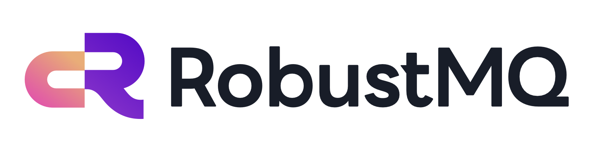
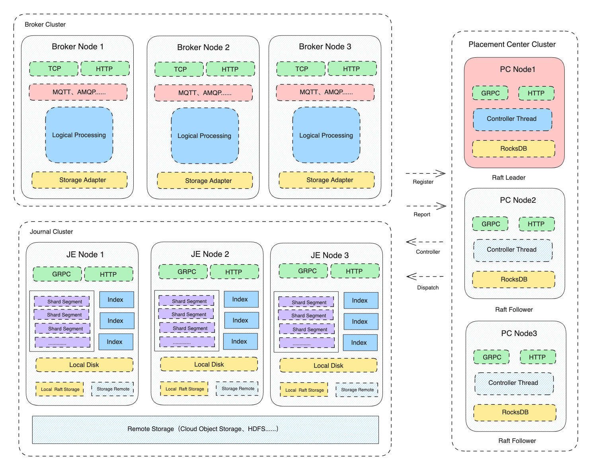

  <picture>
    
  </picture>

  
  
  
  
  

<h3 align="center">
    Next generation cloud-native converged message queue.
</h3>

> Tips: 
> The project is still in its early preview version, undergoing rapid iteration and testing. A stable version has not been released yet. It is expected to release a stable version in the second half of 2025. 
> We are still young, please give us some time to grow up. We expect RobustMQ to become the next Apache top-level project in the message queue space. 

## 🚀 Introduction

RobustMQ is a next-generation high-performance cloud-native converged message queue. The goal is to implement a message queue based on Rust that can be compatible with multiple mainstream message queue protocols and has complete Serverless architecture.

It has long wanted to support multi-protocol and have a full Serverless architecture. At the same time, we hope to keep the architecture simple while adapting to different deployment scenarios and deployment requirements. To achieve lower deployment, operation and maintenance, and use costs.
<picture>

  <source
    media="(prefers-color-scheme: dark)"
    srcset="
      https://api.star-history.com/svg?repos=robustmq/robustmq&type=Date&theme=dark
    "
  />
  <source
    media="(prefers-color-scheme: light)"
    srcset="
      https://api.star-history.com/svg?repos=robustmq/robustmq&type=Date
    "
  />
  
</picture>

## 💡 Features

- 100% Rust: A message queuing kernel implemented entirely in Rust.
- Multi-protocol: Support MQTT 3.1/3.1.1/5.0, AMQP, RocketMQ Remoting/GRPC, Kafka Protocol, OpenMessing, JNS, SQS and other mainstream message protocols.
- Layered architecture: computing, storage, scheduling independent three-tier architecture, each layer has the ability of cluster deployment, rapid horizontal scaling capacity.
- Plug-in storage: Standalone plug-in storage layer implementation, you can choose the appropriate storage layer according to your needs. It is compatible with traditional and cloud-native architectures, and supports cloud and IDC deployment patterns.
- High cohesion architecture: It provides built-in metadata storage components, distributed Journal storage services, and has the ability to deploy quickly, easily and cohesively.
- Rich functions: support sequential messages, dead message messages, transaction messages, idempotent messages, delay messages and other rich message queue functions.

> In the first phase (~ end 2025), we will support RobustMQ MQTT.

## Architecture

RobustMQ is a typical distributed layered architecture with separate computing layer, storage layer, and scheduling layer. By the control layer (Placement Center), computing Layer (Multi-protocol computing layer), Storage Adapter layer (Storage Adapter Layer), independent remote storage layer (Standalone storage) engine) consists of four parts. Each layer has the ability to quickly scale up and down, so as to achieve a complete Serverless capability of the whole system.

- Placement Center

  The metadata storage and scheduling component of the RobustMQ cluster. It is responsible for cluster-related metadata storage, distribution, scheduling, and so on. Such as cluster node uplinking, configuration storage/distribution, and so on.

- Multi-protocol computing layer

  Broker Cluster, the computing layer of RobustMQ cluster. It is responsible for the adaptation of various messaging protocols and the implementation of message-related functions. The received data is written to the Storage Layer through the Storage Adapter Layer.

- Storage Adapter Layer

  Storage adapter layer component, its role to a variety of protocols MQ Topic/Queue/Partition unified abstract Shard. It is also responsible for the adaptation of different storage components, such as local file storage, remote HDFS, object storage, self-developed storage components, and so on. Thus, Shard data can be persistently stored to different storage engines.

- Standalone storage engine
  refers to a standalone storage engine, such as cloud object storage (e.g. AWS S3), HDFS Cluster, Data Lake Cluster (iceberg, hudi, etc.). The RobustMQ is similar to the RobustMQ Journal Server, Apache BookKeeper's distributed, segmented storage service. It is responsible for reliable storage of high-performance message data, and has the ability of rapid horizontal and horizontal expansion without perception.

## RobustMQ MQTT

RobustMQ MQTT is RobustMQ's complete implementation of the MQTT protocol. The goal is to build a high-performance, full-featured message queuing MQTT product in Rust that can be deployed in clusters. The ultimate goal of this feature is to rival enterprise-grade MQTT products such as EMQX and HiveMQ.

### Features

1. **Cluster deployment**: A single cluster supports thousands of Broker nodes, supporting unaware smooth horizontal scaling capabilities.
2. **Full protocol support**: All features of MQTT3.1, 3.1.1, 5.0 protocols are supported
3. **High performance**: A single machine supports millions of connections and high concurrent message throughput.
4. **Multiple communication protocols**: Support TCP, TCP SSL, WebSocket, WebSocket SSL, QUIC, HTTP and other access methods.
5. **Plug-in storage**: Support offline messages, support a variety of message persistence storage engines.
6. **Fully functional**: It supports essential features like testament messages and retained messages, along with all the functionalities of

### Docs

1. [《RobustMQ Quick Start》](https://robustmq.com/QuickGuide/Overview.html)
2. [《RobsustMQ MQTT Doc》](https://robustmq.com/RobustMQ-MQTT/Overview.html)
3. [《RobustMQ MQTT Command》](https://robustmq.com/RobustMQ-Command/Mqtt-Broker.html)

## Run Test Cases

[Run Test Cases](https://robustmq.com/Architect/Test-Case.html)

## Packaging

[Build & Packaging](https://robustmq.com/QuickGuide/Overview.html)

## Contribution Guidelines

[GitHub Contribution Guide](https://robustmq.com/ContributionGuide/GitHub-Contribution-Guide.html)

## Contact us

- **Discord Group**: [Discord Link](https://discord.gg/jVxz2EF3)
- **Wechat Group**: If you're interested in contributing to this project or discussing development topics, scan the QR Code to join our WeChat group for real-time discussions and collaboration.

  

- **Personal wechat**: Wechat group QR code will be updated regularly. If the QR code expires, the developer's personal wechat can be added.

  

## License

RobustMQ uses the Apache 2.0 license to strike a balance between open contributions and allowing you to use the software however you want
