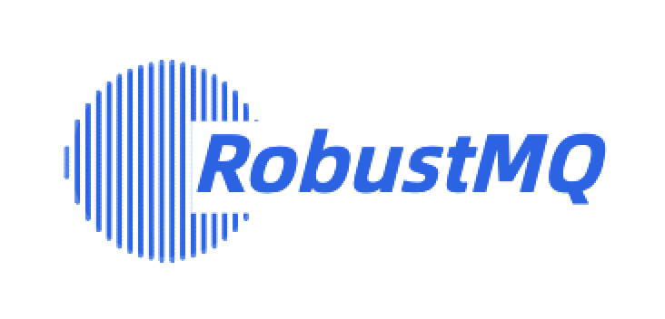
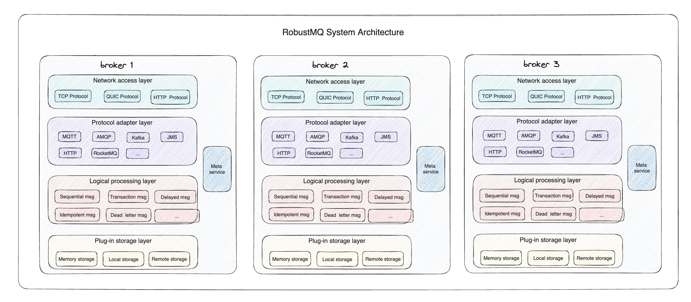

<p  align="center">
  <picture>
    
  </picture>
</p>
 <h3 align="center">
    Next generation cloud-native converged message queue.
</h3>

## What is RobustMQ?
RobustMQ is a 100% Rust-based, minimalist, highly cohesive cloud-native messaging engine. It is a typical computing, storage, scheduling separation architecture, with support for multi-protocol, clustered deployment, computing/storage layer flexibility, minimalist high cohesion architecture of the next generation of cloud-native converged message queue.

## Features
- A cloud-native messaging engine built 100% on Rust with high performance, reliability, and stability.
- Supports a variety of mainstream standard messaging protocols. Support MQTT 3.1, MQTT 5.0, AMQP, RocketMQ Remoting, Kafka Protocol, OpenMessing, JNS, SQS, WebSocket and other mainstream messaging protocols.
- Computing, storage, scheduling hierarchical architecture, computing layer, storage layer, scheduling layer have simple, fast, Serverless expansion capacity.
- Multiple virtual clusters can be created in one physical cluster.
- Flexible multilevel storage architecture can meet different service scenarios, ensuring performance and greatly reducing storage costs.
- Minimalist high cohesion architecture, no external dependent components, simple, reliable and stable architecture.

## Architecture



### Introduce
- 100% Rust kernel

It is hoped that it naturally supports containerized deployment, supports elastic Serverless computing layer and storage layer architecture, and can rapidly expand and shrink capacity. In order to solve the problem of cluster elasticity, improve the utilization rate of cluster, so as to realize the payment according to quantity and use on demand.

- Multi-protocol support

It is hoped that its architecture can naturally support the easy adaptation of multiple MQ protocols. RobustMQ will not customize private protocols in the short term, and the goal is to adapt to a variety of mainstream protocols in the industry, so as to meet the different demands of existing users. To reduce the user's education costs and switching costs.

- Layered architecture

It is developed by Rust programming language which is well known as its outstanding performance and smallest memory. RobustMQ tends to be the best performer in Message Queue industry.

- Multi Tenant

It is designed with flexible architecture with different plugins to support different storages such as local storage, remote storage and classified storages (Local for hot data and remote for cold data). So that it can fully tap into the cost of different storages and makes RobustMQ the most economical product.

- Multilevel storage

It is expected that its system architecture is only composed of brokers, and the cluster is formed by AD hoc networking between brokers. That is, at least one of them can be used to build a cluster, and it also has the ability to expand the cluster horizontally. To reduce deployment and O&M costs. So that it can meet the edge computing scenarios and cloud computing central cluster scenarios.

- Minimal, high cohesion

It is expected that its system architecture is only composed of brokers, and the cluster is formed by AD hoc networking between brokers. That is, at least one of them can be used to build a cluster, and it also has the ability to expand the cluster horizontally. To reduce deployment and O&M costs. So that it can meet the edge computing scenarios and cloud computing central cluster scenarios.


### Build
- Run standalone by placement-center
```
cargo run --package cmd --bin meta -- --conf=config/meta.toml
```

- Run cluster by placement-center
```
cargo run --package cmd --bin meta -- --conf=config/raft/node-1.toml
cargo run --package cmd --bin meta -- --conf=config/raft/node-2.toml
cargo run --package cmd --bin meta -- --conf=config/raft/node-3.toml
```


## License
RobustMQ uses the Apache 2.0 license to strike a balance between open contributions and allowing you to use the software however you want.

## Contributing
Please refer to contribution [guidelines](https://github.com/robustmq/robustmq) for more information.

