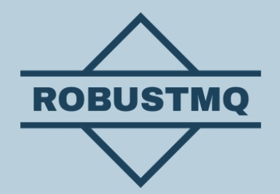

  <picture>
    
  </picture>

<h3 align="center">
    The next-generation Cloud native Message Queue with exetrmely high performance.
</h3>

### Introduction
RobustMQ is a multi-protocol, cloud-native, Serverless, and simple architecture converged message queue.

- Multi-protocol support

It is hoped that its architecture can naturally support the easy adaptation of multiple MQ protocols. RobustMQ will not customize private protocols in the short term, and the goal is to adapt to a variety of mainstream protocols in the industry, so as to meet the different demands of existing users. To reduce the user's education costs and switching costs.

- Cloud-native /Serverless

It is hoped that it naturally supports containerized deployment, supports elastic Serverless computing layer and storage layer architecture, and can rapidly expand and shrink capacity. In order to solve the problem of cluster elasticity, improve the utilization rate of cluster, so as to realize the payment according to quantity and use on demand.

- The architecture is simple

it is expected that its system architecture is only composed of brokers, and the cluster is formed by AD hoc networking between brokers. That is, at least one of them can be used to build a cluster, and it also has the ability to expand the cluster horizontally. To reduce deployment and O&M costs. So that it can meet the edge computing scenarios and cloud computing central cluster scenarios.

### Architecture

