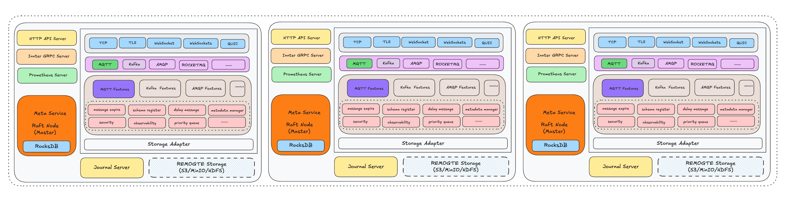
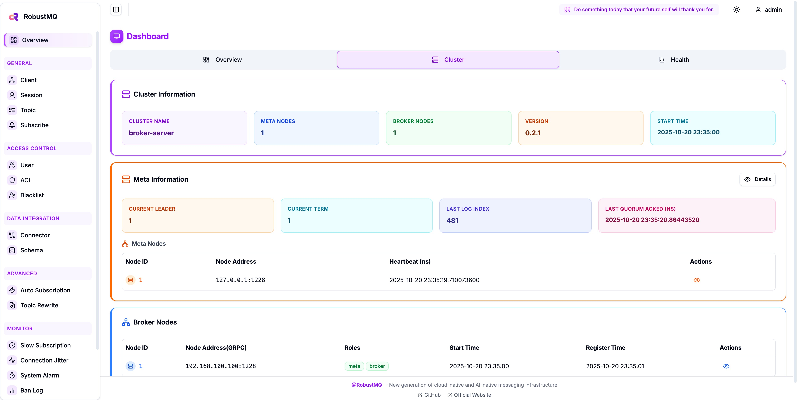

<p align="center">
  <picture>
    
  </picture>
</p>

<p align="center">
  <a href="https://deepwiki.com/robustmq/robustmq"></a>
  <a href="https://zread.ai/robustmq/robustmq" target="_blank"></a>
  
  
  
  
  <a href="https://codecov.io/gh/robustmq/robustmq">
    
  </a>
  
  
</p>

<h3 align="center">
    Communication infrastructure for the AI era — one binary, one broker, one storage layer, any protocol
</h3>

<p align="center">
  <a href="#-what-is-robustmq">What is RobustMQ</a> •
  <a href="#-why-robustmq">Why RobustMQ</a> •
  <a href="#-features">Features</a> •
  <a href="#%EF%B8%8F-roadmap">Roadmap</a> •
  <a href="#%EF%B8%8F-architecture">Architecture</a> •
  <a href="#-quick-start">Quick Start</a> •
  <a href="#-documentation">Documentation</a> •
  <a href="#-contributing">Contributing</a> •
  <a href="#-community">Community</a>
</p>

---

> **⚠️ Development Status**
> RobustMQ is in early development and **not yet production-ready**. MQTT core is stable and continuing to mature. Kafka, NATS, and AMQP are under active development. Production readiness is targeted for 0.4.0.

## 🌟 What is RobustMQ

RobustMQ is a unified messaging engine built with Rust. One binary, one broker, no external dependencies — deployable from edge devices to cloud clusters. It natively supports MQTT, Kafka, NATS, and AMQP on a **shared storage layer**: one message written once, consumed by any protocol.



**Six core scenarios on one system:**

| Scenario | How |
|----------|-----|
| AI Agent communication | `$AI.API.*` subject space over NATS: native Agent registration, discovery, invocation, and load balancing |
| IoT device ingestion | Devices publish via MQTT; AI platforms and data pipelines consume via Kafka — same data, no bridging |
| Streaming data pipelines | Standard Kafka protocol, existing Kafka SDKs connect with zero migration cost |
| Edge-to-cloud sync | Single binary, near-zero memory, offline buffering with automatic cloud sync on reconnect |
| Ultra-low-latency dispatch | NATS pure in-memory routing — no disk writes, millisecond to sub-millisecond latency |
| Traditional messaging | Native AMQP support — existing RabbitMQ applications migrate with minimal changes |

```
MQTT publish  →  RobustMQ unified storage  →  Kafka consume
                                           →  NATS subscribe
                                           →  AMQP consume
```

## 🤔 Why RobustMQ

Today's messaging infrastructure is a collection of protocol silos. IoT uses MQTT brokers, data pipelines use Kafka, enterprise systems use RabbitMQ, and AI Agent communication has no native solution. Multiple systems mean duplicate data copies, overlapping operations, and bridging layers that add latency and failure points.

Existing systems carry heavy architectural baggage. Kafka's file-system-based design hits a hard ceiling at tens of thousands of topics. RabbitMQ's Erlang runtime limits throughput headroom. None of these systems were designed for the AI era — retrofitting them is patching old foundations.

RobustMQ is designed from scratch to solve this structurally: **unified storage + native multi-protocol support**. Not bridging, not routing — one copy of data, each protocol reading it through its own semantic lens. One system replaces multiple brokers. No data duplication, no operational overlap.

## ✨ Features

- 🦀 **Rust-native**: No GC, stable and predictable memory footprint, no periodic spikes — consistent from edge devices to cloud clusters
- 🗄️ **Unified storage layer**: All protocols share one storage engine — data written once, consumed by any protocol, no duplication
- 🔌 **Native multi-protocol**: MQTT 3.1/3.1.1/5.0, Kafka, NATS, AMQP — natively implemented, full protocol semantics, not emulated
- 🏢 **Native multi-tenancy**: Unified across all protocols — full data isolation and independent permission management per tenant
- 🌐 **Edge-to-cloud**: Single binary, zero dependencies, offline buffering with auto-sync — same runtime from edge gateways to cloud clusters
- 🤖 **AI Agent communication**: NATS-based `$AI.API.*` extension — native Agent registration, discovery, invocation, and orchestration
- ⚡ **Ultra-low-latency dispatch**: NATS pure in-memory routing — no disk writes, millisecond to sub-millisecond latency
- 💾 **Multi-mode storage**: Memory / RocksDB / File, per-topic configuration, automatic cold data tiering to S3
- 🔄 **Shared subscription**: Break the "concurrency = partition count" limit — consumers scale elastically at any time
- 🛠️ **Minimal operations**: Single binary, zero external dependencies, built-in Raft consensus, ready out of the box

## 🗺️ Roadmap

The approach: slow is smooth, smooth is fast. Each phase done properly before moving on.

```
Phase 1 — MQTT (current)
  MQTT core production-ready, continuously refined to be the best MQTT Broker available
  Architecture and infrastructure hardened in parallel

Phase 2 — NATS + AI Agent (in progress)
  NATS protocol compatibility + $AI.API.* extension
  Native Agent registration, discovery, invocation, and load balancing

Phase 3 — Kafka (in progress)
  Full Kafka protocol compatibility
  Complete the IoT-to-streaming data path, edge-to-cloud data flow

Phase 4 — AMQP (planned)
  Full AMQP protocol compatibility
  Traditional enterprise messaging migration path
```

| Feature | Status |
|---------|--------|
| MQTT 3.x / 5.0 core | ✅ Available |
| Session persistence and recovery | ✅ Available |
| Shared subscription | ✅ Available |
| Authentication and ACL | ✅ Available |
| Grafana + Prometheus monitoring | ✅ Available |
| Web management console | ✅ Available |
| Kafka protocol | 🚧 In development |
| NATS protocol | 🔬 Demo validated, in development |
| AMQP protocol | 🔬 Demo validated, in development |
| $AI.API.* Agent communication | 🔬 Demo validated, in development |

## 🏗️ Architecture

RobustMQ has three components with fixed, clean boundaries:

- **Meta Service** — metadata management, Raft-based consensus
- **Broker** — protocol parsing and routing (MQTT / Kafka / NATS / AMQP)
- **Storage Engine** — unified data storage with pluggable backends

Adding a new protocol means implementing only the Broker parsing layer. Adding a new storage backend means implementing only the Storage Engine interface. The core architecture does not change.

## 🚀 Quick Start

### One-Line Installation

```bash
curl -fsSL https://raw.githubusercontent.com/robustmq/robustmq/main/scripts/install.sh | bash
broker-server start
```

### Multi-Protocol in Action

```bash
# Publish via MQTT
mqttx pub -h localhost -p 1883 -t "robustmq.multi.protocol" -m "Hello RobustMQ!"

# Consume the same message via Kafka
kafka-console-consumer.sh --bootstrap-server localhost:9092 \
  --topic robustmq.multi.protocol --from-beginning

# Consume the same message via NATS
nats sub "robustmq.multi.protocol"
```

### Web Dashboard

Access `http://localhost:8080` for cluster monitoring and management.

<div align="center">
  
  
</div>

### Try Online Demo

- **MQTT Server**: `117.72.92.117:1883` (admin/robustmq)
- **Web Dashboard**: http://demo.robustmq.com:8080

📚 **Full installation and usage guide: [Documentation](https://robustmq.com/)**

## 🔧 Development

```bash
git clone https://github.com/robustmq/robustmq.git
cd robustmq
cargo run --package cmd --bin broker-server

make build           # Basic build
make build-full      # With frontend
```

📚 **[Build Guide](https://robustmq.com/QuickGuide/Build-and-Package.html)**

## 📚 Documentation

- **📖 [Official Documentation](https://robustmq.com/)** — Comprehensive guides and API references
- **🚀 [Quick Start Guide](https://robustmq.com/QuickGuide/Overview.html)** — Get up and running in minutes
- **🔧 [MQTT Documentation](https://robustmq.com/RobustMQ-MQTT/Overview.html)** — MQTT-specific features and configuration
- **💻 [Command Reference](https://robustmq.com/RobustMQ-Command/Mqtt-Broker.html)** — CLI commands and usage
- **🎛️ [Web Console](https://github.com/robustmq/robustmq-copilot)** — Management interface

## 🤝 Contributing

We welcome contributions. See our [Contribution Guide](https://robustmq.com/en/ContributionGuide/GitHub-Contribution-Guide.html) and [Good First Issues](https://github.com/robustmq/robustmq/labels/good%20first%20issue).

## 🌐 Community

- **🎮 [Discord](https://discord.gg/sygeGRh5)** — Real-time chat and collaboration
- **🐛 [GitHub Issues](https://github.com/robustmq/robustmq/issues)** — Bug reports and feature requests
- **💡 [GitHub Discussions](https://github.com/robustmq/robustmq/discussions)** — General discussions

### 🇨🇳 Chinese Community

- **微信群**: Join our WeChat group for Chinese-speaking users

  <div align="center">
    
  </div>

- **开发者微信**: If the group QR code has expired, follow our official WeChat account

  <div align="center">
    
  </div>

## License

RobustMQ is licensed under the [Apache License 2.0](LICENSE). See [LICENSING.md](LICENSING.md) for details.

---

<div align="center">
  <sub>Built with ❤️ by the RobustMQ team and <a href="https://github.com/robustmq/robustmq/graphs/contributors">contributors</a>.</sub>
</div>
