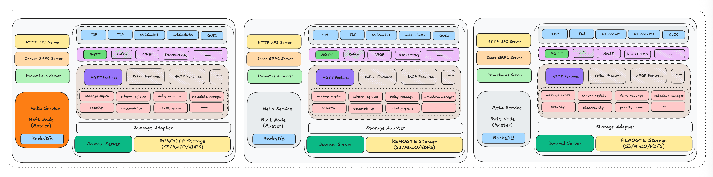

<p align="center">
  <picture>
    
  </picture>
</p>

<p align="center">
  <a href="https://deepwiki.com/robustmq/robustmq"></a>
  
  
  
  
  <a href="https://codecov.io/gh/robustmq/robustmq">
    
  </a>
  
  
</p>

<h3 align="center">
    New generation of cloud-native and AI-native messaging infrastructure
</h3>

<p align="center">
  <a href="#-introduction">Introduction</a> •
  <a href="#-features">Features</a> •
  <a href="#-architecture">Architecture</a> •
  <a href="#-quick-start">Quick Start</a> •
  <a href="#-build-script">Build Script</a> •
  <a href="#-documentation">Documentation</a> •
  <a href="#-contributing">Contributing</a> •
  <a href="#-community">Community</a>
</p>

---

> **⚠️ Development Status**
> RobustMQ is currently in early preview phase with active development and testing. A stable release is anticipated in Q3-Q4 2025. Our roadmap includes achieving production readiness and pursuing Apache top-level project status.

## 🚀 Introduction

**RobustMQ** is a next-generation, high-performance message queue built in Rust, designed for modern cloud-native and AI systems. It unifies MQTT, Kafka, and AMQP protocols with compute-storage separation architecture, enabling microsecond latency and elastic scaling.

### Why RobustMQ?

Traditional message queues face critical challenges in the AI era: **protocol fragmentation** requiring multiple systems, **latency jitter** failing real-time AI needs, **compute-storage coupling** preventing Serverless deployment, and **high costs** lacking elastic scaling.

RobustMQ provides a **unified messaging platform** with flexible architecture that supports all scenarios, eliminating the need to maintain multiple message queue systems.

**Vision**: Become the next-generation cloud-native and AI-native messaging infrastructure, targeting Apache top-level project status.

## ✨ Features

- **🚀 High Performance**: Rust-powered zero-cost abstractions with microsecond latency and zero GC pauses
- **🏗️ Compute-Storage Separation**: Stateless broker nodes enable second-level elastic scaling and Serverless deployment
- **🔌 Multi-Protocol Unified**: Native support for MQTT 3.1/3.1.1/5.0, Kafka, and AMQP with protocol isolation
- **💾 Intelligent Storage Tiering**: Memory/SSD/Object storage with Topic-level engine selection for cost optimization
- **☁️ Cloud-Native Ready**: Kubernetes-native with auto-scaling, service discovery, and container-friendly deployment
- **🛠️ Zero-Operations**: Single binary deployment with built-in Raft consensus and comprehensive management tools
- **🔐 Enterprise Security**: Multi-auth support, fine-grained permissions, and end-to-end encryption
- **📊 Full Observability**: Prometheus metrics, OpenTelemetry tracing, and Grafana dashboards

## 🏗️ Architecture



### Architecture Overview

- **Broker Server**: Stateless protocol processing layer supporting MQTT, Kafka, and AMQP with million-level concurrent connections
- **Meta Service**: Raft-based distributed metadata management and cluster coordination with automatic failover
- **Journal Server**: High-performance persistent storage engine with WAL guarantees and pluggable storage backends
- **Storage Adapter**: Unified storage abstraction layer supporting memory, SSD, and object storage with intelligent tiering
- **One Binary Deployment**: Single executable with zero external dependencies for simplified operations
- **Protocol Isolation**: Dedicated ports per protocol (MQTT: 1883/1884/8083/8084, Kafka: 9092, AMQP: 5672, gRPC: 1228)
- **Compute-Storage Separation**: Stateless brokers enable independent scaling and Serverless deployment without data migration
- **Topic-Level Storage**: Flexible storage engine selection supporting memory, local, and cloud storage backends

## 🚀 Quick Start

### One-Line Installation

```bash
# Install and start RobustMQ
curl -fsSL https://raw.githubusercontent.com/robustmq/robustmq/main/scripts/install.sh | bash
broker-server start
```

### Quick Test

```bash
# Test MQTT connection
mqttx pub -h localhost -p 1883 -t "test/topic" -m "Hello RobustMQ!"
mqttx sub -h localhost -p 1883 -t "test/topic"
```

### Web Dashboard

Access `http://localhost:8080` for cluster monitoring and management.

<div align="center">
  
  
</div>

### Try Online Demo

- **MQTT Server**: `117.72.92.117:1883` (admin/robustmq)
- **Web Dashboard**: http://demo.robustmq.com

📚 **For detailed installation and usage guides, see our [Documentation](https://robustmq.com/)**

## 🔧 Development

```bash
# Clone and build
git clone https://github.com/robustmq/robustmq.git
cd robustmq
cargo run --package cmd --bin broker-server

# Build packages
make build              # Basic build
make build-full         # With frontend
```

📚 **For detailed build options, see our [Build Guide](https://robustmq.com/QuickGuide/Build-and-Package.html)**

## 📚 Documentation

- **📖 [Official Documentation](https://robustmq.com/)** - Comprehensive guides and API references
- **🚀 [Quick Start Guide](https://robustmq.com/QuickGuide/Overview.html)** - Get up and running in minutes
- **🔧 [MQTT Documentation](https://robustmq.com/RobustMQ-MQTT/Overview.html)** - MQTT-specific features and configuration
- **💻 [Command Reference](https://robustmq.com/RobustMQ-Command/Mqtt-Broker.html)** - CLI commands and usage
- **🎛️ [Web Console](https://github.com/robustmq/robustmq-copilot)** - Management interface

## 🤝 Contributing

We welcome contributions! Check out our [Contribution Guide](https://robustmq.com/ContributionGuide/GitHub-Contribution-Guide.html) and [Good First Issues](https://github.com/robustmq/robustmq/labels/good%20first%20issue).


## 🌐 Community

- **🎮 [Discord](https://discord.gg/sygeGRh5)** - Real-time chat and collaboration
- **🐛 [GitHub Issues](https://github.com/robustmq/robustmq/issues)** - Bug reports and feature requests
- **💡 [GitHub Discussions](https://github.com/robustmq/robustmq/discussions)** - General discussions

### 🇨🇳 Chinese Community

- **微信群**: Join our WeChat group for Chinese-speaking users

  <div align="center">
    
  </div>

- **微信公众号**: If the group QR code has expired, welcome to follow our official WeChat account!

  <div align="center">
    
  </div>

## 📄 License

RobustMQ is licensed under the [Apache License 2.0](LICENSE), which strikes a balance between open collaboration and allowing you to use the software in your projects, whether open source or proprietary.

---

<div align="center">
  <sub>Built with ❤️ by the RobustMQ team and <a href="https://github.com/robustmq/robustmq/graphs/contributors">contributors</a>.</sub>
</div>
