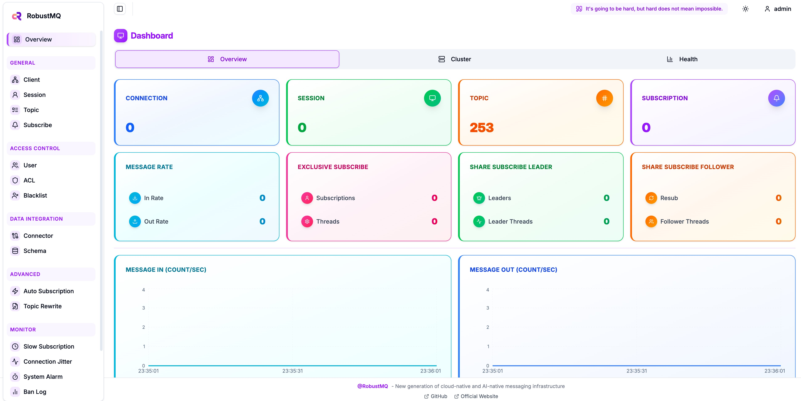

<p align="center">
  <picture>
    
  </picture>
</p>

<p align="center">
  <a href="https://deepwiki.com/robustmq/robustmq"></a>
  
  
  
  
  <a href="https://codecov.io/gh/robustmq/robustmq">
    
  </a>
  
  
</p>

<h3 align="center">
    New generation of cloud-native and AI-native messaging infrastructure
</h3>

<p align="center">
  <a href="#-introduction">Introduction</a> •
  <a href="#-features">Features</a> •
  <a href="#-architecture">Architecture</a> •
  <a href="#-quick-start">Quick Start</a> •
  <a href="#-build-script">Build Script</a> •
  <a href="#-documentation">Documentation</a> •
  <a href="#-contributing">Contributing</a> •
  <a href="#-community">Community</a>
</p>

---

> **⚠️ Development Status**
> This project is currently in its early preview stage and is undergoing rapid iteration and testing. A stable release is expected in the second half of 2025. We are actively working towards making RobustMQ production-ready and aim to become a top-level Apache project in the message queue ecosystem.

## 🚀 Introduction

RobustMQ is a next-generation, high-performance, multi-protocol message queue built in Rust. Our vision is to create a unified messaging infrastructure tailored for modern cloud-native and AI systems.

## ✨ Features

- **🚀 High Performance**: Built with Rust, ensuring memory safety, zero-cost abstractions, and blazing-fast performance
- **🏗️ Distributed Architecture**: Separation of compute, storage, and scheduling for optimal scalability and resource utilization
- **🔌 Multi-Protocol Support**: Native support for MQTT (3.x/4.x/5.x), AMQP, Kafka, and RocketMQ protocols
- **💾 Pluggable Storage**: Modular storage layer supporting local files, S3, HDFS, and other storage backends
- **☁️ Cloud-Native**: Kubernetes-ready with auto-scaling, service discovery, and observability built-in
- **🏢 Multi-Tenancy**: Support for virtual clusters within a single physical deployment
- **🔐 Security First**: Built-in authentication, authorization, and encryption support
- **📊 Observability**: Comprehensive metrics, tracing, and logging with Prometheus and OpenTelemetry integration
- **🎯 User-Friendly**: Simple deployment, intuitive management console, and extensive documentation

## 🏗️ Architecture


### Core Components

- **Broker Server**: High-performance message handling with multi-protocol support
- **Meta Service**: Metadata management and cluster coordination using Raft consensus
- **Journal Server**: Persistent storage layer with pluggable backends
- **Web Console**: Management interface for monitoring and administration

### Key Design Principles

- **One Binary, One Process**: Simplified deployment and operations
- **Protocol Isolation**: Different protocols use dedicated ports (MQTT: 1883/1884/8083/8084, Kafka: 9092, gRPC: 1228)
- **Fault Tolerance**: Built-in replication and automatic failover
- **Horizontal Scaling**: Add capacity by simply adding more nodes

## 🚀 Quick Start

### Installation Options

#### Option 1: Build from Source

```bash
# Clone the repository
git clone https://github.com/robustmq/robustmq.git
cd robustmq

# Build and run
cargo run --package cmd --bin broker-server
```

#### Option 2: Pre-built Binaries

**Method 1: Manual Download**

Visit the [releases page](https://github.com/robustmq/robustmq/releases) and download the appropriate package for your platform:

```bash
# Example for Linux x86_64 (replace with your platform)
wget https://github.com/robustmq/robustmq/releases/latest/download/robustmq-v0.1.30-linux-amd64.tar.gz

# Extract the package
tar -xzf robustmq-v0.1.30-linux-amd64.tar.gz
cd robustmq-v0.1.30-linux-amd64

# Run the server
./bin/robust-server start
```

**Available platforms**: `linux-amd64`, `linux-arm64`, `darwin-amd64`, `darwin-arm64`, `windows-amd64`

**Method 2: Automated Install Script** (Recommended)

```bash
# Download and install automatically
curl -fsSL https://raw.githubusercontent.com/robustmq/robustmq/main/scripts/install.sh | bash

# Or download the script first to review it
wget https://raw.githubusercontent.com/robustmq/robustmq/main/scripts/install.sh
chmod +x install.sh
./install.sh --help  # See available options
```

#### Option 3: Docker (Coming Soon)

```bash
docker run -p 1883:1883 -p 9092:9092 robustmq/robustmq:latest
```

### Verify Installation

Once RobustMQ is running, you should see output similar to:


You can verify the installation by connecting with any MQTT client to `localhost:1883` or using the web console.

## 🔧 Build Script

RobustMQ provides a build script to automatically package installation packages for your local system:

```bash
# Build for current platform (includes server binaries and web UI)
./scripts/build.sh
```

📚 **For advanced build options, cross-platform compilation, and detailed instructions, please refer to our documentation:**
- **🇺🇸 [Build and Package Guide (English)](https://robustmq.com/en/QuickGuide/Build-and-Package.html)**
- **🇨🇳 [构建和打包指南 (中文)](https://robustmq.com/zh/QuickGuide/Build-and-Package.html)**

## 📚 Documentation

- **📖 [Official Documentation](https://robustmq.com/)** - Comprehensive guides and API references
- **🚀 [Quick Start Guide](https://robustmq.com/QuickGuide/Overview.html)** - Get up and running in minutes
- **🔧 [MQTT Documentation](https://robustmq.com/RobustMQ-MQTT/Overview.html)** - MQTT-specific features and configuration
- **💻 [Command Reference](https://robustmq.com/RobustMQ-Command/Mqtt-Broker.html)** - CLI commands and usage
- **🎛️ [Web Console](https://github.com/robustmq/robustmq-copilot)** - Management interface

<div align="center">
  
  
</div>

## 💻 Development

### CI/CD & Docker Images

RobustMQ uses a pre-built dependency cache image strategy to significantly speed up CI/CD pipelines:

**🚀 Performance:**
- **With cache image:** 2-3 minutes (dependencies pre-compiled)
- **Without cache:** 15-18 minutes (compile everything from scratch)
- **5-10x faster** build times in CI/CD!

**📦 Image:**
- **Location:** `ghcr.io/socutes/robustmq/rust-deps:latest`
- **Contents:** Rust 1.90.0 + all dependencies (~300 crates) pre-compiled
- **Size:** ~8-10 GB
- **Maintenance:** Manually updated (see `docker/README.md`)

**🔄 Update Frequency:**
The dependency image is updated:
- Every 2-4 weeks (during active development)
- When Rust version upgrades
- When 20+ dependencies change
- When CI build time exceeds 8 minutes

**ℹ️ For Contributors:**
Don't worry about the cache image! Even if it's slightly outdated, Cargo will only recompile changed dependencies (~1-2 minutes extra), still 3-4x faster than no cache.

**🛠️ For Maintainers:**
To rebuild and push the dependency image:

```bash
cd docker/
./build-and-push.sh
```

See [`docker/README.md`](docker/README.md) for detailed documentation.

## 🤝 Contributing

We welcome contributions from the community! RobustMQ is an open-source project, and we're excited to collaborate with developers interested in Rust, distributed systems, and message queues.

### How to Contribute

1. **📋 Read our [Contribution Guide](https://robustmq.com/ContributionGuide/GitHub-Contribution-Guide.html)**
2. **🔍 Check [Good First Issues](https://github.com/robustmq/robustmq/labels/good%20first%20issue)**
3. **🍴 Fork the repository**
4. **🌿 Create a feature branch**
5. **✅ Make your changes with tests**
6. **📤 Submit a pull request**


## 🌐 Community

Join our growing community of developers, users, and contributors:

### 💬 Discussion & Support

- **🎮 [Discord Server](https://discord.gg/sygeGRh5)** - Real-time chat, questions, and collaboration
- **🐛 [GitHub Issues](https://github.com/robustmq/robustmq/issues)** - Bug reports and feature requests
- **💡 [GitHub Discussions](https://github.com/robustmq/robustmq/discussions)** - General discussions and ideas

### 🇨🇳 Chinese Community

- **微信群**: Join our WeChat group for Chinese-speaking users

  <div align="center">
    
  </div>

- **微信公众号**: If the group QR code has expired, Welcome to follow our official WeChat account!

  <div align="center">
    
  </div>

## 📄 License

RobustMQ is licensed under the [Apache License 2.0](LICENSE), which strikes a balance between open collaboration and allowing you to use the software in your projects, whether open source or proprietary.

---

<div align="center">
  <sub>Built with ❤️ by the RobustMQ team and <a href="https://github.com/robustmq/robustmq/graphs/contributors">contributors</a>.</sub>
</div>
