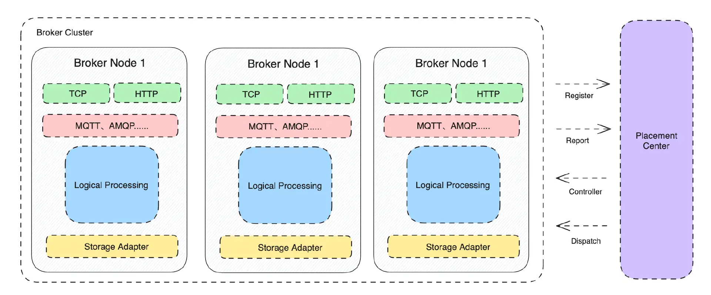

# Broker Server
## Overview
Broker Server is a computation layer component, primarily responsible for the data access of various messaging protocols and the implementation of their related functions. From a design perspective, it aims to support mainstream messaging protocols such as MQTT 3.1/3.1.1/5.0, AMQP, RocketMQ Remoting/GRPC, Kafka Protocol, OpenMessing, JNS, SQS, etc. The architecture is as follows:

- Broker Server relies on Placement Center to complete cluster formation, such as node discovery, cluster metadata storage, etc.
- Nodes within Broker Server are stateless, only responsible for interacting with client SDKs to complete data writing and reading.
- Broker Nodes store some of their runtime metadata in Placement Center (PC), and when a new Broker node starts, it reads, loads, and caches this information from Placement Center.
- When a Broker Node starts, it registers its own information to the Leader node of the Placement Center cluster.
- Broker Nodes periodically send heartbeat messages to the Placement Center cluster. If the heartbeat times out, PC will remove the node and migrate the tasks executed by that node to other available nodes.
- Broker Server supports TCP and GRPC protocols; the TCP protocol is used to handle the access of various standard messaging protocols (such as MQTT, AMQP, etc.), and the GRPC protocol is used to complete internal cluster functional interactions, such as the management and monitoring information retrieval of the Broker itself.
- In the protocol-related logical processing section, the development of message queue-related functions is completed, such as dead letter messages, delayed messages, ordered messages, etc. These functions are provided to different protocols in the form of code blocks.
- In the message data storage part, data reading and writing are completed through the Storage Adapter.
- Broker Nodes continuously report their runtime information to Placement Center at regular intervals.
- Placement Center judges whether to perform certain management operations based on the runtime information reported by Broker Nodes and multi-dimensional information, and then calls the Broker's GRPC interface to complete the corresponding operations.
