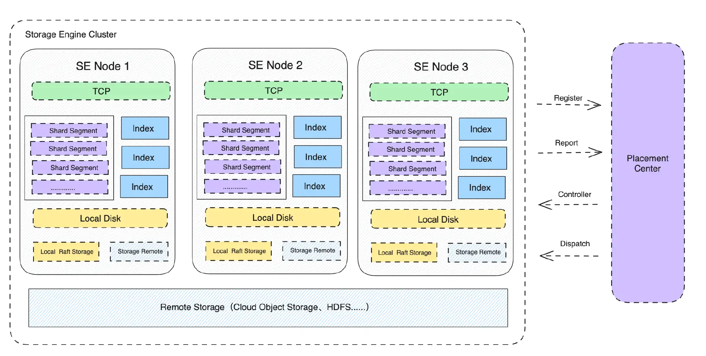

# Journal Server

## Overview

Storage Engine (henceforth referred to as SE) is an independent storage service responsible for the persistent storage of message data, which needs to balance performance, reliability, and cost. It exposes its services in the form of the GRPC protocol (the GRPC protocol may have performance bottlenecks that will be adjusted later). The architecture is as follows:

- SE is a distributed and horizontally scalable cluster. The cluster can be scaled horizontally by adding Storage Engine Nodes (SEN) nodes.
- SE provides data plane services through the GRPC protocol to support data writing and reading.
- SE forms clusters by registering node information in the Placement Center (PC). Nodes maintain availability through periodic heartbeat reporting.
- SE organizes data in units of Shards, which are composed of multiple data segments (Segments). The size of each Segment is 1GB by default (tentative).
- Metadata information related to shards (Shard) is stored in the Placement Center (PC), such as the number of Segments, the distribution of Segments, etc.
- The storage layer of SE is in the Local Raft Storage (LRS) mode. Different data segments (Segment) of a shard are stored with a default of 3 replicas, and different data segments are distributed across different nodes (SEN) based on a balancing algorithm.
- It also provides the implementation of tiered storage, allowing Shard data to be stored in remote low-cost storage engines, such as object storage.
- SE's indexing module is responsible for building data indexes, such as time indexes, key indexes, offset indexes, etc.
