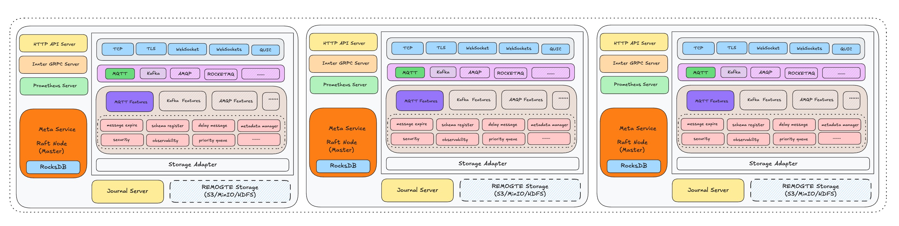

# MetaService Architecture

## Overview

MetaService (also known as Meta Service) is the metadata management and cluster coordination center of RobustMQ. It serves as the brain of the entire system, responsible for managing cluster metadata, node coordination, fault detection, and recovery. Built on the Raft consensus algorithm, MetaService ensures high availability and strong consistency of cluster metadata.

## Design Principles

MetaService is designed with the following core principles:

- **High Availability**: Raft-based consensus ensures cluster availability even with node failures
- **Strong Consistency**: All metadata operations are strongly consistent across the cluster
- **Fault Tolerance**: Automatic detection and recovery from node failures
- **Scalability**: Support for dynamic cluster membership changes
- **Performance**: Optimized for low-latency metadata operations

## Architecture Overview



MetaService follows a layered architecture with clear separation of concerns:

### 1. Service Layer
- **gRPC Services**: External API interfaces for cluster operations
- **Internal Services**: Protocol-specific service implementations
- **Service Discovery**: Node registration and discovery mechanisms

### 2. Core Layer
- **Cache Management**: High-performance in-memory metadata cache
- **Cluster Controller**: Central coordination and control logic
- **Heartbeat Management**: Node health monitoring and failure detection
- **Metrics Collection**: Performance and operational metrics

### 3. Raft Layer
- **Consensus Engine**: Raft algorithm implementation for distributed consensus
- **State Machine**: Metadata state management and transitions
- **Log Store**: Persistent log storage for Raft operations
- **Network Layer**: Inter-node communication and message passing

### 4. Storage Layer
- **RocksDB Engine**: Persistent storage for metadata and logs
- **Data Routing**: Request routing to appropriate storage handlers
- **Schema Management**: Data schema and structure management

## Core Components

### Service Layer (`src/server/`)

The service layer provides external APIs and internal service implementations.

#### gRPC Services
- **MetaServiceService**: Main gRPC service for cluster operations
- **MQTT Service**: MQTT-specific metadata operations
- **Journal Service**: Storage-related metadata operations
- **KV Service**: Key-value metadata operations

#### Service Implementations
```rust
pub struct GrpcPlacementService {
    raft_machine_apply: Arc<StorageDriver>,
    cluster_cache: Arc<CacheManager>,
    rocksdb_engine_handler: Arc<RocksDBEngine>,
    client_pool: Arc<ClientPool>,
    journal_call_manager: Arc<JournalInnerCallManager>,
    mqtt_call_manager: Arc<MQTTInnerCallManager>,
}
```

**Key Responsibilities:**
- Handle external gRPC requests
- Route requests to appropriate internal services
- Manage client connections and authentication
- Provide service discovery and health checks

### Core Layer (`src/core/`)

The core layer contains the essential business logic and coordination mechanisms.

#### Cache Manager (`cache.rs`)
- **In-Memory Cache**: High-performance metadata caching
- **Cache Invalidation**: Automatic cache consistency management
- **Cache Warming**: Proactive cache population for performance
- **Memory Management**: Efficient memory usage and garbage collection

#### Cluster Controller (`controller.rs`)
```rust
pub struct ClusterController {
    cluster_cache: Arc<CacheManager>,
    meta_service_storage: Arc<StorageDriver>,
    stop_send: broadcast::Sender<bool>,
    client_pool: Arc<ClientPool>,
    journal_call_manager: Arc<JournalInnerCallManager>,
    mqtt_call_manager: Arc<MQTTInnerCallManager>,
}
```

**Key Responsibilities:**
- Cluster coordination and management
- Node lifecycle management
- Fault detection and recovery
- Load balancing and routing decisions

#### Heartbeat Management (`heartbeat.rs`)
- **Node Health Monitoring**: Continuous health checks of cluster nodes
- **Failure Detection**: Automatic detection of failed nodes
- **Recovery Coordination**: Orchestrate recovery procedures
- **Health Metrics**: Collect and report node health statistics

### Raft Layer (`src/raft/`)

The Raft layer implements distributed consensus for metadata consistency.

#### Raft Node (`raft_node.rs`)
```rust
pub struct Node {
    pub node_id: u64,
    pub rpc_addr: String,
}

pub type NodeId = u64;
```

**Key Features:**
- **Leader Election**: Automatic leader election and failover
- **Log Replication**: Consistent log replication across nodes
- **Membership Changes**: Dynamic cluster membership management
- **Snapshot Management**: Efficient snapshot creation and restoration

#### State Machine (`store/state_machine_store.rs`)
- **State Transitions**: Manage metadata state changes
- **Log Application**: Apply committed log entries to state
- **Snapshot Creation**: Create consistent snapshots of state
- **Recovery**: Restore state from snapshots and logs

#### Network Layer (`network/`)
- **Inter-Node Communication**: Efficient communication between Raft nodes
- **Message Serialization**: Optimized message serialization/deserialization
- **Connection Management**: Reliable connection handling
- **Load Balancing**: Distribute network load across nodes

### Storage Layer (`src/storage/`)

The storage layer provides persistent storage for metadata and logs.

#### RocksDB Engine (`rocksdb.rs`)
- **Persistent Storage**: Durable storage for metadata and logs
- **High Performance**: Optimized for metadata access patterns
- **Compaction**: Automatic data compaction and optimization
- **Backup/Restore**: Data backup and recovery capabilities

#### Data Routing (`raft/route/`)
- **Request Routing**: Route requests to appropriate handlers
- **Protocol Support**: Support for different data types and protocols
- **Batch Processing**: Efficient batch processing of operations
- **Error Handling**: Comprehensive error handling and recovery

## Data Flow Architecture

### Metadata Operations Flow
1. **Client Request**: Client sends metadata operation request
2. **Service Layer**: gRPC service receives and validates request
3. **Cache Check**: Check in-memory cache for data
4. **Raft Consensus**: If cache miss, propose operation to Raft cluster
5. **Log Replication**: Replicate operation across cluster nodes
6. **State Application**: Apply operation to state machine
7. **Cache Update**: Update in-memory cache with new data
8. **Response**: Return result to client

### Node Management Flow
1. **Node Registration**: New node registers with cluster
2. **Health Monitoring**: Continuous heartbeat monitoring
3. **Failure Detection**: Detect node failures through missed heartbeats
4. **Recovery Coordination**: Coordinate recovery procedures
5. **Load Rebalancing**: Rebalance load after node changes
6. **Membership Update**: Update cluster membership

### Consensus Flow
1. **Leader Election**: Elect leader through Raft consensus
2. **Log Proposals**: Leader proposes operations to followers
3. **Vote Collection**: Collect votes from majority of nodes
4. **Commit**: Commit operations after majority agreement
5. **State Update**: Update state machine with committed operations
6. **Response**: Return results to clients

## Protocol-Specific Controllers

### MQTT Controller (`controller/mqtt/`)
- **Session Management**: Manage MQTT client sessions
- **Topic Routing**: Route messages to appropriate topics
- **Subscription Management**: Handle topic subscriptions
- **QoS Coordination**: Coordinate QoS levels across brokers

### Journal Controller (`controller/journal/`)
- **Storage Coordination**: Coordinate with storage nodes
- **Data Replication**: Manage data replication across storage nodes
- **Garbage Collection**: Coordinate garbage collection operations
- **Storage Health**: Monitor storage node health

## Conclusion

MetaService is the critical component that ensures the reliability, consistency, and performance of RobustMQ clusters. Its Raft-based consensus architecture provides strong consistency guarantees while maintaining high availability and fault tolerance. The layered design with clear separation of concerns makes it maintainable and extensible.

The combination of in-memory caching, efficient consensus algorithms, and robust storage mechanisms enables MetaService to handle high-throughput metadata operations while maintaining sub-second response times. This makes it suitable for demanding production environments requiring high availability and strong consistency.

---

*This document provides a comprehensive overview of MetaService architecture. For more detailed information about specific components, please refer to the individual component documentation.*
