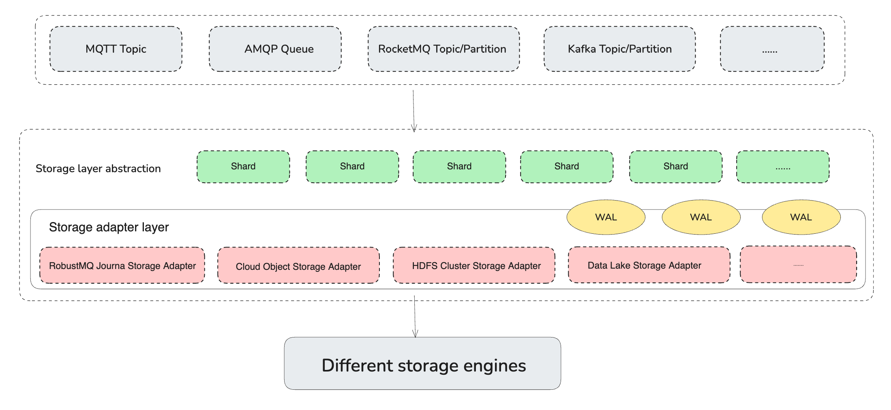

# Storage Adapter
## Background
In traditional message queues, only a single storage is supported, such as Kafka/RocketMQ/RabbitMQ local storage, Pulsar Bookeeper, etc. As a result, these message queues cannot perfectly meet the flexible requirements in different scenarios, such as selection, cost, performance and stability.

In the cloud-native scenario, we want to use a cloud-native Storage system, such as Object Storage(S3), to store our message data. In our build-in scenario, we want to use our own storage system, such as HDFS, to store the message data. In this case, we need a unified storage semantics to shield the differences between different storage systems.

To address this issue, RobustMQ provides a unified Storage semantics through Storage Adapter, and interfaces with different storage systems at the underlying level, thus hiding the differences between different storage systems. Thus, it can meet the flexible demands of different scene selection, cost, performance and stability.


## Design


The Storage Adapter is a lib, not a Service. It defines the following semantics via the trait StorageAdapter:
- create_shard: Creates a Shard
- list_shard: Lists shards
- delete_shard: Deletes the Shard
- write: Writes a single piece of data
- batch_write: To write multiple entries
- read_by_offset: Reads data as Offset
- read_by_tag: Reads data by Tag
- read_by_key: Reads data by Key
- get_offset_by_timestamp: Get the Offset by Timestamp
- get_offset_by_group: Get the Offset by Group
- commit_offset: Commits the Offset
- close: The Storage Adapter is closed


> StorageAdapter file path：src/storage-adapter/src/storage.rs

If you need to adapt to any storage system (HDFS, Ceph, S3, etc.), you just need to implement the StorageAdapter trait. See the StorageAdapter plugins for details.

The available storage systems are:

- Journal Engine
- Memory
- Minio
- Mysql
- RocksDB
- S3

## RobustMQ MQTT storage
For example, the RobustMQ MQTT can select different storage systems via a configuration file:

```
[storage]
storage_type = "memory"
```

Storage config file path：conf/storage.toml
```
pub struct Storage {
    pub storage_type: String,
    #[serde(default)]
    pub journal_addr: String,
    #[serde(default)]
    pub mysql_addr: String,
    #[serde(default)]
    pub rocksdb_data_path: String,
    pub rocksdb_max_open_files: Option<i32>,
}
```
