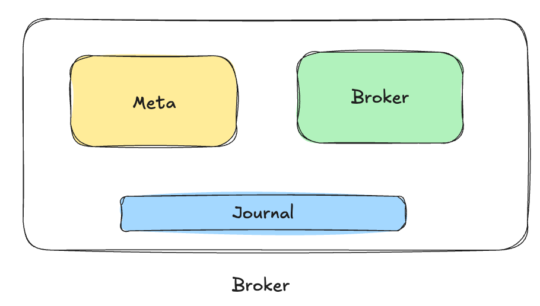
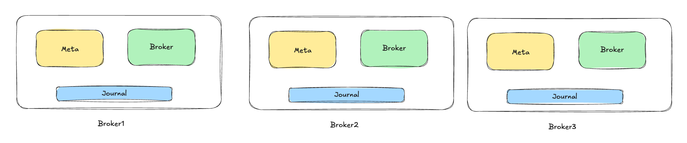

# 03: Introduction to RobustMQ Roles

> RobustMQ is a new generation high-performance multi-protocol message queue built on Rust. The vision is to become the next-generation cloud-native and AI-native messaging infrastructure. It is not simply "yet another message queue", but a rethinking and redesign of message queues for the AI era and cloud-native requirements.

This article mainly introduces the key concept of Roles for deploying RobustMQ.

### One Binary
RobustMQ's installation package is a binary file packaged from Rust code with no external dependencies. You only need one binary to start a cluster. You can download the binary installation package and execute the file to start the cluster.

```
$ wget https://github.com/robustmq/robustmq/releases/download/v0.1.33/robustmq-v0.1.33-linux-amd64.tar.gz
$ tar -xzvf robustmq-v0.1.33-linux-amd64.tar.gz
$ cd robustmq-v0.1.33-linux-amd64
$ tree
.
├── bin
│   ├── robust-bench
│   ├── robust-ctl
│   └── robust-server
├── config
│   ├── certs
│   │   ├── ca.pem
│   │   ├── cert.pem
│   │   └── key.pem
│   ├── server-tracing.toml
│   ├── server.toml
│   ├── server.toml.template
│   ├── version.ini
│   └── version.txt
├── docs
├── libs
│   ├── broker-server
│   ├── cli-bench
│   └── cli-command
└── package-info.txt

```
### Starting RobustMQ

- **[Standalone]** Start a single-node RobustMQ
```
./bin/robust-server start
```
- **[Cluster]** Start a 3-node RobustMQ

Copy and modify config/server.toml into three files: node1.toml, node2.toml, and node3.toml. For configuration file details, please refer to [《RobustMQ Configuration Guide》](../Configuration/COMMON.md)

```
./bin/robust-server start config/node1.toml
./bin/robust-server start config/node2.toml
./bin/robust-server start config/node3.toml
```

### About Roles
In the RobustMQ configuration file, there is a key configuration called roles, which means what roles the current node can run as. Roles have three options:
- meta: metadata node
- broker: compute node
- journal: storage node

#### Start a single-node cluster with memory storage
As shown below:


Roles configuration is as follows:
```
roles = ["meta", "broker"]
```

Because the cluster must have metadata nodes and Broker nodes, meta and broker are definitely needed, but journal is optional.

#### Start a single-node cluster with local storage
As shown below:

Roles configuration is as follows:
```
roles = ["meta", "broker","journal"]
```

#### Mixed deployment of a three-node cluster
For cluster deployment, there must be at least one meta node and one broker node. Other nodes can be configured as meta or broker nodes as needed. Assuming we have three nodes, we can make all three nodes both meta and broker, so we have a cluster of three meta nodes. As shown below:

The roles configuration for all three nodes is as follows:
```
roles = ["meta", "broker","journal"]
```

### About the number of nodes with different roles in the cluster
1. Meta is built on Raft at the bottom layer, so its node count can be 1, preferably an odd number with a minimum of 3 nodes for better disaster recovery capability.
2. The number of brokers is not limited, as long as it can meet business requirements. Minimum of one.
3. Journal is not mandatory for deployment; it's only needed when the storage type is local persistent storage. The number should preferably be greater than 2, as data storage requires at least dual replicas to ensure data reliability.

### Summary
That is to say, when deploying in production environments, we can adjust the role and quantity of each node according to business requirements and data volume. We can independently scale the number of nodes for each role without interfering with each other.
