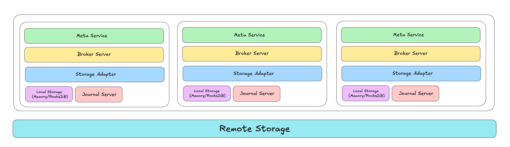
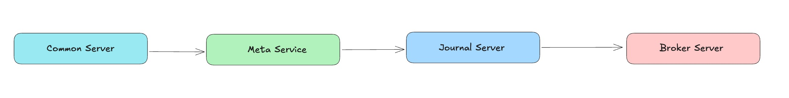

# RobustMQ Overall Architecture Overview

> RobustMQ is a next-generation high-performance multi-protocol message queue built with Rust. Our vision is to become the next-generation cloud-native and AI-native messaging infrastructure. It is not simply "yet another message queue" — rather, it represents a rethink and redesign of message queues for the AI era and cloud-native requirements.

In [RobustMQ: Technical Design Philosophy Overview](02.md), we presented RobustMQ's core technical ideas, covering six key characteristics: high performance, Serverless, plugin-based storage, minimal high-cohesion architecture, compute/storage/scheduling separation, and multi-protocol support. This article details the design and implementation of RobustMQ's overall architecture.

In [Introducing RobustMQ Roles](./03.md), we introduced the concept of node Roles. This article builds on that to analyze RobustMQ's overall architecture design in depth.

## Architecture Overview

The RobustMQ overall architecture is shown in the following diagram:

As shown above, RobustMQ consists of five core modules: Meta Service, Broker Server, Storage Adapter, Journal Server, and the data storage layer:

**1. Meta Service (Metadata and Scheduling Layer)**

Responsible for cluster metadata storage and scheduling management. Main responsibilities include:

- Storage and distribution of Broker and Journal cluster metadata (Topic, Group, Queue, Partition, etc.)
- Control and scheduling of Broker and Journal clusters, including cluster node lifecycle management, configuration storage and distribution, etc.

**2. Broker Server (Message Queue Logic Layer)**

Responsible for parsing and logic processing of different message queue protocols. Main responsibilities include:

- Parsing MQTT, Kafka, AMQP, RocketMQ, and other protocols
- Integrating and abstracting common logic across protocols, handling protocol-specific business logic, and achieving compatibility with multiple message queue protocols

**3. Storage Adapter (Storage Adapter Layer)**

Unifies Topic/Queue/Partition from various MQ protocols into the Shard abstraction, while adapting to different underlying storage engines (such as local file storage Journal Server, remote HDFS, object storage, custom storage components, etc.), implementing plugin-based and pluggable storage. The Storage Adapter routes data to the appropriate storage engine based on configuration.

**4. Journal Server (Persistence Storage Engine)**

RobustMQ's built-in persistence storage engine, using a local multi-replica, segmented persistence storage architecture similar to Apache BookKeeper. Its design goal is to build a high-performance, high-throughput, highly reliable persistence storage engine. From the Storage Adapter's perspective, Journal Server is one of the supported storage engines. This component is designed to satisfy RobustMQ's high-cohesion, no-external-dependencies architecture.

**5. Data Storage Layer (Local/Remote Storage)**

Refers to the actual data storage media, which can be local memory or remote storage services (such as HDFS, MinIO, AWS S3, etc.). This layer is interfaced with by the Storage Adapter.

## Detailed Architecture

The RobustMQ detailed architecture is shown in the following diagram:

As shown above, this is a cluster composed of three RobustMQ Nodes. When using the built-in persistence storage engine Journal Server, no external components are required — a single `./bin/robust-server start` command starts the nodes.

From a single-node perspective, it mainly consists of four parts: Generic Server, Meta Service, Message Broker, and the storage layer:

### Generic Server

Composed of Inner gRPC Server, Admin HTTP Server, and Prometheus Server, providing shared services for Meta Service, Message Broker, and Journal Server:

- **Inner gRPC Server**: For internal communication between multiple RobustMQ Nodes
- **Admin HTTP Server**: Provides a unified HTTP protocol operations interface
- **Prometheus Server**: Exposes metric collection endpoints for monitoring data collection

### Meta Service

The metadata service module within a node. After the Inner gRPC Server starts successfully, Meta Service reads the `meta_addrs` parameter from configuration to obtain all Meta Server Node information, communicates with all nodes via gRPC, and elects a Meta Master node based on the Raft protocol. After election completes, Meta Service can provide external services.

### Message Broker

The core module responsible for message logic processing within a node, adapting multiple message protocols and completing the corresponding logic. This module uses a layered architecture:

**1. Network Layer**

Supports parsing and handling of five network protocols: TCP, TLS, WebSocket, WebSockets, and QUIC.

**2. Protocol Layer**

Above the network layer, responsible for parsing request packet contents of different protocols. Long-term plans support MQTT, Kafka, AMQP, RocketMQ, and other protocols; currently MQTT and Kafka are implemented.

**3. Protocol Logic Layer**

Since different protocols have their own processing logic, this layer provides independent implementations for each protocol, such as mqtt-broker, kafka-broker, amqp-broker, etc., handling protocol-specific business logic.

**4. Message Common Logic Layer**

Message queues, as a vertical domain, are centered on the Pub/Sub model. There is substantial reusable common logic across protocols: message send/receive, message expiry, delayed messages, monitoring, logging, security, Schema, etc. This common code is extracted into independent modules for reuse by all protocols. With this design, as core infrastructure matures, the development cost for adding new protocol support will decrease significantly.

**5. Storage Adapter Layer**

Responsible for adapting different storage engines, mainly:

- Unifying MQTT Topic, AMQP Queue, Kafka Partition, and similar concepts into the Shard abstraction
- Integrating with different storage engines for persistence

### Storage Layer

The actual message storage layer, consisting of two parts:

- **Built-in Storage Engine**: The segmented distributed storage engine Journal Server
- **Third-Party Storage Engines**: Support for external distributed storage systems

## Single-Node Startup Flow

In standalone mode, the component startup order when a node starts is: Generic Server → Meta Service → Journal Server → Message Broker. The flow:

**1. Start Generic Server Layer**

First start the Server layer to establish inter-node communication.

**2. Start Metadata Coordination Service**

Start Meta Service. In a three-node cluster, nodes use the Raft protocol for election to select the Meta Service Master. After election, the cluster metadata layer can provide external services.

**3. Start Built-in Storage Layer**

Start Journal Server. Journal Server uses a cluster architecture and depends on Meta Service for election, cluster formation, metadata storage, etc., so it must wait for Meta Service to be ready before starting.

**4. Start Message Broker Layer**

Start Message Broker. Message Broker relies on Meta Service for cluster formation, election, and coordination. If built-in storage is configured, it also depends on Journal Server for persistence, so it must start last.

## Hybrid Storage Architecture

RobustMQ supports a hybrid storage architecture. Storage engine selection is at Topic granularity, not cluster granularity. During cluster startup or operation, you can configure the cluster default storage engine and also assign different storage engines to different Topics. Choose the appropriate storage scheme based on business characteristics:

**1. Local Persistence Storage Engine**

Suitable for Topics with small data volume, latency sensitivity, and no tolerance for data loss.

**2. Memory Storage Engine**

Suitable for Topics with large data volume, latency sensitivity, and tolerance for minor data loss under extreme conditions.

**3. Remote Storage Engine**

Suitable for Topics with large data volume, latency-insensitive, no tolerance for data loss, and cost sensitivity.

**4. Built-in Journal Server**

Suitable for Topics with large data volume, latency sensitivity, no tolerance for data loss, and cost-insensitive.

Based on observed real-world usage, most scenarios do not require hybrid storage. Even when hybrid needs exist, they are usually isolated at the deployment level. In practice, configuring a single storage engine typically suffices.
