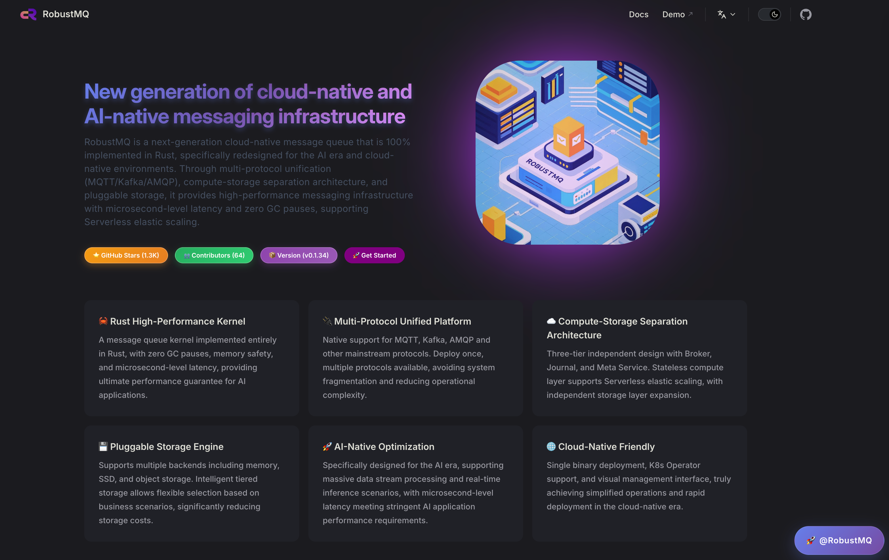

# 🎉 RobustMQ 0.2.0 RELEASE Official Launch

> RobustMQ is a next-generation high-performance multi-protocol message queue built with Rust. Our vision is to become the next-generation cloud-native and AI-native messaging infrastructure. It is not simply "yet another message queue" — rather, it represents a rethink and redesign of message queues for the AI era and cloud-native requirements.

### 🎆 First Official Release

In our previous article "Glad to Have the Chance to Show You Something Different," we expected to release version 0.2.0 in October. In this first RELEASE, we've mainly completed three core module areas:

- **Overall Architecture**: Finalized system and code architecture, completed development of network module, plugin-based storage, observability system, security system, and other foundational components
- **MQTT Protocol**: Full support for MQTT 3.1/3.1.1/5.0 and various advanced features
- **Ecosystem Tools**: Web admin UI, CLI tools, HTTP RESTful API, technical documentation, website, and a complete toolchain

This release largely completes Phase 1 development of the technical vision described in the "Technical Design Philosophy Overview."

### 🏢 Architecture Design Fully Stabilized

The biggest achievement of the past two years is the full stabilization of the overall architecture design. During this time our architecture and code went through many rounds of refactoring. The current architecture and implementation are what we're satisfied with. One command starts the service and brings up the cluster — no external dependencies. This architecture also supports our three biggest characteristics: multi-protocol parsing, plugin-based storage, and Serverless.

The overall architecture is shown below:


We believe that with this architecture, RobustMQ's pace of adding protocol support will accelerate over time. Message queues share many common traits — network layer, observability, even features like delayed messages and message expiry — all reusable. In other words, once we've fully supported one protocol, supporting others will reuse a lot of code.

The six core characteristics from the "Technical Design Philosophy Overview" — **high performance, Serverless, plugin-based storage, minimal high-cohesion architecture, compute/storage/scheduling separation, multi-protocol** — are all well reflected in 0.2.0 and have completed Phase 1 development:

#### 🚀 High-Performance Architecture
- **Rust-based zero-copy design**: No memory copies throughout message processing, significant performance gain
- **Async I/O model**: Tokio-based high-concurrency processing, supports millions of connections per node
- **Cluster deployment**: Multi-node cluster deployment with strong horizontal scaling

#### ☁️ Cloud-Native Architecture
- **Storage-compute separation**: Stateless compute nodes for fast elastic scaling
- **Plugin-based storage**: Supports memory, local storage, object storage, and other storage engines
- **Multi-protocol support**: Unified kernel supports multiple message protocols, reducing operational complexity
- **Container-friendly**: Perfect fit for Kubernetes, supports Docker and Operator deployment

#### 🔧 Minimal Architecture
- **Single-binary deployment**: One file starts the full cluster, no external dependencies
- **Built-in metadata management**: Raft-based distributed consistency, no ZooKeeper
- **Automatic fault recovery**: Node failure detection and recovery, low operational cost

### 📡 MQTT 3/4/5 Full Protocol Support

This release fully implements **MQTT 3.1, 3.1.1, and 5.0** protocol support. This is not just basic protocol parsing — it includes complete feature implementation:

- **Complete MQTT protocol stack**: From connection establishment, subscribe/publish, to session management, every detail strictly follows the protocol
- **Cluster deployment**: Stateless horizontal scaling, perfect fit for Docker and Kubernetes
- **Flexible QoS support**: QoS 0, 1, 2 fully supported for reliable message delivery
- **All MQTT 5 advanced features**: Will messages, retained messages, shared subscriptions, auto-subscribe, delayed publish, exclusive subscriptions, session persistence, offline messages, and more
- **Data bridging**: Supports data import to downstream Kafka, Pulsar, and other message engines

### 🛠️ Complete Ecosystem Tools

In this release we wanted to deliver a complete open-source component, not just a standalone server. So we invested heavily in the Web admin, monitoring UI, CLI, API, documentation, and more. Therefore in this release we provide:

#### 🎛️ Dashboard Admin Interface
RobustMQ MQTT Web admin interface with:
- Real-time cluster status and performance metrics
- Topic, subscription, and client connection management
- Message flow and system resource usage
- Cluster parameter and storage engine configuration

Interface preview:


#### 🔧 Command CLI Tool
Fully featured CLI, for example:
```bash
# View cluster configuration
robust-ctl cluster config get

# View Topic list
robust-ctl mqtt topic list

# View client connections
robust-ctl mqtt client list

# Send test message
robust-ctl mqtt publish --topic test --payload "Hello RobustMQ!"
```

CLI output preview:


#### 🌐 HTTP API

Complete RESTful API for integration with existing ops systems:
```bash
# Get cluster configuration
POST /api/cluster/config/get

# View Topic list
POST /api/mqtt/topic/list

# View MQTT overview
GET /api/mqtt/overview
```

#### 🌐 Website and Documentation
We also provide the main website and comprehensive technical documentation.



### ❓ Production Usage Notice

0.2.0-RELEASE is the first trial version and is not yet suitable for production deployment. We expect to release a production-ready version by year-end. We welcome trials and feedback.

### 🗺️ Future Plans

0.2.0 as the first RELEASE is just a starting point. We have a detailed roadmap:

#### 📋 Short-term (This Year)
- **Foundation module improvements**: Continue improving network module, storage engine, monitoring, etc.
- **MQTT stability**: Improve MQTT protocol stability and reliability
- **Performance**: Further optimize throughput, lower latency, increase connection capacity
- **Feature richness**: Add more MQTT advanced and enterprise features
- **Documentation**: More detailed guides and best practices

#### 🎯 Mid-term (Next Year)
- **AMQP protocol**: RabbitMQ ecosystem compatibility for seamless AMQP migration
- **Multi-tenancy**: Enterprise-grade permissions and resource isolation
- **High availability**: Cross-region deployment and disaster recovery
- **Ops tools**: Stronger monitoring, alerting, and management tools

#### 🌟 Long-term Vision
- **Kafka protocol**: Kafka ecosystem compatibility for true multi-protocol unification
- **AI-native capabilities**: Message processing and intelligent routing optimized for AI scenarios
- **Edge computing**: Lightweight edge node deployment for IoT and edge scenarios
- **Ecosystem**: Rich client SDKs, integration tools, and community

Further out, we'll support more protocols while streamlining and improving the kernel.

### 🚀 Quick Start and Feedback

We welcome you to try RobustMQ 0.2.0 and share feedback.

#### 🚀 Quick Start
```bash
# Download binary
wget https://github.com/robustmq/robustmq/releases/download/v0.2.0/robustmq-0.2.0-linux-amd64.tar.gz

# Extract and run
tar -xzf robustmq-0.2.0-linux-amd64.tar.gz
cd robustmq-0.2.0-linux-amd64
./bin/robust-server start
```

#### 🔗 Links
- **GitHub**: https://github.com/robustmq/robustmq
- **Website**: https://robustmq.com
- **Documentation**: https://robustmq.com/docs
- **Dashboard**: `http://localhost:8080` (after startup)
- **Online Demo**: http://demo.robustmq.com/

#### 📱 Join Us
- **WeChat**: Scan QR code on website to join tech discussion group
- **GitHub Discussions**: Participate in project discussion and planning
- **Contributing**: Contributions of any kind are welcome.

---

**RobustMQ Team**
September 29, 2025
