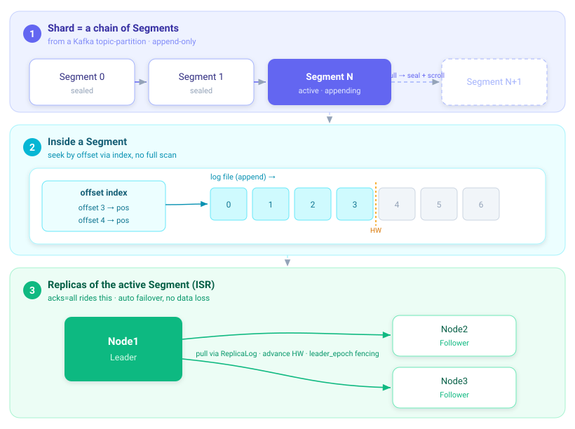

# A Quick Update on What's Been Happening with RobustMQ's Kafka

It's been a while since the last Kafka post, so here's an informal update on what's landed recently.

## Consumer group coordinator pinned to the Raft leader

Both the classic 8-API consumer group protocol and the new KIP-848 protocol are implemented and coexist. Neither needs its own leader-election mechanism — the coordinator role is simply pinned to whichever node is the current meta-service Raft leader. When the Raft leader changes, the coordinator moves with it, for free. No separate coordinator-election protocol to build or debug.

## File Segment storage

The underlying storage is a segment-based append-only log: each shard is split into segments, each segment has an offset index, reads go through mmap, and a segment seals and scrolls to a new one once it hits `max_segment_size`. This is the same storage layer Kafka's log ends up sitting on top of — Kafka doesn't get a bespoke storage engine, it gets mapped onto the same File Segment abstraction everything else uses.

ISR replication is built on top of this same segment layer, so replica catch-up and failover work the same way regardless of which protocol (MQTT, Kafka, etc.) produced the data.

## MQTT and Kafka share storage

Because Kafka's topics and MQTT's topics both come down to the same shard storage underneath, the same topic can be read and written from either protocol. Publish over MQTT, consume over Kafka, or vice versa — there's no translation layer or bridging process, it's the same data.

## No-rebalance elasticity

Kafka's partition reassignment is heavyweight: moving a partition to a new broker means copying all its data. RobustMQ sidesteps this for new capacity — when a new node joins, new segments get placed on it automatically by the meta layer, without needing to rebalance existing partitions across brokers. Scaling out doesn't require the same kind of manual, data-copying reassignment operation.

## What's next

The near-term roadmap is about bridging IoT and big-data workloads, unifying edge and cloud deployments, and continuing to deepen Kafka protocol correctness.
