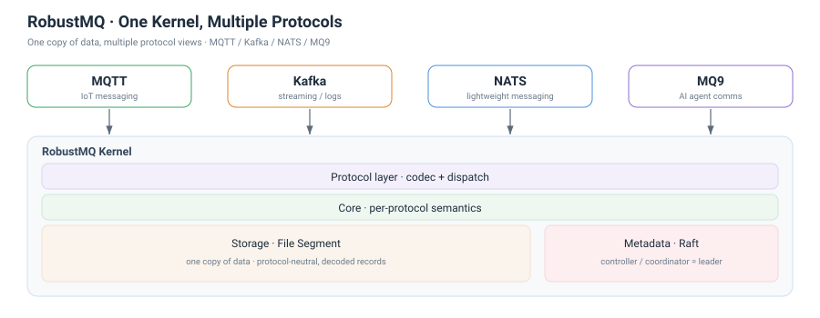
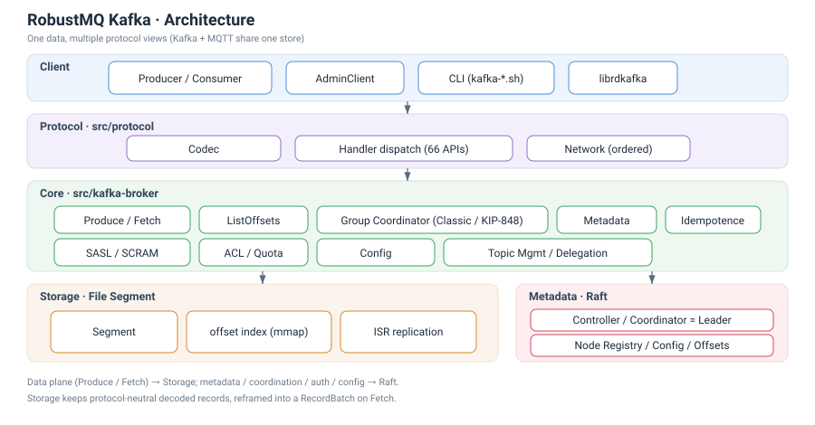
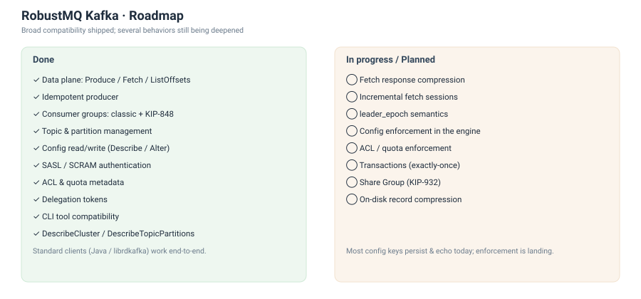

# The Kafka Protocol, Implemented in Rust, Is Here

This is an announcement post: RobustMQ now has a Kafka-compatible protocol layer running on top of its unified kernel. This is not a Kafka rewrite — it's a protocol adapter over the same storage and metadata layer that already serves MQTT.

## What's supported

66 Kafka APIs are implemented and working end to end.

## Current limitations

To be upfront about where this stands today:

- No transactions
- No KIP-932 share groups
- Fetch does not support compression yet
- Permissions and quotas aren't enforced at runtime yet
- No replica-migration or manual-leader-switch admin APIs — these aren't needed in the same way Kafka needs them, since storage and Raft already handle data placement and failover underneath

## Testing done so far

Around 200 integration tests running against a 3-node cluster, tests against real Java Kafka clients, and verification against the official Kafka CLI tools.

## Architecture

Five layers: client → protocol codec → core semantics → File Segment storage → Raft metadata.

## Core technical features

- **Raft-based metadata, no ZooKeeper, no KRaft needed.** RobustMQ already has its own metadata/Raft layer; Kafka's protocol support rides on it directly instead of bringing in a separate metadata system.
- **File Segment storage.** Same segment-based append-only log used across the rest of the system.
- **Both old and new rebalance protocols.** The classic protocol and KIP-848 are both implemented and usable.
- **Segment-level data rebalancing instead of partition reassignment.** New capacity gets new segments placed on it, rather than requiring existing partition data to be copied around.
- **ISR replication with epoch fencing.** Standard correctness guarantees around replica catch-up and leader epochs.
- **Rust plus an append-only design for performance.**

## What's next

AMQP is next up — it's another data point for validating the "one kernel, many protocols" architecture, this time against a protocol with a very different consumption model than Kafka or MQTT.

Beyond that, there's mq9 — not a compatibility layer for an existing standard, but a brand-new protocol built specifically for AI agent communication.
