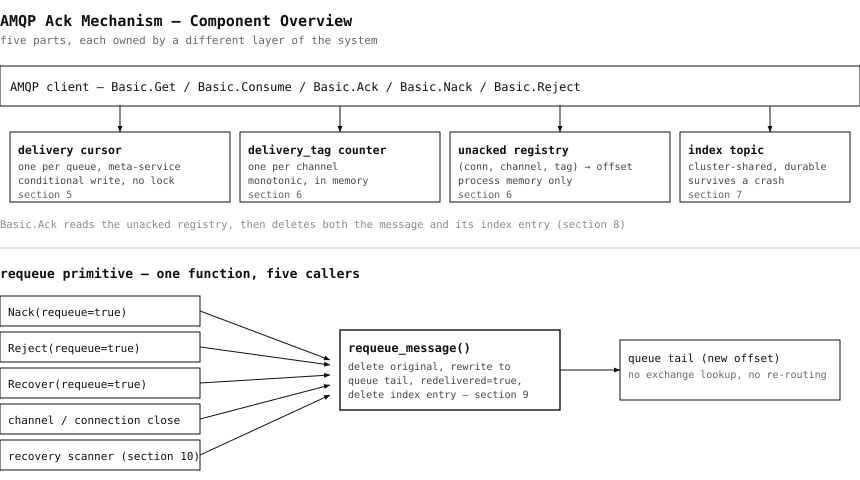
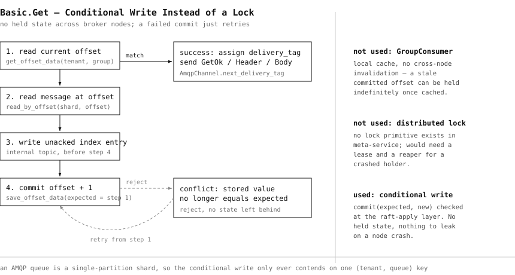
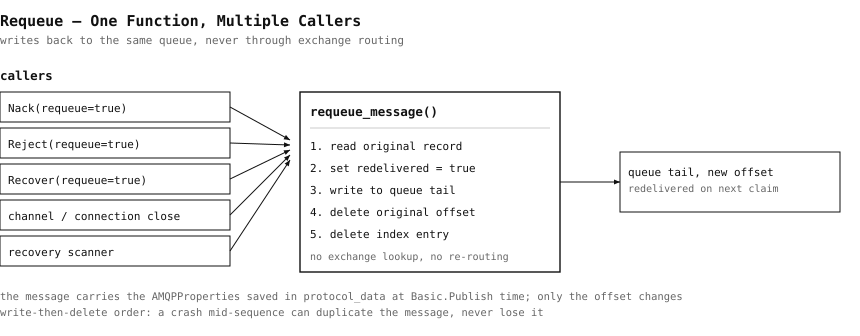
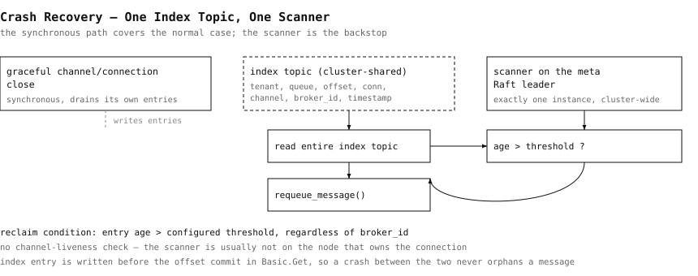

# How AMQP's Ack Maps Onto RobustMQ's Storage Model

AMQP doesn't have a concept of a message ID the way Kafka has an offset or MQTT has a packet ID. `delivery_tag` is channel-scoped and broker-assigned, there's a no-ack mode, and there's no consumer-group concept for competing consumers — if you want fanout, you get it at the exchange level instead.

This post walks through how we landed on the current design for AMQP acknowledgment, including the approaches we tried and rejected along the way.

## What didn't work

**Connection-pinned cursor.** The first instinct was to give each connection its own read cursor. This is wrong: if two connections subscribe to the same queue, each one would receive every message — that's fanout behavior, not competing-consumer behavior, and it's not what AMQP `Get`/`Consume` semantics call for.

**`GroupConsumer` from storage-adapter.** This is the mechanism MQTT persistent sessions already use, so reusing it was tempting. But its local cache has no cross-node invalidation — if the cursor moves on one node, another node's local cache doesn't know about it until it's stale, and it stays stale until a restart clears it. That's not a brief window of staleness, it's indefinite, which makes it unusable for shared progress.

**A real distributed lock via meta-service.** We looked at whether meta-service could provide an actual lock primitive. It doesn't have one, and building one would mean heartbeats and lease management — a lot of machinery for what's fundamentally a low-QPS operation.

## What we landed on: conditional writes

Instead of locking, `Get` does a compare-and-swap on the offset cursor: the caller submits the old cursor value along with the new value, meta-service validates that the old value still matches before committing the write, and if it doesn't match, the caller re-reads and retries. Because AMQP `Get` QPS is low, there's no need for backoff on retry.

## Tracking unacked messages

Two places track an unacked message:

1. An in-memory table keyed by `(connection_id, channel_id, delivery_tag)`, mapping to `(tenant, queue, offset)`.
2. A persistent index written to an internal shared topic. Each entry is self-describing: tenant, queue, offset, connection_id, channel_id, broker_id, timestamp.

Ordering matters here: the index entry is written **before** the offset cursor commits. If we did it the other way around, a crash between the cursor commit and the index write would leave a message that's been skipped past with no index entry pointing back to it — effectively lost from the recovery path.

The index covers both durable and non-durable queues, because message data storage doesn't currently differ based on the `durable` flag — that's a pre-existing gap we didn't fix in this pass.

## Ack does two deletes

Acking a message deletes it twice: once from the queue shard via `delete_by_offsets`, and once from the persistent unacked index. This is different from Kafka, where committing is a single bookmark move — AMQP's per-message ack model means there's genuinely two pieces of state to clean up per message, not one.

## Requeue

`requeue_message` is one shared function with five call sites: `Nack`, `Reject`, `Recover` (all with `requeue=true`), channel/connection close, and the crash-recovery scanner.

It writes a new copy of the message to the queue tail **before** deleting the old offset — crash-safe ordering, where the worst case is an acceptable duplicate rather than data loss. Requeue explicitly does not re-run exchange routing logic; the message goes back to the same queue it came from, not back through direct/fanout/topic/headers routing again.

## Crash recovery

Graceful channel or connection close does synchronous cleanup of any unacked messages it owns.

For the ungraceful case, a single scanner process — pinned to the current meta-service Raft leader, the same placement pattern used for the Kafka coordinator — periodically scans the shared index topic for entries older than a configured threshold and requeues them. It does this regardless of which `broker_id` an entry was originally tagged with, since the scanner is likely not running on the same node as the original connection anyway.

## Where things stand

Done and unit-tested: exchange/queue CRUD, real routing (direct/fanout/topic/headers, including exchange-to-exchange chaining), `Basic.Publish` property passthrough, and the full ack/unack mechanism described above.

The biggest known gap: `Basic.Consume` isn't integrated with this shared cursor/unacked mechanism yet — it still uses its own local read cursor with no ack support. That means `Get` and `Consume` on the same queue don't currently share progress. That's the next thing to fix.
