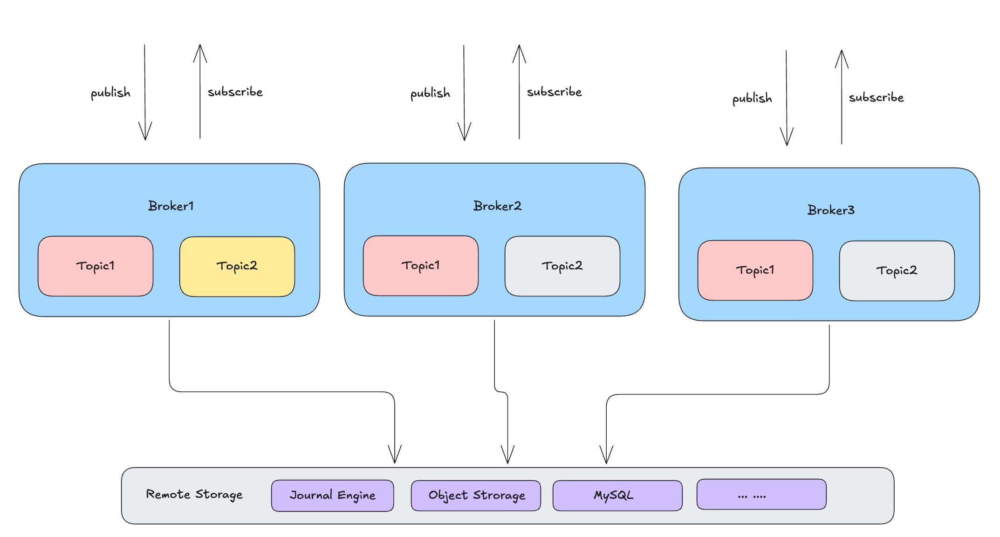
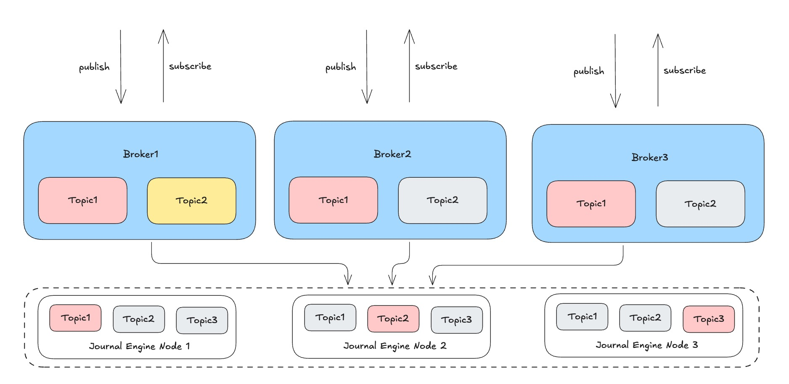

# RobustMQ MQTT Storage Model

### Offline Messages

By default, when clients subscribe to data in a Topic, an in-memory distribution mechanism is used. When the Broker receives Topic data, it first checks whether the Topic is already subscribed. If it is subscribed, the message is pushed directly to subscribers; if not, the message is discarded.

This behavior fits common MQTT use cases where only the latest data is retained. For example, when a sensor device goes offline and comes back online, it only needs to receive the latest control instructions, not historical ones.

However, in many real-world scenarios, when subscribers go offline and then reconnect, they need to receive all data produced during the offline period and consume it in order. The default handling strategy cannot meet this requirement, so the concept of offline messages was introduced.

Offline messages mean that when a Topic receives data, the data is persisted regardless of whether any subscribers are online. When subscribers reconnect, the system pushes data from the offline period to clients in order.

RobustMQ supports offline messages and allows this feature to be enabled through configuration. Offline message configuration has two levels: Topic and Cluster; Topic-level configuration takes precedence over Cluster-level.

```
[mqtt_offline_message]
enable = true
```

### Read-Write Model

The MQTT read-write model is shown in the figure below. In a cluster deployment, each client can connect to any Broker node and publish or subscribe to any Topic. For example, clients can publish and subscribe on Broker1, Broker2, or Broker3. Thus, from a technical perspective, every Broker node needs to be able to read and write complete Topic data.



This means that after data is written to Broker1, clients connected to Broker2 or Broker3 should also be able to subscribe to the latest data from that Topic. Therefore, in a cluster deployment, the problem of data synchronization across multiple nodes must be solved.

From an implementation perspective, there are mainly two approaches:
1. Distribute data to all Broker nodes
2. Implement centralized read-write through a unified storage engine

These two approaches essentially address the same problem with similar implementation ideas. Considering that RobustMQ supports a pluggable storage model and will support multiple storage engines in the future, we chose the second approach technically.

### Storage Model

In standalone deployment mode, RobustMQ MQTT supports Memory and RocksDB storage engines. Note that these two storage engines are only suitable for standalone deployment. If used in cluster mode, subscribers will not receive messages, because Topic messages are not synchronized across nodes.

In standalone deployment, the main difference between Memory and RocksDB storage engines is whether they support persistence. Since standalone mode is usually only for development and testing, not production, the difference in persistence is not significant.

> **Design Consideration**: In practice, the necessity of supporting both Memory and RocksDB engines is debatable. For standalone testing, the RocksDB engine can meet most needs—it supports persistence and covers various test scenarios. Therefore, the Memory type may be removed in future versions. As for adding inter-node synchronization for these two engines, that would introduce data consistency complexity and conflict with the compute-storage separation architecture, so we are not considering it.

In cluster deployment mode, RobustMQ MQTT supports remote storage engines such as Journal Engine, S3, MySQL, and Redis. Data is written directly to these remote storage systems, so all Broker nodes can access complete data.

The cluster deployment architecture must rely on a remote storage system to achieve data synchronization across nodes. To reduce dependency on external storage systems, RobustMQ provides the built-in distributed storage engine Journal Engine to synchronize data across nodes.



In cluster mode, the data flow is as follows:

**Data write flow**:
- Clients connect to any Broker node
- The Broker writes data to remote storage (e.g., Journal Engine) through the Storage Adapter (pluggable storage layer)
- After remote storage write completes, the Broker returns a write-success response to the client

**Data consumption flow**:
- Clients connect to any Broker node to subscribe to data
- The Broker reads data from remote storage (e.g., Journal Engine) through the Storage Adapter (pluggable storage layer)
- The Broker pushes the read data to clients

In summary, for standalone testing, we essentially only need to keep the RocksDB storage engine. It supports persistence and meets various test scenario needs.

### MQTT and Journal Engine

In cluster mode, RobustMQ MQTT requires at least Journal Engine to be enabled as the storage engine—i.e., the storage layer must be configured as Journal Engine—for the system to work properly. Of course, other storage engines such as S3 can be used based on actual needs.

Journal Engine is designed for MQTT's fast distribution scenario and supports two storage mechanisms:

**Memory storage**:
- Data is written to the memory of a Journal Engine node
- Data is read directly from that node; data is not persisted
- Suitable for fast distribution scenarios similar to NATS with optimal performance

**File storage**:
- Data is persisted to disk files
- Suitable for scenarios requiring data reliability guarantees

Users can configure Journal Engine's storage mode based on actual needs, trading off between high performance and data persistence. Memory storage mainly addresses fast distribution performance, while file storage guarantees data reliability.

**Data mapping**:
- One MQTT Topic corresponds to one Shard in Journal Engine
- Topic data is stored sequentially within the Shard
- Both writes and reads are sequential, ensuring message ordering
