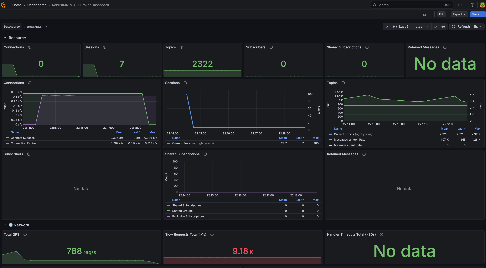
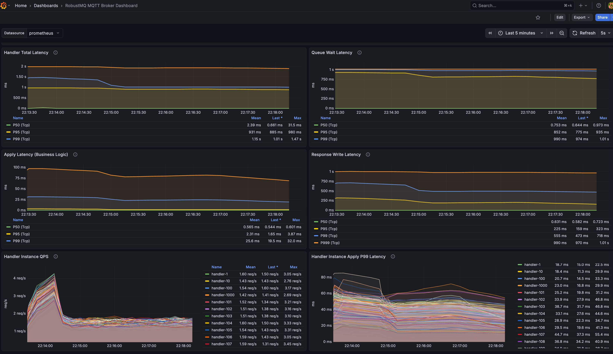
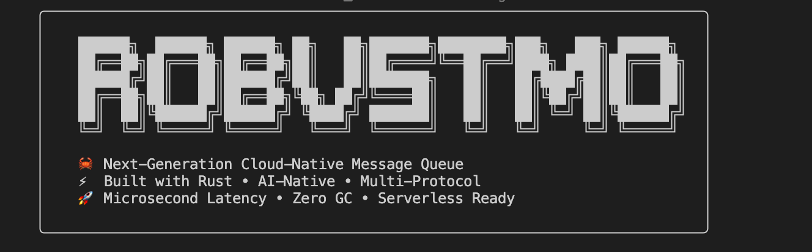
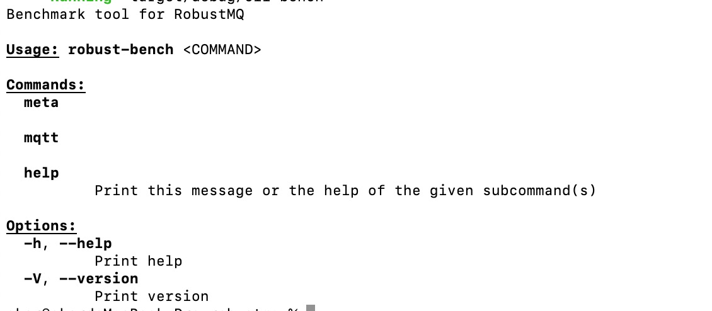

# RobustMQ 0.3.0 RELEASE Officially Released

RobustMQ 0.3.0 is officially released today. This is an important milestone—not just a feature update, but a re-examination of RobustMQ's overall positioning and architecture.

> **Note**: 0.3.0 is still in early stage and not recommended for production use. We plan to reach production-ready standard in 0.4.0, expected around May. We welcome early adoption and feedback to help us iterate faster.

## Redefining RobustMQ

Starting with 0.3.0, RobustMQ's positioning is clearer: **next-generation unified communication infrastructure for AI, IoT, and big data.**

Specifically: RobustMQ is a Rust-built, unified communication platform designed for AI, IoT, and big data scenarios. With dual protocols (MQTT and Kafka), million-scale Topics, object storage (S3/MinIO, etc.) as data source, multi-mode storage (memory/hybrid/persistent/tiered), and intelligent data caching, it provides high-performance, low-cost, reliable communication for AI training, Agent communication, IoT (edge and cloud), and big data processing.

Why this positioning? After over a year of development, I increasingly see that existing communication middleware targets single scenarios. Kafka is built for big data log streams and can't support million-scale Topics or AI training data caching. EMQ targets IoT device connectivity and lacks high-throughput stream processing. Neither considers AI-era needs like Agent communication and GPU training data acceleration.

RobustMQ's opportunity: design for these scenarios from the start, not bolt them on later. 0.3.0 is the first step in that direction.

## Minimal Architecture: Three Components


0.3.0 has a redesigned architecture. The system consists of three components:

**Meta Service** manages cluster metadata and coordination. Node state, Topic config, client sessions are stored in Meta Service, with consistency and HA guaranteed by a custom Multi Raft mechanism.

**Broker** handles protocol processing and request routing. Brokers are stateless—only connection handling, protocol parsing, message routing. No persistent data. This storage-compute separation lets Brokers scale horizontally; adding nodes doesn't require data migration.

**Storage Engine** handles data persistence. It supports three engines: Memory (pure memory, microsecond latency), RocksDB (unified KV, million-scale Topics), and File Segment (sequential write, high throughput for Kafka-style workloads). Protocol and storage are connected via a pluggable interface for future storage backends.

The architecture is **fixed**. Component boundaries are clear and won't shift for new protocols or storage. Adding a protocol means implementing parsing in the Broker layer; adding storage means implementing the Storage Engine interface. Core architecture stays stable.

**Multi Raft** is a major 0.3.0 investment. Meta Service uses a custom Multi Raft with independent Raft groups; different metadata types can be managed by different groups, avoiding a single Raft bottleneck. This supports future large-scale deployment.

## MQTT Broker Core Functionality Complete

0.3.0 marks an important point for the MQTT Broker: core functionality covers the main production MQTT scenarios.

This includes: full MQTT 3.x and 5.0 support (connect/disconnect/keep-alive/will/retain, QoS 0/1/2), session persistence and recovery, shared subscription, topic rewrite and filtering, auth and ACL (username/password), offline message storage, delayed messages, and basic rule engine.

In practice: common IoT scenarios can run on RobustMQ's MQTT Broker today. Stability, ops tooling, and ecosystem integration still need work, but core protocol features are in place.

## Code Quality: Multiple Refactors and Bug Fixes

0.3.0 includes substantial behind-the-scenes engineering.

The codebase has undergone multiple refactors: connection management from a single implementation to an extensible abstraction; storage engine decoupled into pluggable interfaces; gRPC client layer with retry and timeout; Handler layer with per-Handler monitoring.

Stability improvements: fixed several race conditions under high concurrency, edge-case bugs in session recovery, and memory growth with many connections. Performance: optimized connection establishment, reduced unnecessary gRPC calls; Handler timeout prevents task stalls from killing throughput.

These changes don't add features but determine whether the system can run reliably in production.

## Ecosystem Tooling

A messaging system's success depends on more than core features—supporting tools matter. 0.3.0 improves tooling in six areas:

**1. Grafana + Prometheus**: Built-in metrics for connections, message throughput, Handler latency, gRPC latency, storage read/write, queue backlog. Ready-to-use Grafana dashboards can be imported to see full system state without custom setup.

<div align="center">
  
  
</div>

**2. Command CLI**: Command-line management for cluster status, Topic management, client sessions, user permissions. All admin actions can be done from the CLI.



**3. HTTP API**: REST API for cluster management, Topic ops, user management, rule engine config, integrating with existing ops platforms and automation scripts.

**4. Bench CLI**: Built-in benchmarking for MQTT connect, publish, subscribe. Parameters include concurrency, message rate, payload size, duration—useful for validating performance and stability after deployment.



**5. RobustMQ Dashboard**: Web console for cluster overview, node status, Topic list, client connections, rule engine config. Lowers ops barrier for visual management.

<div align="center">
  
  
</div>

**6. Website and docs**: Reworked site structure and docs covering quick start, architecture, config reference, API, benchmarking—lowering onboarding friction. Docs are kept in sync with code.

## Roadmap

0.3.0 is a starting point. Next steps:

**Performance and stability.** MQTT connection path has clear optimization potential; Meta Service Raft write throughput is a bottleneck; storage read/write haven't been deeply tuned. These will continue.

**MQTT feature completion.** Full rule engine, Webhook integration, admin API, and monitoring dashboards are needed for production MQTT use.

**AI MQ features.** Topic-direct object storage (S3/MinIO as source), three-tier intelligent cache (memory/SSD/object storage), predictive prefetch for multi-epoch training—RobustMQ's main differentiators from other message queues.

**Kafka features.** Full Kafka protocol implementation so existing Kafka clients and tooling (Flink, Spark, Kafka Connect) connect without changes. Shared subscription to break Partition-based concurrency limits.

---

## How to Use

RobustMQ aims for minimal deployment—no external dependencies; three commands for a full cluster.

**One-command install and start**—after the install script, run directly; no JVM, ZooKeeper, or other dependencies:

```bash
curl -fsSL https://raw.githubusercontent.com/robustmq/robustmq/main/scripts/install.sh | bash
broker-server start
```

With the cluster up, verify with any MQTT client:

```bash
mqttx pub -h localhost -p 1883 -t "test/topic" -m "Hello RobustMQ!"
mqttx sub -h localhost -p 1883 -t "test/topic"
```

Or open the Web console at `http://localhost:8080` to view cluster status.

Quick start guide: https://robustmq.com/QuickGuide/Overview.html

---

0.3.0 marks RobustMQ's move from "finding direction" to "advancing steadily with clear direction." Architecture is fixed; positioning is clear; next is deepening and stabilizing each area.

Project: https://github.com/robustmq/robustmq

Welcome to try it and share feedback.
