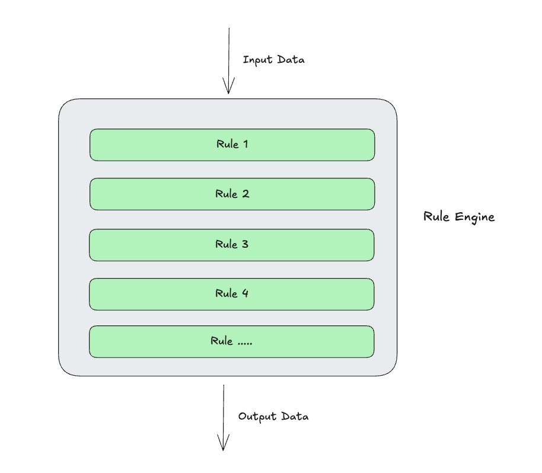
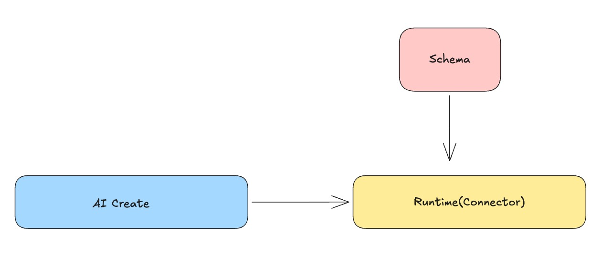

# RobustMQ Rule Engine and AI Integration: Technical Design and Boundary Thinking

The core motivation for planning a rule engine in RobustMQ comes from the MQTT use case. When device messages arrive at the Broker, they often need immediate filtering, field cleansing, format conversion, and simple routing. Pushing all of that out to external systems quickly raises both pipeline complexity and operational overhead. In edge scenarios especially, attaching a heavy stream-processing system is too costly — this capability is a hard requirement, not an option.

This isn't unique to MQTT; it's a common need across all types of MQ. The rule engine's position is clear: it doesn't replace systems like Flink, doesn't do heavy stateful computation — it provides a lightweight, controllable layer of simple processing directly inside the Broker.

It also works naturally with RobustMQ's built-in AI capabilities: the rule engine handles stable execution within defined boundaries, AI lowers configuration overhead and generation cost, forming a closed loop of "controlled execution + fast generation."

## What It Is

The rule engine is fundamentally a lightweight built-in ETL capability — not a standalone large-scale compute system. It solves the "process in place" problem after a message enters the Broker: completing basic filtering, field cleansing, format conversion, and route rewriting before delivering to downstream.

As shown in the diagram below, the design is a chain-processing model: data flows through operators in a defined order, ultimately producing a processed result or being dropped.

{width=75%}

At runtime, it works alongside Connectors — each Connector's per-message processing runs through the rule engine pipeline to transform the data, then the Connector writes the result to the downstream.

In code, it looks like a JSON configuration: an ETL Rule chain, i.e., the processing pipeline in `ops`. Every message passes through this rule. Example:

```json
{
  "id": "rule-temp-normalize-v1",
  "name": "Temperature data cleansing",
  "enabled": true,
  "match": {
    "protocols": ["mqtt"],
    "topics": ["devices/+/telemetry"]
  },
  "ops": [
    {
      "type": "filter",
      "expr": "payload.device_id != null && payload.temp != null"
    },
    {
      "type": "set",
      "field": "payload.temp_f",
      "expr": "double(payload.temp) * 1.8 + 32.0"
    },
    {
      "type": "delete",
      "fields": ["payload.raw_bytes"]
    }
  ],
  "on_error": {
    "strategy": "deadletter",
    "topic": "$rule/rule-temp-normalize-v1/deadletter"
  }
}
```

This combination of "lightweight ETL + strongly constrained model" reduces system complexity. Many simple processing tasks that previously required external orchestration frameworks can now close the loop directly inside the Broker. Fewer system components, shorter pipelines, fewer failure points — while rule governance capability doesn't degrade. That's the real architectural value of the rule engine.

## How It Works

From an engineering standpoint, the rule engine is split into three layers: Runtime, Schema, and AI.

{width=75%}

AI translates natural-language requirements into structured rules. Runtime lives inside the Connector and handles deterministic per-message processing. Schema enforces constraints on rule structure, field types, and operator parameters. The value of three-layer separation is clear boundaries: the execution path only cares about stability, rule definitions only care about conformance, and the interaction entry point only cares about usability — they collaborate without polluting each other.

In the execution path, the Connector reads a message, first performs `match` evaluation, then executes operators in `ops[]` order, and finally hands the result back to the Connector to write downstream. There's no separate `sink` because the output destination is determined by the Connector context. This design embeds the rule engine stably into the existing data path without introducing a new routing control plane, avoiding the conflicts that arise from having both "rule config" and "Connector config" control routing.

Execution semantics are stateless and per-message — no dependency on external session context. This makes behavior predictable, latency controllable, and failure boundaries clean. It also enables reuse of the same execution core across MQTT, Kafka, and future protocols. For edge scenarios this is especially important, since resource-constrained environments need simple, stable, low-overhead execution models.

On operator implementation strategy, dynamic expressions and structural transforms are handled separately. Operators like `filter` and `set` that need expression capabilities use a constrained expression engine; structural operators like `rename`, `delete`, and `decode` use fixed logic. This preserves necessary expressiveness without scripting all logic — which would cause debugging complexity, performance variability, and semantic drift. The result is an implementation framework that is "extensible in rules, controllable in execution, and governable in practice."

## How AI Integrates: Generation Decoupled from Execution

The core of AI + rule engine integration is "generation decoupled from execution." AI converts natural-language requirements into rule configurations; the runtime executes only rules that have passed validation — no model inference on the execution path. This preserves AI's efficiency advantage while maintaining the determinism required in Broker scenarios.

The key is Schema constraints. Natural-language input can be flexible, but the final configuration must satisfy structural, type, and operator semantic constraints. In other words, AI produces candidate rules — not directly executable results. Only after Schema validation and test verification does a rule enter the publication flow.

The overall flow stays: "generate → validate → test → activate." Generation failures return correctable error messages; if test results don't match expectations, iteration continues. AI lowers the expression barrier. Schema enforces legality. Runtime ensures deterministic execution. Together, these three achieve "complex tasks naturally expressed, production behavior strictly controlled."

## What the Boundary Is: No Stateful Stream Computation

The rule engine's boundary must be defined upfront: it focuses on stateless, per-message processing — filtering, field transforms, format normalization, routing decisions. It doesn't handle windowed aggregation, multi-stream joins, or complex CEP. This isn't a capability limitation — it's a deliberate architectural tradeoff.

Without clear boundaries, the system will accumulate "looks more powerful" features short-term, but will develop semantic conflicts, uncontrollable resource usage, and unpredictable performance long-term. Inside a Broker core especially, any uncontrolled state complexity amplifies operational risk. Keeping high-frequency stateless capability in the core and delegating complex stateful computation to specialized systems is a more stable and sustainable division of responsibility.

From a product perspective, clear boundaries have another practical meaning: they determine whether the system can run stably at both edge and cloud. The core rule engine must stay lightweight, deployable, and observable to become a default capability — not a heavyweight component usable only in heavy scenarios.

## Target Form: Capability Shape and Goal

The target isn't to add a rule page — it's to use RobustMQ's built-in MCP Server as the unified entry point, letting users generate executable data processing tasks directly through natural language. The emphasis isn't on simple rules — multi-step operator chains, conditional logic, field mapping, and format conversion should all be stably generatable.

The overall flow stays: "natural language input → structured rule generation → Schema validation → test verification → Runtime execution." For users, the entry point is simple. For the system, the output is still strictly structured configuration. This lowers the barrier for complex task configuration while ensuring determinism and traceability in production execution.

The ultimate goal: complex tasks can be naturally expressed, the processing pipeline is generated and activated inside the Broker, reducing external system dependencies, while execution remains strictly controllable. This is the long-term value of combining the rule engine with AI — reliably delivering data processing capability at scale.

Project: [https://github.com/robustmq/robustmq](https://github.com/robustmq/robustmq)
