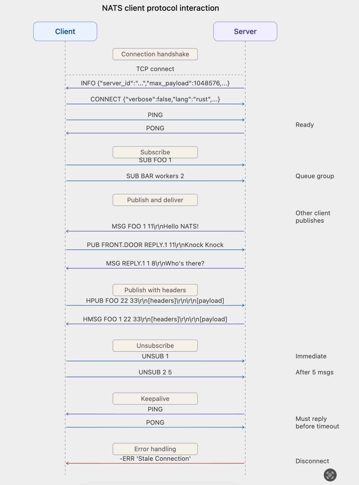

# NATS Client Protocol Reference

NATS is a lightweight, high-performance messaging system whose client protocol is designed with extreme simplicity: a pure text protocol over TCP, where each command ends with `\r\n` (CRLF), fields are separated by whitespace (spaces or tabs), and multiple consecutive whitespace characters are treated as a single separator. Operation commands are case-insensitive, but Subject names are case-sensitive.

This article fully describes the NATS client protocol's handshake flow, all command formats, Subject naming rules and wildcards, error codes, and keep-alive mechanism.

## Connection Handshake

After a client connects to the server, the handshake proceeds in the following order:

```
Server → Client:  INFO {...}\r\n
Client → Server:  CONNECT {...}\r\n
Client → Server:  PING\r\n
Server → Client:  PONG\r\n
```

Upon receiving `INFO`, the client responds with `CONNECT` to complete authentication and capability declaration. The client then proactively sends `PING`; only after receiving the server's `PONG` is the connection truly ready and normal Pub/Sub operations can begin. This PING/PONG exchange ensures the communication link between both sides is fully operational.

Below is the complete interaction sequence diagram for the NATS client protocol, covering the full flow of connection handshake, subscription, publish delivery, Header messages, unsubscription, keep-alive heartbeats, and error handling:



## Command Reference

## INFO

The server immediately sends `INFO` upon accepting a connection, informing the client of its capabilities and connection requirements.

**Format:**

```
INFO {<json>}\r\n
```

**Example:**

```
INFO {"server_id":"Zk0GQ3JBSrg3oyxCRRlE09","server_name":"my-nats","version":"2.10.0","proto":1,"host":"0.0.0.0","port":4222,"headers":true,"auth_required":false,"tls_required":false,"tls_available":false,"max_payload":1048576,"jetstream":false}\r\n
```

**JSON Field Descriptions:**

| Field | Type | Required | Description |
| ---- | ---- | -------- | ---- |
| `server_id` | string | Yes | Unique identifier for the server node |
| `server_name` | string | Yes | Server node name |
| `version` | string | Yes | NATS Server version number |
| `go` | string | Yes | Go version used to compile |
| `host` | string | Yes | IP address the server is listening on |
| `port` | int | Yes | Port the server is listening on |
| `headers` | bool | Yes | Whether message Headers (HPUB/HMSG) are supported |
| `max_payload` | int | Yes | Maximum allowed Payload size in bytes |
| `proto` | int | Yes | Protocol version; `1` indicates support for dynamic INFO updates and Echo |
| `auth_required` | bool | No | Whether client authentication is required |
| `tls_required` | bool | No | Whether a TLS encrypted connection is required |
| `tls_verify` | bool | No | Whether the client is required to present a certificate |
| `tls_available` | bool | No | Whether the server optionally supports TLS |
| `client_id` | uint64 | No | Internal client ID assigned by the server |
| `client_ip` | string | No | Client's IP address |
| `nonce` | string | No | Random nonce for NKey authentication |
| `cluster` | string | No | Cluster name |
| `domain` | string | No | NATS domain |
| `connect_urls` | []string | No | List of other node addresses in the cluster, for client reconnection |
| `ws_connect_urls` | []string | No | WebSocket connection address list |
| `ldm` | bool | No | Whether the server is in Lame Duck mode (about to shut down) |
| `jetstream` | bool | No | Whether JetStream is supported |
| `git_commit` | string | No | Git commit hash of the build |
| `cluster_dynamic` | bool | No | Whether the cluster supports dynamic routing; only present when cluster routes are configured |
| `xkey` | string | No | Server's X25519 public key for message-level encryption (NKey encryption extension); not used in standard deployments |

When `proto >= 1`, the server may push new `INFO` messages at any time after the connection is established. The client should continuously listen and update its local cluster topology information.

## CONNECT

After receiving `INFO`, the client must respond with `CONNECT` to complete the handshake, providing authentication information and capability declarations.

**Format:**

```
CONNECT {<json>}\r\n
```

**Example:**

```
CONNECT {"verbose":false,"pedantic":false,"tls_required":false,"name":"my-client","lang":"go","version":"1.34.0","protocol":1,"echo":true,"headers":true}\r\n
```

**JSON Field Descriptions:**

| Field | Type | Required | Description |
| ---- | ---- | -------- | ---- |
| `verbose` | bool | Yes | Whether to enable `+OK` acknowledgment responses; setting to `false` reduces unnecessary traffic |
| `pedantic` | bool | Yes | Whether to enable strict format validation |
| `tls_required` | bool | Yes | Whether a TLS connection is required |
| `lang` | string | Yes | Client implementation language, e.g. `go`, `rust`, `java` |
| `version` | string | Yes | Client library version number |
| `name` | string | No | Client name, used in server logs |
| `protocol` | int | No | Protocol version; `1` indicates support for dynamic INFO updates |
| `auth_token` | string | Conditional | Used for token-based authentication |
| `user` | string | Conditional | Used for username/password authentication |
| `pass` | string | Conditional | Password, used together with `user` |
| `echo` | bool | No | Whether to echo messages published by this client back to its own subscriptions; default `true` |
| `sig` | string | Conditional | Signature of the `nonce`, used for NKey authentication |
| `jwt` | string | No | User JWT for access control |
| `nkey` | string | No | NKey public key |
| `no_responders` | bool | No | Whether to enable the feature that immediately returns an error when there are no subscribers |
| `headers` | bool | No | Whether message Headers are supported |

## PUB

The client publishes a message to the server.

**Format:**

```
PUB <subject> [reply-to] <#bytes>\r\n[payload]\r\n
```

**Fields:**

| Field | Description |
| ---- | ---- |
| `subject` | Target Subject for the message (required) |
| `reply-to` | Optional reply address; subscribers can respond to this Subject |
| `#bytes` | Number of bytes in the Payload (required; use `0` for no content) |
| `payload` | Message content, immediately following the control line, ending with `\r\n` |

**Examples:**

```
# Publish a message
PUB FOO 11\r\n
Hello NATS!\r\n

# Publish with reply-to
PUB FRONT.DOOR JOKE.22 11\r\n
Knock Knock\r\n

# Empty Payload
PUB NOTIFY 0\r\n
\r\n
```

## HPUB

Publish a message with custom Headers; Header format is the same as HTTP/1.

**Format:**

```
HPUB <subject> [reply-to] <#header bytes> <#total bytes>\r\n[headers]\r\n\r\n[payload]\r\n
```

The Header section begins with `NATS/1.0\r\n`, followed by key-value pairs in `Name: Value\r\n` format, ending with a blank line (`\r\n`).

**Example:**

```
HPUB FOO 22 33\r\n
NATS/1.0\r\n
Header: value\r\n
\r\n
Hello NATS!\r\n
```

Here `#header bytes` = `22` (length of the Header section including the trailing blank line) and `#total bytes` = `33` (total length of Header + Payload).

## SUB

The client subscribes to a Subject.

**Format:**

```
SUB <subject> [queue group] <sid>\r\n
```

**Fields:**

| Field | Description |
| ---- | ---- |
| `subject` | Subject to subscribe to; supports wildcards |
| `queue group` | Optional queue group name; only one subscriber in the same queue group receives each message |
| `sid` | A subscription ID unique within this connection; at the protocol level it is a string type (not limited to numbers); used to identify subscriptions in subsequent UNSUB and message delivery |

**Examples:**

```
# Normal subscription
SUB FOO 1\r\n

# Queue group subscription
SUB BAR workers 44\r\n

# sid can be any string
SUB BAZ my-sub-id\r\n
```

## UNSUB

Unsubscribe, or set an automatic unsubscription after receiving N messages.

**Format:**

```
UNSUB <sid> [max_msgs]\r\n
```

**Examples:**

```
# Unsubscribe immediately
UNSUB 1\r\n

# Auto-unsubscribe after receiving 5 more messages
UNSUB 1 5\r\n
```

## MSG

The server pushes a message to a subscriber.

**Format:**

```
MSG <subject> <sid> [reply-to] <#bytes>\r\n[payload]\r\n
```

**Examples:**

```
# Without reply-to
MSG FOO.BAR 9 11\r\n
Hello World\r\n

# With reply-to
MSG FOO.BAR 9 GREETING.34 11\r\n
Hello World\r\n
```

## HMSG

The server pushes a message with Headers.

**Format:**

```
HMSG <subject> <sid> [reply-to] <#header bytes> <#total bytes>\r\n[headers]\r\n\r\n[payload]\r\n
```

The Header format is the same as HPUB, beginning with `NATS/1.0\r\n`.

The Header status line can carry a status code and description text in addition to `NATS/1.0`. For example, when a client has set `no_responders: true` in `CONNECT` and performs a request-reply to a Subject with no subscribers, the server returns:

```
HMSG FOO 1 16 16\r\n
NATS/1.0 503\r\n
\r\n
\r\n
```

Here `503` means No Responders; the client can immediately know there is no available server rather than waiting for a timeout.

## PING and PONG

Used for connection keep-alive and connection readiness confirmation.

**Format:**

```
PING\r\n
PONG\r\n
```

PING/PONG serves two purposes:

1. **Connection readiness confirmation**: During the handshake, after the client sends `CONNECT` it proactively sends `PING`; upon receiving `PONG` the connection is confirmed ready.
2. **Connection keep-alive**: The server sends `PING` to the client at fixed intervals; the client must respond with `PONG` within the timeout, or the server will close the connection with a `Stale Connection` error. The client can also proactively send `PING`, and the server will respond with `PONG`. Normal data traffic (such as PUB) also resets the keep-alive timer.

## +OK and -ERR

Server protocol responses.

**Format:**

```
+OK\r\n
-ERR '<error message>'\r\n
```

`+OK` is only sent when `verbose: true` is set in `CONNECT`, to acknowledge each received protocol message. By default, clients set `verbose: false` to avoid unnecessary traffic.

`-ERR` falls into two categories: errors that close the connection and errors that preserve it.

**Connection-closing errors:**

| Error Message | Description |
| -------- | ---- |
| `Unknown Protocol Operation` | An unrecognized command was received |
| `Attempted To Connect To Route Port` | Client mistakenly connected to the cluster's internal port |
| `Authorization Violation` | Authentication failed |
| `Authorization Timeout` | Client failed to complete authentication within the timeout after connecting (default 1 second) |
| `Invalid Client Protocol` | The protocol version number in `CONNECT` is invalid |
| `Maximum Control Line Exceeded` | Subject or control line exceeds the maximum length (default 1024 bytes) |
| `Parser Error` | The protocol message could not be parsed |
| `Secure Connection - TLS Required` | Server requires TLS but the client did not use it |
| `Stale Connection` | Client has not responded to PING for a long time |
| `Maximum Connections Exceeded` | Server connection count reached the limit (default 64K) |
| `Slow Consumer` | Client is consuming too slowly; server's pending send buffer has reached the limit (default 10MB) |
| `Maximum Payload Violation` | Payload exceeds the server's `max_payload` limit |

**Connection-preserving errors (no disconnect):**

| Error Message | Description |
| -------- | ---- |
| `Invalid Subject` | Subject format is invalid |
| `Permissions Violation for Subscription to <subject>` | No subscription permission for this Subject |
| `Permissions Violation for Publish to <subject>` | No publish permission for this Subject |

## Subject Naming Rules

Subjects consist of letters, numbers, and UTF-8 characters, with `.` as the level separator.

**Valid examples:**

```
FOO
foo.bar
FOO.BAR.BAZ
foo.bar.1
```

**Invalid examples:**

```
FOO. BAR      # cannot contain spaces
foo..bar       # cannot have an empty token
```

### Wildcards

NATS supports two wildcards, which can only be used in `SUB`, not in `PUB`.

**Single-level wildcard `*`**

Matches one token. Can appear at any level position.

```
foo.*.baz  matches foo.bar.baz, does not match foo.bar.qux.baz
foo.*      matches foo.bar, does not match foo.bar.baz
```

**Multi-level wildcard `>`**

Matches one or more tokens; must appear at the last position in the Subject.

```
foo.>   matches foo.bar, foo.bar.baz, foo.bar.baz.qux
>       matches all Subjects
```

Wildcards must be standalone tokens; `foo*` and `f*o` are invalid.

## Framing and Parsing

Protocol parsing consists of two steps:

1. Read the control line: scan the byte stream for `\r\n`, then parse fields according to the command word
2. Read the Payload: the control line contains a `#bytes` field; read the corresponding number of bytes, then consume the trailing `\r\n`

For PING, PONG, +OK, -ERR, SUB, and UNSUB, the control line is the complete message and no Payload is involved.

For PUB and MSG, after the control line is parsed, an additional `#bytes + 2` bytes must be read (Payload content + trailing `\r\n`).

For HPUB and HMSG, the control line contains two length fields: `#header bytes` and `#total bytes`. When parsing, first read `#total bytes + 2` bytes; the first `#header bytes` of those form the Header section (containing the `NATS/1.0\r\n` status line, key-value pairs, and the trailing blank line), and the remaining bytes form the Payload.

When `#bytes = 0` (PUB/MSG) or `#total bytes = #header bytes` (HPUB/HMSG, meaning no Payload), the Payload is empty, but the trailing `\r\n` (i.e., 2 bytes) still needs to be consumed.

## References

- [NATS Client Protocol — Official Documentation](https://docs.nats.io/reference/reference-protocols/nats-protocol)
- [NATS Protocol Demo](https://docs.nats.io/reference/reference-protocols/nats-protocol-demo)
- [NATS Subject-Based Messaging](https://docs.nats.io/nats-concepts/subjects)
