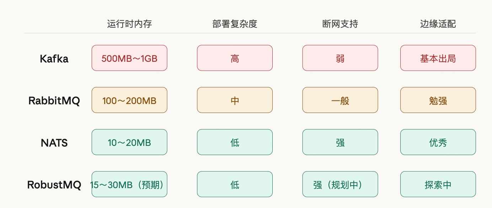
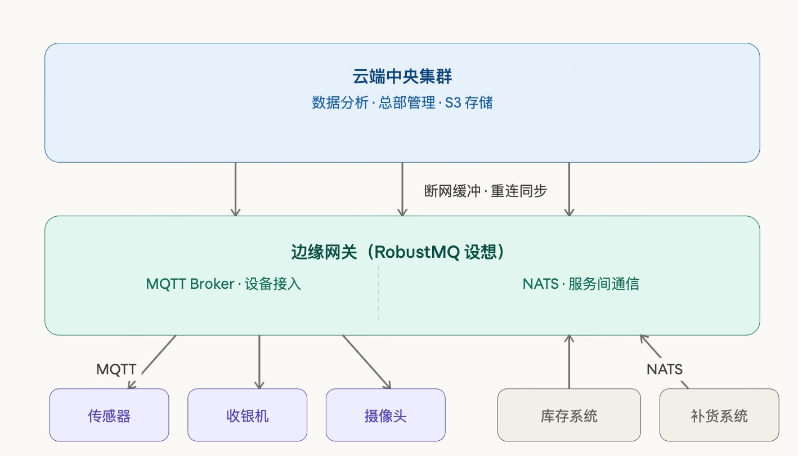
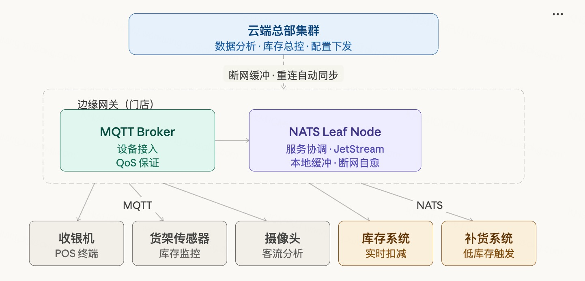
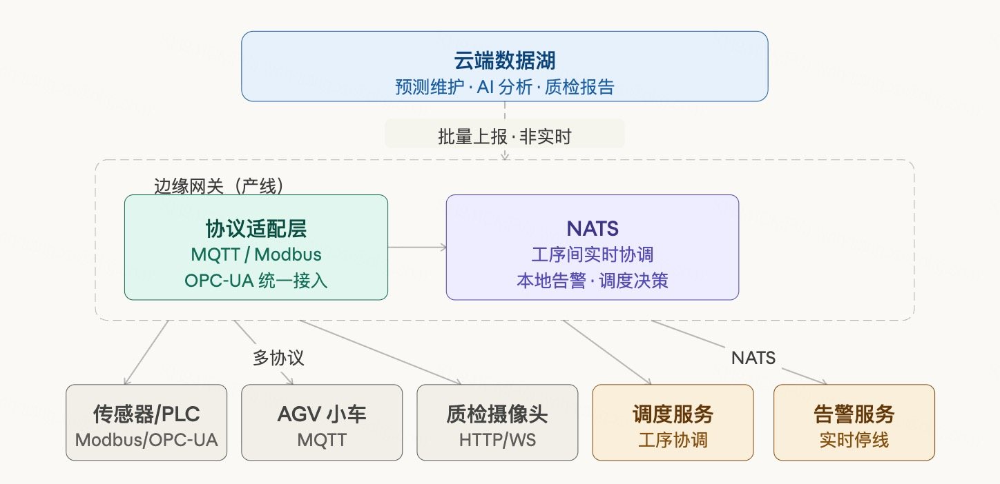
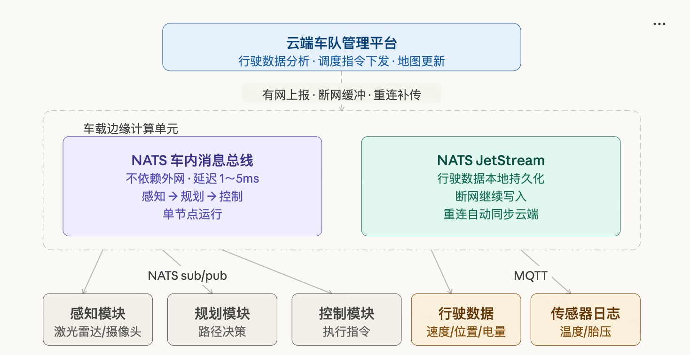

# RobustMQ at the Edge: Thinking Through Adaptation for Edge Scenarios

## I. Why We're Looking at Edge Scenarios

When planning RobustMQ's application directions, our focus was initially on the cloud — high-throughput data pipelines, microservice messaging. But as we dug deeper into IoT use cases, edge computing gradually came into view.

Edge scenarios have a set of constraints completely different from the cloud, and those constraints directly determine how middleware gets chosen. This article records our research thinking and initial ideas about RobustMQ's potential adaptation for edge scenarios.

## II. The Constraints of Edge Scenarios

Edge devices are not "smaller servers." They run in resource-constrained, network-unreliable, unattended environments.


Of the four constraints, memory is the hardest limit. Edge devices typically have only a few hundred MB to a few GB of memory, while storage is relatively generous (eMMC, SSD usually 8–256 GB). This means the middleware selection criterion isn't binary file size — it's runtime memory footprint. The binary lives on disk; once running, disk is irrelevant. Runtime memory is the continuously consumed resource.

Unreliable network connectivity is another fundamental characteristic of edge scenarios. Store network outages, factory network jitter, vehicles driving out of coverage — these are everyday occurrences. Middleware must be able to cache data locally during outages and automatically sync on reconnect, without manual intervention.

Weak operational capability sets a hard ceiling on deployment complexity. Edge devices are scattered everywhere with no dedicated ops staff. Middleware must be a single binary, zero dependencies, simple configuration.

Latency sensitivity is often overestimated in edge scenarios. Most edge scenarios require latency in the 1–20ms range — sub-millisecond isn't needed. Scenarios that genuinely require sub-millisecond (high-frequency trading, industrial servo control) won't use a message broker at all; they use point-to-point communication or dedicated hardware buses.

## III. Middleware Selection: Why Kafka Lost, Why NATS Won



Kafka is basically disqualified from edge scenarios for a simple reason: the JVM's memory baseline is 500 MB–1 GB, and edge devices simply can't run it. This isn't a design flaw in Kafka — it was never designed for resource-constrained environments.

RabbitMQ depends on the Erlang VM, using 100–200 MB of memory — barely viable, but deployment complexity and offline support are not ideal.

NATS stands out in edge scenarios for several reasons: single binary around 20 MB, zero external dependencies, idle memory of only 10–20 MB; JetStream's Leaf Node mechanism is purpose-built for edges — local buffering when offline, automatic sync on reconnect; written in Go, simple cross-platform compilation.

Worth noting is the memory predictability problem. NATS is written in Go, and Go's GC causes periodic memory fluctuations — typically 20 MB, but can temporarily spike higher when GC hasn't triggered. Rust has no GC, so memory usage is stable and predictable. For edge devices, the predictability of memory peaks matters more than average consumption — unpredictable memory spikes in an unattended environment can directly cause OOM, and are extremely difficult to diagnose.

## IV. MQTT + NATS: Natural Partners for Edge Scenarios

MQTT and NATS have a clear division of responsibility at the edge — they don't replace each other.



MQTT handles device-layer communication. Sensors, POS terminals, cameras, industrial control devices — most of these terminal devices natively support MQTT. MQTT's QoS mechanisms ensure no message loss; session persistence lets devices receive offline messages after reconnecting. The protocol is designed for low-bandwidth, low-power, unstable network environments — it naturally fits edge device characteristics.

NATS handles service-layer communication and data sync. Multiple services inside an edge gateway need to coordinate — NATS Pub/Sub and Request/Reply are a natural fit. More importantly, NATS's Leaf Node mechanism: local nodes connect to a cloud central cluster, data buffers locally in JetStream when offline, automatically syncs on reconnect — the entire process is transparent to the application layer.

Synadia's blog documents a real case: a retailer deploying NATS Leaf Nodes in thousands of stores, using JetStream's mirror/source mechanism to sync store data to the cloud, with network instability guaranteeing local store operations continue uninterrupted. Not a proof-of-concept — a large-scale production deployment.

## V. Three Typical Scenarios

### Scenario 1: Chain Retail Stores

**Background and Pain Points**

The store's core requirement is just one: the network going down cannot stop operations. POS offline, price lookups failing, loyalty points unavailable — every minute is real revenue loss. According to Shopify research, for a 200-store chain, 30 minutes of downtime during peak hours produces losses that can't be ignored. And it's not rare — a fiber cable getting cut, a router overheating, ISP jitter at peak hours — all of these make every system dependent on the cloud fail simultaneously.

NATS's official blog documents a real case: a retailer with thousands of stores whose original architecture was highly cloud-dependent — a network outage caused store chaos. They ended up deploying a NATS Leaf Node in each store, using JetStream for local buffering and offline sync.

**Communication Architecture**

Stores have multiple device types: POS terminals, shelf sensors (RFID or weight sensors), cameras (foot traffic analysis), digital price tags. Most of these devices natively support MQTT and connect to the edge gateway via MQTT.



Inside the edge gateway, two layers of logic run: MQTT Broker aggregates all device data; NATS handles service coordination — notifying inventory deduction after a transaction completes, triggering restocking when shelf inventory falls below threshold, pushing camera analysis results to digital signage for real-time promotions.

The cloud connection is maintained via NATS Leaf Node. When offline, all transaction data writes to local JetStream; store operations are completely unaffected. When network recovers, data automatically syncs to headquarters — no manual intervention required.

**Specific Middleware Responsibilities**

```
Device layer (MQTT)
  POS terminal        → topic: store/pos/transaction
  Shelf sensor        → topic: store/shelf/{id}/stock
  Camera              → topic: store/camera/traffic

Service layer (NATS)
  Inventory service   ← sub: store/pos/transaction (deduct inventory)
  Restock service     ← sub: store/shelf/+/stock (low stock trigger)
  Signage service     ← sub: store/camera/traffic (real-time promotions)

Cloud sync (NATS Leaf Node + JetStream)
  Offline buffer      → local persistence, auto mirror to HQ cluster on reconnect
```

**Key Challenge**

Edge gateways are typically low-spec industrial PCs — 4 GB RAM, 64 GB eMMC. Under this constraint, the middleware itself can't consume too many resources; it must leave room for business applications. This is also the fundamental reason Kafka is completely unsuitable for this scenario — the JVM starts at 500 MB before any business logic runs.

---

### Scenario 2: Factory Floor (Industrial IoT)

**Background and Pain Points**

Industrial scenarios are an order of magnitude more complex than retail. A modern production line may simultaneously have: PLCs from 20 years ago (communicating via Modbus), sensors from 5 years ago (OPC-UA), newly purchased AGV carts (MQTT), and quality inspection cameras (HTTP/WebSocket). These devices speak different languages, have different data formats, and incompatible protocols.

MachineMetrics is an industrial IoT company whose clients are manufacturers of all kinds. In their actual deployments, they found that the industrial IoT space has large numbers of devices natively supporting MQTT, while also needing to feed that data into internal services for real-time analysis. They ended up choosing NATS, partly because NATS natively supports MQTT clients connecting directly — devices use MQTT protocol to connect to NATS with no additional protocol translation layer needed. Their engineers said: "MQTT support basically just works out of the box, which is critical for IIoT scenarios."

**Communication Architecture**

The edge gateway has a heavier role here: it doesn't just relay data — it also handles local real-time decisions. When process A on the production line completes, process B must be notified to prepare within tens of milliseconds; you can't wait for data to go up to the cloud and come back down.



```
Device layer (multi-protocol ingestion)
  Sensors/PLCs         → MQTT/Modbus/OPC-UA → protocol adapter → unified MQTT topic
  AGV carts            → MQTT
  Inspection cameras   → HTTP/WebSocket → adapted to MQTT

Service layer (NATS)
  Scheduling service   → inter-process coordination, A complete → notify B to prepare
  Alert service        → real-time device anomaly trigger, local line stop or slowdown
  Data aggregation     → sampling, compression, preparing for upload

Cloud (NATS JetStream)
  Batch upload         → production data, inspection results, device status
  Predictive maintenance → cloud AI analyzes vibration/temperature trends, predicts failures
```

**True Latency Requirements**

Factory scenarios are often mistakenly assumed to have extreme latency requirements. In reality, production line cycle times are usually seconds or even minutes (a car stays at one process step for 30 seconds to several minutes). Inter-process coordination latency requirements are 10–50ms, not sub-millisecond. Sub-millisecond response is needed for servo motor control — that's handled by PLCs and dedicated fieldbus protocols (EtherCAT). Message brokers don't touch that layer.

**Multi-Protocol Coexistence Challenge**

Edge gateways often need to run multiple protocol adapters simultaneously (Modbus gateway, OPC-UA client, MQTT Broker) — each a separate process consuming independent memory. If the middleware itself also requires a JVM, resource pressure becomes severe. Lightweight, single-binary is a hard requirement in industrial edge scenarios, not a bonus.

---

### Scenario 3: Connected Vehicles / Fleet Management

**Background and Pain Points**

Vehicles represent the most extreme edge scenario: devices moving at high speed, network coverage changing constantly, multiple compute units inside the vehicle needing real-time coordination, and driving data continuously uploaded to the cloud.

NATS's official docs explicitly list vehicles as a typical Leaf Node deployment scenario. Synadia's NEX (NATS Execution Engine), released at KubeCon 2024, specifically targets edge scenarios including vehicles — supporting workloads running locally during disconnection and syncing automatically when network recovers.

**Communication Architecture**

Two completely different communication needs exist inside a vehicle:

The first is in-vehicle real-time communication, requiring 1–5ms latency, completely independent of external networks. The perception module pushes obstacle information to the planning module; the planning module pushes path decisions to the control module. The entire chain closes inside the vehicle — any external network latency must not interfere with this loop. NATS serves as the in-vehicle message bus, deployed on the onboard edge compute unit, running as a single node.

The second is vehicle-cloud data synchronization — low real-time requirements but high reliability requirements. Driving data, sensor logs, and map updates cannot be lost. JetStream provides local buffering: upload when connected, buffer locally when not, auto-upload on reconnect.



```
In-vehicle communication (NATS, purely local, no external network dependency)
  Perception module (LiDAR/cameras)
    → pub: vehicle/perception/obstacles
  Planning module
    ← sub: vehicle/perception/obstacles
    → pub: vehicle/planning/path
  Control module
    ← sub: vehicle/planning/path

In-vehicle device data collection (MQTT)
  Temperature/battery/tire pressure sensors → MQTT → onboard gateway

Cloud data sync (NATS JetStream Leaf Node)
  Driving data         → real-time upload when connected
  Sensor logs          → local buffer, batch upload
  Map/config updates   → cloud pushes down to vehicle
  Disconnected         → local JetStream continues writing
  Reconnected          → automatic mirror, no data loss
```

**Additional Dimension for Fleet Management**

For operational fleets (logistics trucks, ride-hailing, campus shuttles), there's an additional need: coordinating dispatch between vehicles. This is typically centralized cloud scheduling — not vehicle-to-vehicle direct communication. Dispatch instructions come from the cloud and sync to each vehicle's edge node via NATS Leaf Node. This pattern is identical to the hub-and-spoke architecture of retail stores — the "store" is just replaced with a "vehicle."

**Resource Constraints**

Onboard edge compute units typically have 4–16 GB of memory — more generous than industrial PCs, but they also need to simultaneously run perception, planning, and control AI models. The budget left for communication middleware is still limited. Rust-written middleware has an advantage here in stable memory footprint — AI inference itself already periodically consumes large amounts of GPU/CPU resources. The communication layer can't add GC-induced memory spikes on top of that.

---

## VI. Thoughts on RobustMQ's Edge Adaptation

RobustMQ is a multi-protocol unified message engine — one storage layer underneath, MQTT/Kafka/NATS and other protocol views on top. The cloud value proposition is reasonably clear; edge scenarios are a direction we're actively thinking about.

**Potential Advantages**

Rust's no-GC property means runtime memory usage is low and stably predictable. On memory-scarce edge devices, this is more advantageous than Go-based solutions.

Protocol unification brings real deployment simplification. Today's typical edge deployment needs an MQTT Broker + NATS Server — two systems, two configurations, two monitoring setups. If RobustMQ can handle MQTT and NATS in a single process, that's real operational relief for edge scenarios with weak ops capability.

The pluggable storage backend design naturally fits edge needs: prioritize memory storage at the edge to reduce latency, switch to RocksDB when persistence is needed, offload cold data to S3 for cloud archival — same code, different configuration, no need to maintain a separate edge version.

**Current Gaps**

RobustMQ still has a distance to travel before being production-ready for edge scenarios. MQTT core is being refined; NATS protocol compatibility is still in the planning stage. Edge scenarios have extremely high stability requirements — offline self-healing, long-term unattended operation — and require thorough testing and validation before claiming production readiness.

Additionally, edge scenarios are typically single-node deployments. RobustMQ's current design leans toward cluster scenarios; single-node lightweight mode still needs dedicated optimization.

This is a direction we're exploring — not something we've already accomplished.

---

## References

1. [NATS for Retail: Manage Thousands of Nodes at the Edge](https://www.synadia.com/blog/east-west-vs-north-south-in-nats) — Synadia, real retail edge deployment case
2. [Edge Computing in Retail 2026](https://www.shopify.com/enterprise/blog/edge-computing-in-retail) — Shopify, retail edge computing scenario analysis
3. [Edge Computing Use Cases](https://www.n-ix.com/edge-computing-use-cases/) — N-iX, industrial edge computing scenario analysis
4. [Bridging the Edge: Using NATS Leaf Nodes](https://thinhdanggroup.github.io/nats-left-nodes/) — NATS Leaf Node edge deployment guide
5. [NATS About](https://nats.io/about/) — NATS official, edge scenario positioning
