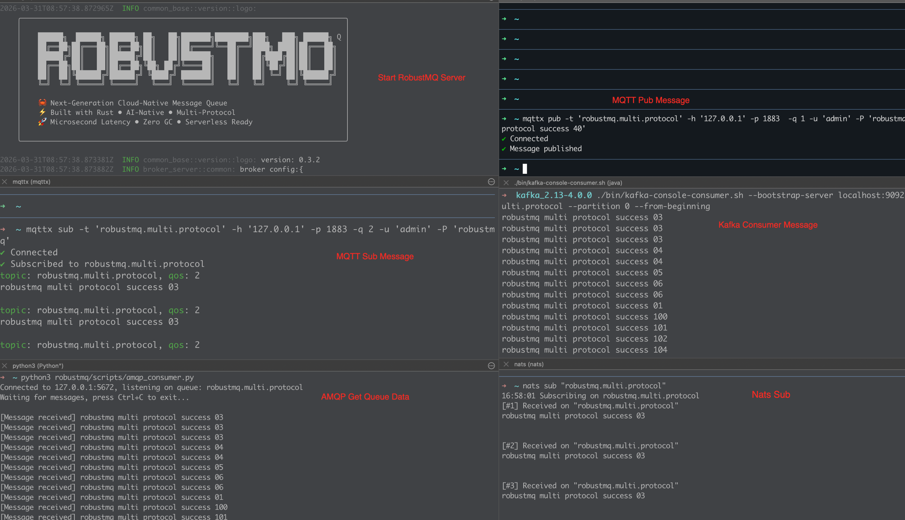

# RobustMQ Milestone: Unified Storage, Multi-Protocol Native Consumption — It Works

Today, RobustMQ has reached a milestone: **a single message written via MQTT, consumed simultaneously by MQTT, Kafka, NATS, and AMQP — one copy of data underneath, zero bridging, zero replication.**

What this means to us: we have confirmed the most important thing — this architecture can sustain the goal, and we won't need to tear it down and start over. This marks the end of phase one: architecture design and code refinement.


## What We Proved

A single message written via MQTT. No bridging, no protocol forwarding, no data copying — and four consumers, one for each of MQTT, Kafka, NATS, and AMQP, all received the same message at the same time.



Commands used:

```bash
# MQTT publish
mqttx pub -t 'robustmq.multi.protocol' -h '127.0.0.1' -p 1883 -q 1 \
  -u 'admin' -P 'robustmq' -m 'robustmq multi protocol success'
```

Four consumers running simultaneously, each using their own native tools and SDKs:

```bash
# MQTT consume
mqttx sub -t 'robustmq.multi.protocol' -h '127.0.0.1' -p 1883 -q 2 -u 'admin' -P 'robustmq'

# Kafka consume
./bin/kafka-console-consumer.sh --bootstrap-server 127.0.0.1:9092 \
  --topic robustmq.multi.protocol --partition 0 --from-beginning

# NATS consume
nats sub "robustmq.multi.protocol" --server 127.0.0.1

# AMQP consume
python3 robustmq/scripts/amqp_consumer.py
```

There is one copy of data underneath, written into a unified Shard storage layer, and each protocol reads from it according to its own semantics. No data replication, no routing, no write amplification, no new concepts to learn.

Native SDKs, native commands, native semantics. You don't need to learn anything RobustMQ-specific — the learning cost is zero. A single binary, zero external dependencies.

---

## Why This Is Hard

Traditional multi-protocol solutions follow the path of parallel multi-Broker deployments or "routing + bridging." For example, messages come in, and a routing engine forwards them to different storage backends based on rules, with each protocol maintaining its own data replica. For MQTT data to be consumed by Kafka, a copy must be written there. The more consumers, the worse the write amplification, and the more operational complexity piles up.

RobustMQ chose a different path at the architectural level: **a unified storage layer where protocols are simply read/write interfaces.** A message is written once into Shard storage. MQTT, Kafka, NATS, and AMQP each act as protocol layers, reading from the same storage according to their own semantics. Write once, consume from any protocol — no data replication, no storage redundancy.

This path is cleaner by design, but harder to implement. Each protocol has its own semantics — Kafka has offset and partition, MQTT has QoS and retain, NATS has subject and queue group, AMQP has exchange and binding. Making all these protocols behave correctly on top of the same storage required extensive design work in the storage abstraction layer. Over three years, we have torn down architectures, refactored core modules, and rejected designs we thought we had figured out. Every teardown made the architecture cleaner; every refactor made the code more solid.

Today's demo is the first signal that this path works.

---

## To Be Honest: This Is Validation, Not Completion

This demo only covers MQTT publishing with basic subscription consumption across four protocols. Its purpose is to validate the architectural feasibility, not to demonstrate complete capabilities.

Here is an honest picture of the project's current state:

- The overall architecture is stabilizing; core abstractions are largely settled
- MQTT core functionality is mostly complete and still being refined
- Protocol parsing for Kafka, NATS, and AMQP is done, but each protocol's feature set is just getting started and will be filled out over time

Kafka, NATS, and AMQP still have a long road ahead. We are showing the direction, not the destination. Infrastructure software cannot be built on packaging — only on accumulation.

---

## The Future We Are Building Toward

What really excites us about this validation is not just that four protocols work together.

It's that we have confirmed something: **on this architecture, adding a new protocol costs very little at the architectural level.** One protocol, five, one hundred — the storage layer doesn't need to change. Protocols are just read/write interfaces; adding a protocol is just adding a parsing layer.

This property is especially important in industrial and edge scenarios. The protocol ecosystem in factories is extremely fragmented — OPC-UA, Modbus, CoAP, MQTT-SN — every industry and device vendor has its own stack. Traditional solutions deal with this fragmentation by stacking bridges and adapters, with operational complexity growing linearly with the number of protocols. RobustMQ's architecture has a fundamental advantage here: no matter how chaotic the external protocol world gets, there is only one copy of data underneath, and adding a new protocol only adds a parsing layer without touching the core.

AI Agent communication follows the same logic. There is no consensus yet on what communication protocols Agents should use. MCP is one direction; we are also exploring a `$mq9.AI.API.*` subject namespace based on NATS extensions. There may be new protocols in the future that we cannot even imagine today. This architecture gives us room to explore calmly — we don't need to redesign storage for each new protocol, and we don't have to worry that adding something new will break existing stability.

In the messaging space, Kafka took ten years to become the de facto standard for data pipelines, and MQTT took twenty years to establish itself in IoT. There are no shortcuts in infrastructure software. We don't know how far RobustMQ will ultimately go, but things worth doing deserve to be done seriously.

---

## Steps to Reproduce

Refer to the [Quick Install Guide](https://robustmq.com/en/QuickGuide/Quick-Install) to run the service.

**1. MQTT Publish**

```bash
mqttx pub -t 'robustmq.multi.protocol' -h '127.0.0.1' -p 1883 -q 1 \
  -u 'admin' -P 'robustmq' -m 'robustmq multi protocol success'
```

**2. MQTT Consume**

```bash
mqttx sub -t 'robustmq.multi.protocol' -h '127.0.0.1' -p 1883 -q 2 \
  -u 'admin' -P 'robustmq'
```

**3. Kafka Consume**

```bash
./bin/kafka-console-consumer.sh --bootstrap-server 127.0.0.1:9092 \
  --topic robustmq.multi.protocol --partition 0 --from-beginning
```

**4. AMQP Consume**

```bash
python3 robustmq/scripts/amqp_consumer.py
```

**5. NATS Consume**

```bash
nats sub "robustmq.multi.protocol" --server 127.0.0.1
```
