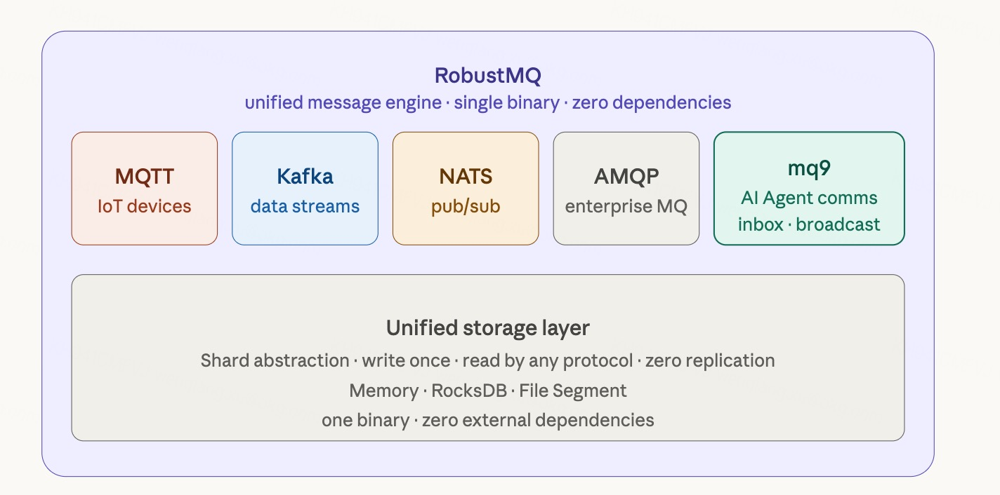

# mq9: What It Is

## One Line

mq9 is a communication protocol layer designed specifically by RobustMQ for AI Agents, sitting alongside MQTT, Kafka, NATS, and AMQP, providing Agents with mailbox and broadcast capabilities.


---

## What Problem It Solves

Agents need to communicate. But Agents are not services — they are temporary, going online and offline at any time, with a lifecycle that may be only a few seconds.

Today, when Agent A sends a message to Agent B and B is offline, the message is simply lost. Every team is working around this problem with Redis, polling databases, or custom queues.

mq9 solves it directly: **send it out, and the other party receives it naturally when they come online.**

---

## Three Primitives

**Mailbox**: every Agent has its own mailbox for point-to-point asynchronous communication; if the other party is offline, the message waits.

**Broadcast**: one-to-many; whoever cares subscribes; the publisher doesn't need to know who is listening.

**Priority**: urgent messages are processed first and are not buried under ordinary tasks.

```bash
# One command to request a mailbox
nats req '$mq9.AI.MAILBOX.CREATE' '{}'

# Send a message
nats pub '$mq9.AI.INBOX.{mail_id}.normal' '{"from":"A","payload":"..."}'

# Broadcast
nats pub '$mq9.AI.BROADCAST.task.available' '{"task_id":"t-001"}'
```

---

## Why No New SDK Is Needed

mq9 is based on the NATS protocol. NATS clients in any language — Go, Python, Rust, Java — are directly mq9 clients. Nothing new to install.

---

## Relationship with RobustMQ

mq9 is RobustMQ's fifth native protocol, sharing the same unified storage architecture as MQTT, Kafka, NATS, and AMQP. Deploy one RobustMQ instance and all of mq9's capabilities are ready.
