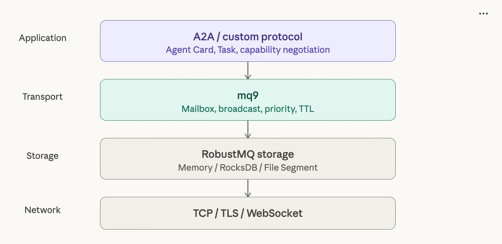
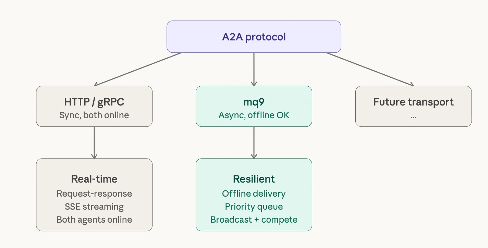
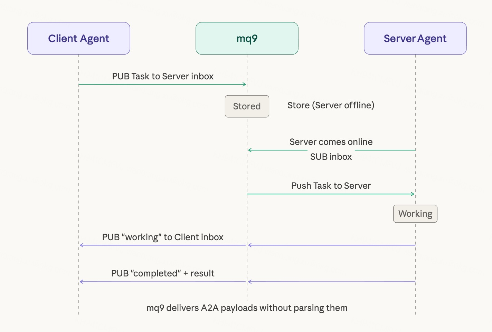
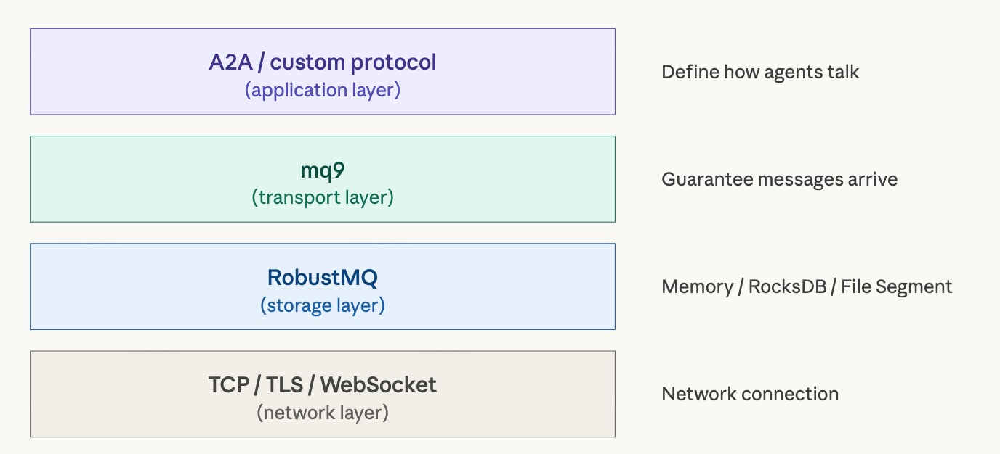

# mq9 and A2A: The Relationship Between Transport Layer and Application Layer

Two standardization efforts are taking shape in the Agent communication space: A2A (Agent2Agent Protocol), led by Google, defines *how* Agents talk to each other; mq9 defines *how* messages are delivered between Agents. This post covers what each protocol is, what problem it solves, and how they relate.

---

## What Is A2A

A2A (Agent2Agent Protocol) is an open protocol launched by Google in April 2025, since donated to the Linux Foundation and now backed by 150+ organizations.

The core problem A2A solves is: **how Agents built on different frameworks by different vendors interoperate.** How does an Agent built with LangGraph collaborate with one built with CrewAI? A2A provides a standard answer.

### Core Concepts in A2A

**Agent Card**: Each Agent publishes a JSON file (`/.well-known/agent.json`) declaring its name, capabilities, endpoints, and supported authentication methods. Think of it as the Agent's business card — other Agents use it to discover the Agent and understand what it can do.

**Task**: The core interaction unit in A2A. A Client Agent initiates a Task with a Server Agent; the Server Agent processes it and returns a result. Tasks have a full lifecycle: submitted → working → input-required → completed / failed.

**Message**: The communication unit within a Task, supporting text, files, structured data, and other content types.

**Capability negotiation**: Agents can negotiate supported data formats and interaction modes to ensure mutual understanding.

### How A2A Transports Messages

A2A is built on HTTP + JSON-RPC + SSE (with gRPC support added in v0.3). The basic flow:

```
Client Agent                     Server Agent
    |                                 |
    |-- HTTP POST (JSON-RPC) -------->|  Initiate Task
    |                                 |  Processing...
    |<--- SSE streaming --------------|  Push progress
    |                                 |
    |<--- HTTP Response --------------|  Return result
```

This is a classic synchronous RPC model — the Client sends a request, the Server processes it, returns a result. Long-running tasks push progress via SSE, but the fundamental model is still HTTP request-response.

### A2A and MCP

The official positioning is complementary: MCP (Model Context Protocol) handles Agent-to-tool connectivity (Agent ↔ Tool), A2A handles Agent-to-Agent communication (Agent ↔ Agent).

```
Agent ↔ Tool    = MCP  (tool invocation)
Agent ↔ Agent   = A2A  (collaboration)
```

---

## What Is mq9

mq9 is the communication transport layer that RobustMQ designed for AI Agents. Built on the NATS protocol, it provides asynchronous mailbox communication.

The core problem mq9 solves is: **message delivery between Agents — sender and receiver don't need to be online at the same time.**

### Core Concepts in mq9

The entire mq9 protocol has just four command words:

```
MAILBOX.CREATE                  — Request a mailbox, receive a mail_id
MAILBOX.QUERY.{mail_id}        — Query unread messages (fallback pull)
INBOX.{mail_id}.{priority}     — Point-to-point mailbox communication
BROADCAST.{domain}.{event}     — Public broadcast
```

**INBOX is a private mailbox**: you know the recipient's address, you write a message and drop it in. Whether they're home doesn't matter — the message waits in the mailbox. Supports three priority levels (urgent / normal / notify).

**BROADCAST is a public channel**: no need to know who you're sending to — announce on a channel, and anyone who cares tunes in. Supports wildcard subscriptions and queue group competing consumers.

### mq9 Message Flow

```
Message arrives → write to storage → check if subscriber is online?
                                          |
                               Online  → push to subscriber → ACK → mark consumed
                               Offline → message waits in storage → subscriber comes online and subscribes or pulls via QUERY
```

Store first, then push. Push is the fast path; storage is the safety net. QUERY is the last resort.

---

## Two Protocols, Two Different Layers



A2A is an **application-layer protocol** — it defines how Agents "talk." Task structure, capability declaration, interaction flow, authentication, multimodal negotiation — these are all semantic concerns.

mq9 is a **transport-layer protocol** — it defines how messages "arrive." Storage, push, priority, TTL, offline delivery — these are all delivery concerns.

A2A doesn't care how messages physically reach the other side. mq9 doesn't care about the task semantics inside the message. Two distinct layers, naturally complementary.

Analogous to the network protocol stack:

```
HTTP (application layer)  ← defines request methods, status codes, headers, body
TCP  (transport layer)    ← defines reliable delivery, flow control, retransmission
```

```
A2A  (application layer)  ← defines Agent Card, Task, Message, capability negotiation
mq9  (transport layer)    ← defines mailboxes, broadcast, priority, offline delivery
```

mq9 is to A2A what TCP is to HTTP. HTTP doesn't care how TCP ensures data arrives. TCP doesn't care what the HTTP request says.

---

## A2A's Fundamental Limitation Today

A2A is well-designed, but it has one fundamental limitation: **it assumes both parties are online.**

A2A is built on HTTP, and HTTP is a synchronous protocol — the Client sends a request, and the Server must be online to receive and respond. What if the Server Agent is offline? The HTTP request fails immediately: Connection refused or Timeout.

For enterprise internal Agent systems, this may be manageable — Agents are typically deployed on stable servers with high uptime. But for broader Agent scenarios — Agents on edge devices, Agents that spin up temporarily, Agents across network boundaries — being offline is the norm, not the exception.

A2A's protocol spec does not define how to handle offline scenarios. It leaves that to implementers.

---

## A2A's Transport Layer Can Be Anything

A2A is an application-layer protocol — it doesn't bind to a specific transport. It runs on HTTP today because Google chose that as the default implementation. But A2A's protocol spec — Agent Cards, Tasks, Messages — has no hard dependency on HTTP.

So A2A's transport layer has multiple options:



```
A2A over HTTP  ← both parties online, synchronous request-response, real-time
A2A over gRPC  ← both parties online, high performance, streaming (supported in v0.3)
A2A over mq9   ← no requirement for simultaneous online, async delivery, offline-reachable
```

Agents choose their transport based on the scenario:

- Recipient is online, real-time interaction needed → HTTP / gRPC
- Recipient may be offline, real-time not required → mq9
- Same Agent uses HTTP for some tasks, mq9 for others — switch as needed

This mirrors today's web world — the same service uses REST over HTTP, event notifications over WebSocket, and async tasks over a message queue. Not either-or, but transport chosen by scenario.

---

## What A2A over mq9 Looks Like

Concretely, here's what A2A Task messages look like when transported via mq9:

**Agent Card publishing**: An Agent writes its Agent Card into a mq9 mailbox with type=latest. Other Agents subscribe to or query that mailbox to retrieve capability declarations. No HTTP endpoint to expose, no `/.well-known/` path required.

**Task initiation**: The Client Agent PUBs an A2A-formatted Task message to the Server Agent's mq9 mailbox. Server Agent offline? The message waits in the mailbox.

**Task status updates**: As the Server Agent processes, it PUBs status updates (working, input-required) to the Client Agent's mailbox.

**Task completion**: The Server Agent PUBs the result to the Client Agent's mailbox.

The full flow:


Key point: **mq9 does not parse A2A's Task JSON — it only delivers it.** A2A's Task structure, state machine, capability negotiation — all of that lives in the payload. mq9 doesn't need to understand any of it. The adaptation logic belongs in the A2A layer. mq9 requires zero code changes.

---

## mq9's Boundaries

One thing needs to be explicit: **mq9 only handles delivery, not semantics.**

The capabilities A2A defines — Agent Cards, Task lifecycle, multimodal negotiation — mq9 does none of that. Not because it can't, but because it shouldn't.

mq9 is a pipe, not an envelope. The pipe's job is: deliver it, don't lose it, respect priority, support broadcast. What's inside the envelope, how to open it, what to do after opening — that's the upper layer's concern.

How the upper layer composes semantics through delivery and subscription is A2A's problem. A2A decides whether task status updates go via INBOX or BROADCAST. A2A decides which mailbox type to use for Agent Cards. A2A decides whether capability queries go broadcast or point-to-point. All application-layer design decisions, nothing to do with mq9.

This keeps mq9's boundaries permanently clean — four command words, no bloat, no intrusion into application semantics. Whatever runs on top — A2A, MCP, or custom protocols — can all run on mq9.

---

## Why They're Not Competing

Someone might ask: both A2A and mq9 are solving Agent communication problems — aren't they competing?

No. One analogy makes it clear:

**A2A is like a phone call** — both parties are online, real-time interaction, you say something and I respond, it ends when you hang up. Good for scenarios requiring immediate feedback.

**mq9 is like email** — you can send even if the other party is offline, the message waits in the mailbox, they pick it up when they have time. Good for async, offline, no-immediate-feedback scenarios.

Phone calls and email are not competitors — they're complementary. You don't stop making calls because you have email, and you don't stop emailing because you can call.

A2A and mq9 cover different scenarios:

| Scenario | A2A over HTTP | A2A over mq9 |
|----------|--------------|--------------|
| Both online, real-time interaction needed | Ideal | Unnecessary |
| One party may be offline | Can't do it | Ideal |
| Long task, needs async result | SSE polling, complex | Mailbox handles it natively |
| Edge device, unstable network | Unreliable | Offline message persistence |
| Massive ephemeral Agents communicating | HTTP connection cost is high | pub/sub is lightweight |
| Task broadcast, competing consumers | Not supported | BROADCAST + queue group |

A2A over HTTP and A2A over mq9 are not substitutes — they're supplements. A real Agent system will use both.

---

## What This Means for mq9

From mq9's perspective, A2A's existence is a good thing.

**A2A validates the direction.** Google and 150+ organizations pushing Agent communication standardization confirms that communication between Agents is a real problem worth solving. mq9 is not solving an imaginary problem.

**A2A defines the application layer, so mq9 doesn't have to.** Without A2A, mq9 might have been tempted to add Task state, capability declarations, multimodal support into the protocol — growing heavier and less transport-like over time. With A2A owning the application layer, mq9 can stay focused on transport, keeping its four command words clean and simple.

**A2A's weakness is mq9's opportunity.** A2A over HTTP can't handle offline scenarios — and that is exactly mq9's core value. mq9 doesn't need to push this combination. When A2A users genuinely hit the offline wall, mq9 will already be the obvious answer.

---

## The Long View

Stepping back, the Agent communication protocol stack might eventually look like this:



Each layer does its own job. Each layer can evolve independently. A2A upgrades to v1.0 — mq9 doesn't need to change. mq9 adds a new storage engine — A2A is unaffected. RobustMQ upgrades its cluster implementation — neither layer above notices.

That's the value of layering — **each layer's stability does not depend on changes in other layers.**

mq9's position in this stack is clear: transport layer, guarantee delivery, nothing more and nothing less. What protocol runs on top, what storage sits below — mq9 doesn't care.

That's not a big role. But it's a stable one. Do the transport layer well. That's enough.
