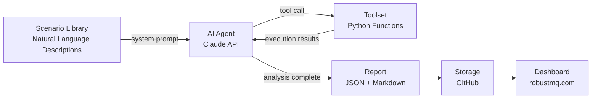

# RobustMQ Test Agent: Technical Design Document

RobustMQ Test Agent is an AI testing agent purpose-built for RobustMQ, designed to address the project's own quality challenges. It drives a complete chaos testing loop powered by an AI agent — automatically deploying clusters, injecting faults, running multi-language SDK tests, analyzing logs, and generating reports — to continuously and uninterruptedly verify the stability and protocol compatibility of RobustMQ.

---

## Background

RobustMQ is a multi-protocol message broker targeting production-grade use across mainstream protocols including MQTT and mq9.

The quality bar for a message broker is extremely high. When evaluating a message broker, the first question users ask is not whether it has enough features, but whether it can be trusted: will messages be lost, can the system recover when a node goes down, will the client SDK still work after a version upgrade? These questions cannot be answered by unit tests or conventional integration tests — they require continuous verification under genuinely chaotic conditions.

For RobustMQ, **protocol compatibility is both the greatest risk and the greatest competitive advantage**. Supporting multiple protocols means maintaining compatibility with client SDKs across languages and versions. A single incompatibility in any SDK version prevents users from onboarding smoothly and directly damages the project's credibility. Ensuring protocol compatibility in a systematic, low-cost manner is central to whether RobustMQ can survive and grow.

---

## Limitations of Existing Tests

RobustMQ currently has unit tests and basic integration tests covering the correctness of core logic. However, the following blind spots exist:

**Protocol compatibility lacks systematic coverage**: There is no continuous verification mechanism for compatibility between client SDKs across different languages and versions and the broker. Compatibility issues can only be discovered after users report them.

**Fault scenarios are not covered**: Message delivery behavior during broker crashes, process kills, and node restarts has not been systematically tested.

**Long-running issues are not covered**: Memory leaks, connection pool exhaustion, and behavior under message backlog can only surface after extended operation — no verification mechanism currently exists for these.

**Composite scenarios are not covered**: Single failures are relatively easy to test; system behavior when multiple failures occur simultaneously is almost entirely uncovered.

**Problem discovery cycles are too long**: Traditional open-source communities rely on users finding problems, filing issues, and waiting for fixes — a process that often takes months. For an early-stage project, this pace is too slow to support rapid iteration.

---

## Goals

Build a fully automated chaos testing system powered by AI, purpose-built for RobustMQ. There are three core goals:

**First, automatically discover problems and accelerate fixes.** Use AI to replace manual effort across the full cycle of test execution, log analysis, and issue localization — dramatically compressing the time from problem occurrence to discovery. Phase one focuses on code bugs, logic errors, and optimization opportunities. Phase two digs deeper into security issues. Phase three introduces Claude Code for in-depth static analysis of source code to directly assist with fixes.

**Second, make the testing process public to build community trust.** All test records, analysis reports, and issue fix statuses are fully public — including failure records. We are not afraid of exposing problems; we are afraid of problems existing without anyone seeing or fixing them. A completely transparent testing process is the most direct way to build community trust, more convincing than any documentation or public statement.

**Third, systematically address protocol compatibility.** Introduce a multi-language, multi-version SDK matrix, automatically executed by the AI agent, which automatically identifies and attributes compatibility issues. Continuously guarantee RobustMQ's compatibility with all major client SDKs at low cost.

This system is implemented entirely by Claude Code. It is a non-core system whose logic consists primarily of tool functions — exactly the kind of scenario Claude Code excels at, requiring no core development effort.

---

## System Design

### Core Approach

At its essence, this is **chaos engineering, fully automated end-to-end by AI**.

The core idea of chaos engineering is: actively construct failures, observe system behavior, discover hidden problems. Traditional chaos engineering requires humans to design scenarios, analyze results, and write reports — expensive and hard to sustain continuously. This system uses an AI agent to replace humans across all three steps, enabling chaos testing to run continuously without interruption.

The system consists of an **AI agent + toolset**. The AI agent is the brain: it reads scenario descriptions, autonomously determines execution order, dynamically adjusts strategy based on intermediate results, and ultimately generates a report. The toolset is the hands: it executes specific cluster operations, fault injections, and log collection. There is no hardcoded execution flow, no Python scheduling logic — AI drives everything.

The implementation is minimal: Claude API tool use + a set of Python tool functions. No LangGraph, CrewAI, or other agent frameworks — these solve multi-agent coordination problems, while this system is a single agent with a fixed toolset, where native tool use is simpler and more controllable.

### Overall Architecture

The AI agent reads scenario descriptions, calls the toolset to execute operations, observes returned results, decides the next action, and ultimately generates a report. The entire process runs without human intervention, continuously and uninterruptedly.

### AI Agent

Implemented using Claude API tool use. The input is a natural language scenario description; the agent autonomously completes:

- Deciding how many nodes to deploy and what configuration to use for this run
- Selecting which fault to inject and at what point to inject it
- Choosing which language and version of SDK to use for running the test client
- Judging whether message delivery results match expectations
- Collecting logs, analyzing anomalies, localizing suspicious causes
- Generating a structured test report

The agent can call tools across multiple rounds, dynamically adjusting based on intermediate results. For example, when an anomalous metric is detected, the agent can autonomously decide whether to re-run with a different SDK version to confirm a compatibility issue, or to dig deeper into logs to localize the broker-side cause.

### Toolset

| Tool | Function |
|------|----------|
| `cluster_start(nodes, config)` | Start a RobustMQ cluster with the specified number of nodes |
| `cluster_stop()` | Tear down the current cluster and release resources |
| `inject_fault(type, target, params)` | Inject faults: kill / network delay / packet loss / disk pressure |
| `run_client(protocol, sdk_lang, sdk_version, scenario)` | Run a test client in the specified language and version, return message reconciliation results |
| `get_logs(level, time_range)` | Fetch broker logs, filtered by level and time range |
| `get_metrics(node)` | Fetch cluster metrics: connection count, message rate, memory usage, etc. |
| `push_report(report)` | Push the test report to a public GitHub repository |

Tool functions are responsible only for execution and contain no business logic. All judgment and decision-making happens on the agent side.

### Report Format

Each test run generates a structured report containing:

- Test time, scenario name, protocol, SDK language and version, cluster configuration
- Execution process: the agent's tool call sequence and result at each step
- Verification results: total messages sent, received, lost, and duplicated
- Problem description: what happened and at which stage
- Preliminary analysis: suspicious causes and code paths to investigate
- Severity: P0 / P1 / P2
- Raw logs: complete broker logs

Reports are output in both JSON and Markdown formats, pushed to a public GitHub repository as the data source for the dashboard.

---

## Protocol Compatibility Testing

Protocol compatibility is the central focus of this system. RobustMQ supports multiple protocols and needs to maintain compatibility with client SDKs across languages and versions. Any compatibility issue directly affects the user onboarding experience.

### Multi-Language, Multi-Version SDK Matrix

When executing tests, the AI agent systematically covers different combinations of SDK languages and versions:

**MQTT SDK Coverage**

| Language | SDK | Covered Versions |
|----------|-----|-----------------|
| Python | paho-mqtt | 1.x / 2.x |
| Go | eclipse/paho.mqtt.golang | 1.x |
| Rust | rumqttc | 0.2x |
| Java | Eclipse Paho Java | 1.x |
| JavaScript | mqtt.js | 4.x / 5.x |
| C | Eclipse Paho C | 1.x |

**mq9 SDK Coverage**

Coverage for official SDKs across languages will be added continuously as the mq9 protocol implementation progresses.

### Compatibility Issue Attribution

The same scenario is executed against different SDK languages and versions. The AI agent compares results and automatically identifies three problem patterns:

| Symptom | Attribution |
|---------|------------|
| Same scenario, different results across SDKs | Protocol implementation issue — broker behavior deviates from protocol specification |
| Specific SDK version fails while others succeed | SDK version compatibility issue — adaptation needed for that version |
| All SDKs fail | Broker-side issue, unrelated to client implementation |

---

## Scenario Library Design

Scenarios are described in natural language; the AI agent reads and autonomously executes them — no scripts, no flowcharts required. The scenario library grows continuously as protocol support expands.

### MQTT

| Scenario | Type | Description |
|----------|------|-------------|
| QoS 0/1/2 normal send and receive | Basic | Verify message delivery correctness at each QoS level |
| Large message send/receive (1MB+) | Basic | Verify large packet handling capability |
| High-concurrency connections (1000+) | Basic | Verify connection management stability |
| Persistent session reconnect | Basic | Whether offline messages are correctly redelivered after reconnection |
| Broker node kill -9 | Fault | Process forcefully killed during message transmission; verify message integrity |
| Broker node graceful restart | Fault | Message delivery behavior during restart |
| Network delay injection | Fault | Whether QoS 1/2 retransmission logic is correct under high latency |
| Network packet loss injection | Fault | Message reliability under packet loss |
| Mass simultaneous disconnection | Client anomaly | Impact on broker when 1000 connections disconnect simultaneously |
| Reconnect storm | Client anomaly | Immediate reconnection after disconnection, repeated in a loop |
| Slow consumer | Client anomaly | Consumption rate far below production rate; verify backlog behavior |
| Publish mid-flight + broker crash + reconnect | Composite | Whether QoS 1/2 messages are redelivered after crash recovery |
| Slow consumer + broker restart | Composite | Whether backlogged messages are fully preserved after restart |

### mq9

| Scenario | Type | Description |
|----------|------|-------------|
| Basic Mailbox create and destroy | Basic | Mailbox lifecycle management correctness |
| High/normal/low priority message send and receive | Basic | Delivery order verification across three priority levels |
| TTL-expired Mailbox auto-cleanup | Basic | Whether expired Mailboxes are correctly reclaimed |
| Multiple agents concurrently writing to the same Mailbox | Basic | Message integrity under concurrent writes |
| PUBLIC.LIST subscription discovery | Basic | System Mailbox list maintenance correctness |
| Broker node kill -9 | Fault | Whether Mailbox data is preserved after force kill |
| Broker node graceful restart | Fault | Whether unconsumed messages are intact after restart |
| Network delay injection | Fault | Message delivery behavior under high latency |
| Mass simultaneous Mailbox creation | Client anomaly | Impact on broker from high-concurrency creation |
| Agent sends then immediately destroys Mailbox | Client anomaly | Handling of unconsumed messages |
| Slow consuming agent + message backlog | Client anomaly | Priority queue behavior under backlog |
| Broker restart + high-priority messages unconsumed | Composite | Whether priority order is maintained after restart |
| Multiple agents writing concurrently + network jitter | Composite | Message integrity under dual pressure |

---

## Quality Dashboard

All test records are publicly displayed on the official website without any filtering — including failure records and unresolved issues.

Our stance: we are not afraid of exposing problems; we are afraid of problems existing without anyone seeing or fixing them. Publishing failure records is itself proof that quality is being taken seriously. The complete process from discovery to fix for any known issue is on display — more convincing than any quality statement.

**List page**: time, scenario name, protocol, SDK language and version, status (pass/fail), one-line summary; filterable by protocol, status, and time.

**Detail page**: full test background, agent execution process, message delivery verification results, raw broker logs, AI analysis report, issue fix status (open / fixed in vX.X.X).

Data is stored in a public GitHub repository; the official website reads it statically — zero backend.

---

## Roadmap

**Phase One: Code Quality**

Focus on discovering code bugs, logic errors, and optimization opportunities. The AI agent triggers issues through chaos testing, analyzes logs to localize causes, and generates actionable fix recommendations. The goal is to rapidly establish baseline stability for RobustMQ.

**Phase Two: Security Issues**

After baseline stability is established, introduce security scenarios: malformed inputs, boundary conditions, protocol attack surfaces. The AI agent digs deeper into potential security issues.

**Phase Three: Deep Code Analysis**

Introduce Claude Code for continuous static analysis of the RobustMQ source code, generating focused and non-excessive analysis reports that identify logic errors and optimization opportunities, and directly assist with fixes. Further compress the time from problem discovery to fix, making the entire development cycle faster.

---

## Summary

This system is, at its core, chaos engineering — fully automated end-to-end by AI.

In the AI era, the competition among infrastructure projects is not only about technical architecture, but also about who can leverage AI effectively in the right places. RobustMQ's protocol compatibility challenges and quality verification challenges are precisely the kinds of problems AI can solve systematically at low cost.

This project is not RobustMQ's core engine, but it will be the most important supporting system. It addresses whether RobustMQ can be trusted and whether it can be adopted at scale.

Its core value has two dimensions: first, **accelerating product growth** — in traditional open-source communities, the cycle from problem discovery to fix is measured in months; this system aims to compress that to days, with AI running and discovering problems without interruption, driving rapid quality improvement; second, **building community trust** — fully public test records and issue fix histories let the community see a project that genuinely takes quality seriously.

---

## References

- **TiDB TiPocket**: PingCAP's internal automated chaos testing framework; the closest open-source implementation to the design goals of this system, but without an AI analysis layer, with hardcoded workflows, and strongly dependent on Kubernetes.
- **Jepsen**: A distributed system correctness verification tool focused on consistency verification, not continuous automated operation.
- **Chaos Mesh**: A Kubernetes-native fault injection platform; can serve as an alternative fault injection mechanism in the toolset once RobustMQ migrates to Kubernetes deployment.
