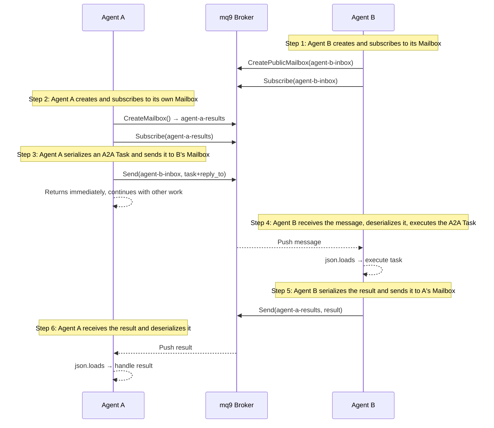

# Solving A2A Async Reliable Communication with mq9

## What Is A2A

AI agents are multiplying. A typical system now has several collaborating agents: one for search, one for analysis, one for report generation. These agents may be built with different frameworks (LangChain, CrewAI, AutoGen) and running on different servers. Agent A wants to call Agent B, but doesn't know where B is, what it can do, or what its interface looks like.

**A2A (Agent2Agent)** is a standardization protocol launched by Google with the goal of letting agents built by different frameworks and different companies discover and call each other. It's now a Linux Foundation project with 100+ companies behind it.

Three core concepts:

**AgentCard**: Each agent exposes a JSON file at a fixed URL (`/.well-known/agent.json`) describing who it is, what it can do, and how to reach it.

```json
{
  "name": "DataAnalysisAgent",
  "description": "Analyzes data and generates reports",
  "url": "https://agent-b.example.com",
  "version": "1.0.0",
  "skills": [
    {
      "id": "data_analysis",
      "name": "Data Analysis",
      "description": "Analyzes input data and returns an insights report"
    }
  ]
}
```

**Task**: A standardized task object defining the format for "send a task, track progress, retrieve the result."

**HTTP communication**: Agent A reads Agent B's AgentCard, then sends a Task to B using standard HTTP + JSON-RPC.

---

## A2A's Async Blind Spot

A2A solves agent interoperability, but there's one scenario it handles poorly: **the receiver is offline**.

A2A supports three interaction modes:

- **Synchronous request/response**: Send and wait for the result — fails immediately if Agent B is offline
- **SSE streaming**: Good for streaming progress on long tasks, but messages are lost when the connection drops
- **Push notification**: Requires Agent B to expose a reachable callback URL — fails the same way if B is offline

All three share one assumption: **the receiver must be online and reachable**.

In production, this is a real problem. Agent restarts, network blips, and task backlogs are the norm. A2A has no built-in message persistence; reliability is entirely up to the application layer.

Beyond that:

- **No priority**: Urgent and routine tasks are treated the same
- **No broadcast**: Sending one task to multiple agents requires a separate HTTP call per agent
- **Network isolation**: Agents behind a corporate firewall can't expose a public HTTP address, making cross-network collaboration difficult

---

## What mq9 Is

mq9 is a messaging protocol designed specifically for async agent communication. Its core abstraction is the **Mailbox**.

Each agent has a Mailbox. Other agents drop messages into it; messages are persisted in the broker; the receiver picks them up whenever it's ready. Sender and receiver don't need to be online at the same time.

Key features:

- **Persistence**: Messages are stored in the broker and won't be lost before their TTL expires
- **Offline-safe**: Messages sent while the receiver is offline are retained and delivered when it comes back online
- **Priority**: Three levels — critical / urgent / normal — urgent messages are processed first
- **Fan-out**: Multiple agents can subscribe to the same Mailbox; one send reaches all of them
- **Network flexibility**: Both sides just need to reach the same broker — no direct network path required between agents

mq9 is built on the NATS protocol and provides SDKs for Python, Go, Java, Rust, JavaScript, and C#.

---

## Filling A2A's Gap with mq9

The core idea is simple: **replace A2A's HTTP transport layer with mq9**.

```text
A2A without mq9:
Agent A ──HTTP──▶ Agent B  (B must be online)

A2A with mq9:
Agent A ──send──▶ mq9 Mailbox ──receive──▶ Agent B  (B can be online anytime)
```

A2A handles task format (Task) and capability discovery (AgentCard). mq9 handles reliable async delivery.

**This works today.** No standardization work needed. The only thing required is serializing an A2A Task to JSON before sending to mq9, and deserializing it on the receiving end.

---

## Hands-on: Complete Example

### Install

```bash
pip install langchain-mq9 langchain-openai
```

### Communication Flow



### agent_b.py

Agent B runs independently. On startup it creates its Mailbox and subscribes, then waits continuously for tasks.

```python
# agent_b.py
import asyncio
import json
from langchain_mq9 import Mq9Toolkit, CreatePublicMailboxTool
from langchain.agents import AgentType, initialize_agent
from langchain_openai import ChatOpenAI
from robustmq.mq9 import Client

SERVER = "nats://demo.robustmq.com:4222"

async def main():
    toolkit = Mq9Toolkit(server=SERVER)
    tools = toolkit.get_tools()
    llm = ChatOpenAI(model="gpt-4o-mini")

    # Step 1: Agent B creates its Mailbox
    await CreatePublicMailboxTool(server=SERVER)._arun(
        name="agent-b-inbox",
        ttl=86400,
        desc="Agent B task queue"
    )
    print("Agent B: Mailbox ready, subscribing to agent-b-inbox...")

    agent_b = initialize_agent(
        tools, llm,
        agent=AgentType.OPENAI_FUNCTIONS,
        verbose=True,
    )

    # Step 2: Subscribe to the Mailbox; callback fires when a message arrives
    # Step 4: Deserialize and execute the A2A Task
    # Step 5: Serialize the result and send it back to the reply_to Mailbox
    async def on_message(msg):
        task = json.loads(msg.data)
        print(f"Agent B: received task {task['task_id']}")

        agent_b.invoke({
            "input": f"Execute a {task['type']} task on data: {task['payload']}. "
                     f"Serialize the result with json.dumps and send it to the Mailbox "
                     f"with mail_id {task['reply_to']} at normal priority."
        })

    async with Client(SERVER) as client:
        await client.subscribe("agent-b-inbox", on_message)
        print("Agent B: subscribed, waiting for tasks...")
        await asyncio.sleep(float("inf"))  # run indefinitely

asyncio.run(main())
```

### agent_a.py

Agent A runs independently. It creates its own result Mailbox, sends the task and immediately moves on, then retrieves the result asynchronously.

```python
# agent_a.py
import asyncio
import json
from langchain_mq9 import Mq9Toolkit, CreateMailboxTool
from langchain.agents import AgentType, initialize_agent
from langchain_openai import ChatOpenAI

SERVER = "nats://demo.robustmq.com:4222"

async def main():
    toolkit = Mq9Toolkit(server=SERVER)
    tools = toolkit.get_tools()
    llm = ChatOpenAI(model="gpt-4o-mini")

    agent_a = initialize_agent(
        tools, llm,
        agent=AgentType.OPENAI_FUNCTIONS,
        verbose=True,
    )

    # Step 2: Agent A creates its result Mailbox
    result_mailbox = await CreateMailboxTool(server=SERVER)._arun(ttl=3600)
    print(f"Agent A: result Mailbox ready → {result_mailbox}")

    # Step 3: Serialize an A2A Task and send it to Agent B's Mailbox
    a2a_task = {
        "task_id": "task-001",
        "type": "data_analysis",
        "payload": "dataset_v1: [record_1, record_2, record_3]",
        "reply_to": result_mailbox  # tells Agent B where to send the result
    }
    agent_a.invoke({
        "input": "Send a normal-priority message to the Mailbox with mail_id agent-b-inbox: " + json.dumps(a2a_task)
    })
    print("Agent A: task sent, continuing with other work...")
    print("(Whether Agent B is online right now doesn't matter — the message is persisted)")

    # Do other work in the meantime...
    await asyncio.sleep(10)

    # Step 6: Retrieve the result asynchronously and deserialize it
    agent_a.invoke({
        "input": f"Read messages from the Mailbox with mail_id {result_mailbox}, parse with json.loads, and output the analysis result"
    })

asyncio.run(main())
```

### Running It

Start Agent B first, then Agent A:

```bash
# Terminal 1: start Agent B — creates Mailbox, subscribes, waits
python agent_b.py

# Terminal 2: start Agent A — sends task, retrieves result asynchronously
python agent_a.py
```

If Agent B is offline when Agent A sends, the task is persisted in the Mailbox and automatically picked up when Agent B comes back online.

---

## Priority: Urgent Tasks Jump the Queue

A2A has no built-in priority mechanism. With mq9, critical messages are always processed before normal and low — no need to maintain multiple queues.

```python
# Routine task
agent_a.invoke({
    "input": f"Send a normal-priority message to 'agent-b-inbox': {json.dumps({'task_id': 'task-002', 'type': 'batch_report'})}"
})

# Urgent task — Agent B will always process this first, regardless of send order
agent_a.invoke({
    "input": f"Send a critical-priority message to 'agent-b-inbox': {json.dumps({'task_id': 'task-003', 'type': 'incident_analysis', 'payload': 'Payment system anomaly detected'})}"
})
```

---

## Broadcast: One Task to Multiple Agents

```python
# Create a broadcast channel
await CreatePublicMailboxTool(server=SERVER)._arun(
    name="all-agents-broadcast",
    ttl=86400
)

# Send once — every agent subscribed to this Mailbox receives it
agent_a.invoke({
    "input": f"Send a normal-priority message to 'all-agents-broadcast': {json.dumps({'type': 'config_update', 'payload': 'System config updated, please reload'})}"
})
```

---

## Cross-Network Collaboration

A2A's HTTP model requires both sides to be network-reachable, which means agents behind a corporate firewall can't directly expose a public HTTP address.

mq9 works differently: **both sides just need to reach the same broker**.

```text
# Public internet
SERVER = "nats://demo.robustmq.com:4222"
Any agent with internet access can communicate through this broker

# Corporate intranet
SERVER = "nats://192.168.1.100:4222"
Deploy RobustMQ on-prem; all internal agents connect through the internal broker
Data never leaves the network — meets security and compliance requirements

# Hybrid
internal broker ──federation──▶ public broker
Internal and external agents communicate through federation; outbound data flow is controlled
```

The broker address can be public or self-hosted. Switching is one config change.

---

## A2A Native HTTP vs. A2A + mq9

| | A2A Native HTTP | A2A + mq9 |
|---|---|---|
| Receiver offline | Task is lost | Message persisted, delivered when receiver comes online |
| Sender blocked | Waits for response | Fire and forget, non-blocking |
| Priority | No built-in support | critical / urgent / normal, automatically ordered |
| Broadcast | One HTTP call per agent | Multiple agents subscribe to one Mailbox |
| Network isolation | Both sides must be reachable | Only need to reach the same broker |
| Network blip | Request fails, needs retry | Message already persisted, unaffected |

---

## Current Limitations

This approach works today. Two things you'll need to handle yourself:

**Manual serialization/deserialization of A2A Tasks**: `json.dumps()` the Task before sending to mq9, `json.loads()` on the receiving end. There's no ready-made library wrapping this yet — you write it yourself.

**Out-of-band mail_id sharing**: Agent B's Mailbox address needs to be agreed on in advance. There's no automatic discovery mechanism yet.

---

## Next Step: Native Integration

The proper long-term fix is adding an `mq9_addr` field to the A2A AgentCard:

```json
{
  "name": "DataAnalysisAgent",
  "url": "https://agent-b.example.com",
  "mq9_addr": "agent-b-inbox",
  "version": "1.0.0"
}
```

An mq9-aware agent reading this AgentCard automatically routes through the async channel. An agent that doesn't support mq9 ignores the field and falls back to HTTP — fully backward compatible.

Once this field enters the A2A spec, mq9 becomes the standard async communication layer for the A2A ecosystem. That's the direction we're pushing toward.

---

## Summary

A2A solves agent interoperability but has a clear gap in async reliable communication. mq9 fills it: message persistence, offline delivery, priority ordering, cross-network collaboration.

The two work together today — no standardization needed. A2A handles capability discovery and task format; mq9 handles reliable delivery.

---

## Resources

- A2A protocol: [github.com/a2aproject/A2A](https://github.com/a2aproject/A2A)
- mq9 protocol spec: [docs/mq9-protocol.md](https://github.com/robustmq/robustmq-sdk/blob/main/docs/mq9-protocol.md)
- langchain-mq9: [github.com/robustmq/robustmq-sdk/tree/main/langchain-mq9](https://github.com/robustmq/robustmq-sdk/tree/main/langchain-mq9)
- RobustMQ: [github.com/robustmq/robustmq](https://github.com/robustmq/robustmq)
- Demo server: `nats://demo.robustmq.com:4222` (connect directly for testing, no local deployment needed)
