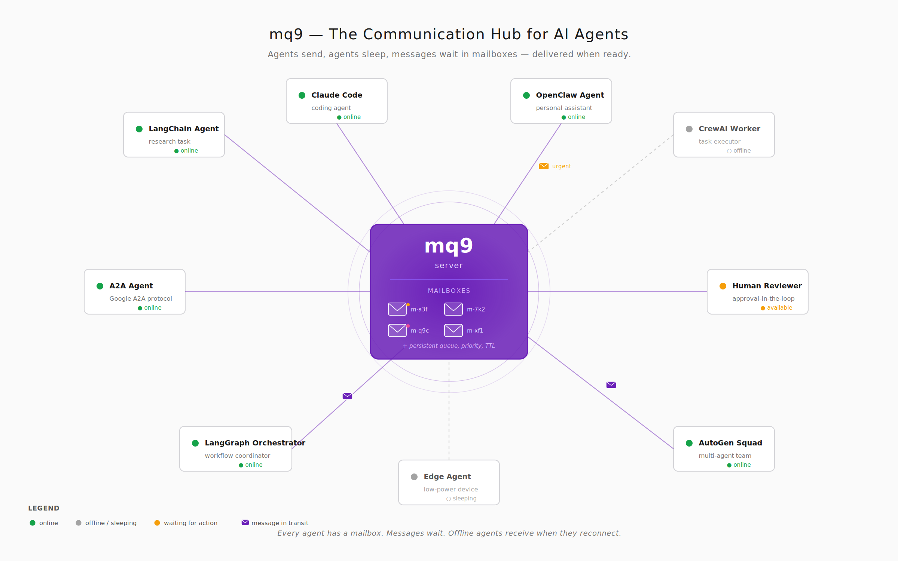

# Looking for Someone to Build mq9 Together

We are looking for one person. Two at most.

Someone with a genuine interest in AI Infra — someone curious about the Agent ecosystem, Agent communication, and what next-generation AI infrastructure should look like. To build mq9 together.

---

## What We Are Building

mq9 is an asynchronous communication protocol designed for AI Agents.

Agents are not human applications. They have identity, state, they sleep, they go offline, and they need to collaborate with other Agents across time. For this behavior pattern, Kafka is too heavy, HTTP is too synchronous, Redis Pub/Sub does not persist, and NATS is a good foundation but lacks Agent-native abstractions.

mq9 wants to fill that layer. Every Agent gets a mailbox. Messages are delivered to the mailbox. The Agent processes them at its own pace.

The protocol design is solid, the core functionality works, the LangChain integration is shipped, and the A2A collaboration model is clear. The website is at [mq9.robustmq.com](https://mq9.robustmq.com/) and the code is at [robustmq/mq9](https://github.com/robustmq/mq9).

But there is too much to do and not enough hands.

---

## What We Want to Build

Every one of the items below is something we want to do, and none of them get enough time:

1. **mq9 Agent-to-Agent async communication core development**
2. **Multi-language SDKs** (Python / Go / Rust / TypeScript / Java)
3. **Deep LangChain & LangGraph integration**
4. **OpenClaw mq9 plugin** — bringing mq9 to the 240k-star OpenClaw community
5. **mq9 and A2A protocol convergence** — Google's Agent-to-Agent sync protocol, used by 150+ companies; the async side is empty, which is exactly mq9's position
6. **CrewAI / AutoGen integration**
7. **Technical articles and deep-dive blog posts**
8. **Hacker News / X / Reddit promotion**
9. **Public mq9 server + visualization page** — all Agents communicating on a shared network, visible in a browser in real time
10. **Exploring and discussing the future of Agent communication together**

Current status: the core is mostly ready, documentation is solid, first versions of SDKs in several languages exist, LangChain & LangGraph integration is mostly done. The next priorities are items 9 and 4, along with writing more technical articles.

Imagine: someone running OpenClaw installs a plugin and their Agent joins a global Agent communication network. Open a browser and watch your Agent exchanging messages with other Agents, picking up tasks, broadcasting events.

This is something that did not exist before.

---

## Why Only One Person

In the AI Coding era, more people does not automatically mean more output. Every additional person adds communication friction and coordination overhead. I do not believe in headcount-driven development for a small, precise infrastructure project.

And honestly — apart from the mq9 core, which genuinely needs careful engineering (and even the core includes this) — almost everything else will be done with AI assistance. Docs, blog posts, promotion, integrations, SDKs, plugins, web pages: AI can handle most of it.

So I am not looking for labor. I am looking for someone who genuinely wants to build this.

Not a "developer" in the traditional sense. Someone with judgment, curiosity, and the willingness to push something forward alongside AI.

---

## What You Will Get

Let me be direct: **no money. None at all.**

Not "no money for now, we'll share after funding." We are not planning to commercialize this. We just want to see if it can work.

What you actually get:

**Real AI practice across every domain.** Coding, thinking, research, writing, promotion, collaboration — every direction is a genuine AI-in-practice scenario. Not a toy project; a growing open-source infrastructure.

**Genuine depth in AI Infra.** Not reading analysis articles or attending talks — you are the one building this layer. Understanding it from the inside.

**Watching something go from zero to something.** No KPIs, no funding pressure. Pure curiosity about whether this can work. If it does, it matters. If it does not, no harm done.

**Building with people who actually care.** The RobustMQ community already exists; mq9 is its newest direction. We are not strangers — we are people who want to do one thing right.

If that appeals to you, keep reading. If you are thinking résumé padding, reference letters, or a path to a big tech company, this is not the place.

---

## What We Are Looking For

**Actually want to do it.** Not a three-minute burst of enthusiasm, not a social media commitment, not "let me come have a look."

**Have the time.** Not full-time, not a fixed number of hours per day. But you need a rhythm — a few consistent blocks of time each week. Not necessarily long, but regular.

**Have the drive.** Genuine curiosity about Agents, infrastructure, and what next-generation communication looks like. The kind of curiosity that makes you excited to talk about it and unable to stop digging when you see what others are doing.

**Not knowing is fine.** Unfamiliar with protocols — you can learn. No Rust — you can learn. Rusty on LangChain — try it and figure it out. In the AI Coding era, the real scarcity is not skills. It is that determination to understand and to build.

---

## What We Do Not Want

Someone who shows up and disappears.

Three-minute enthusiasm.

That is it. Just those two.

---

## Who You Might Be

You might be a university or graduate student. Strongly interested in AI and technology. Time is relatively flexible; curiosity has not been worn down (this is the most important thing — it may be the highest bar). Not afraid to work on something that sounds a little idealistic.

But that is just my guess. What actually matters is not who you are — it is whether you want to do it.

Working engineers, independent developers, people transitioning from other fields — all welcome. Absolutely no age bias; the core contributors are mostly not young, ha. We just feel that "doing it for love" is not entirely fair to people who are already exhausted from day jobs. Though if you want to and you fit, you are very welcome.

---

## Why We Think This Is Worth It

The world's first protocol for asynchronous Agent-to-Agent communication. An OpenClaw plugin. A2A integration. CrewAI / AutoGen integration. LangChain / LangGraph integration. A public mq9 server where Agents around the world communicate. A visualization page where you can watch conversations between Agents unfold in real time.

We are solving a problem that has not been solved: how Agents collaborate asynchronously, reliably, across time.

Pretty cool, right?

No money though. Let's build it for the love of it.

---

## How to Find Us

Take a look at what we're doing and what we want to build. See if it fits. This matters — we do not want to waste your time.

**GitHub**: [github.com/robustmq/mq9](https://github.com/robustmq/mq9)
**Website**: [mq9.robustmq.com](https://robustmq.com/en/mq9/)
**RobustMQ**: [github.com/robustmq/robustmq](https://robustmq.com/en/mq9/Overview)

We hope that when you arrive, it just fits. We do not want to do interviews. We are all friends here — just people who want to build something interesting together.

---

We are doing something small but serious.

We hope you are the person who wants to walk this road with us.
