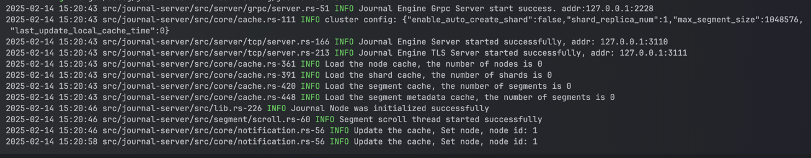

# Running with Cargo

1. **Run standalone by placement-center**

   ```
   cargo run --package cmd --bin placement-center -- --conf=config/placement-center.toml
   ```

   If the following output is displayed, it indicates that the placement-center has started successfully:
   

2. **Run standalone by mqtt-server**

   ```
   cargo run --package cmd --bin mqtt-server -- --conf=config/mqtt-server.toml
   ```

   If the following output is displayed, it indicates that the mqtt-server has started successfully:


3. **Run standalone by journal-server**

   ```
   cargo run --package cmd --bin journal-server -- --conf=config/journal-server.toml
   ```
   The following output indicates that the journal-server has started successfully:
   
