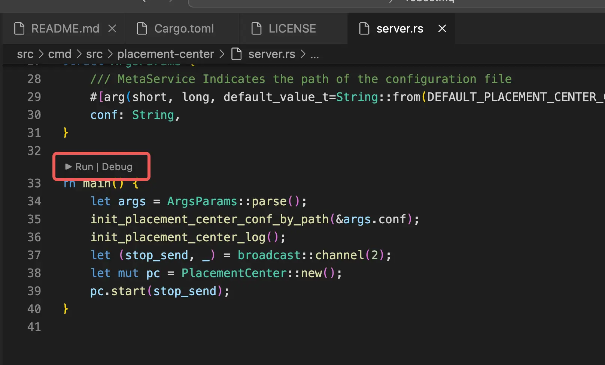

# Running in VSCode

1. **Download the Project Code**
    - Clone the project repository to your local machine.

2. **Initialize the Environment**
    - Ensure that all necessary dependencies and tools are installed and configured.

3. **Navigate to the `src/cmd/src` Directory**
    - You will see the following structure:
   ```
   .
   ├── journal-server
   │   └── server.rs
   ├── mqtt-server
   │   └── server.rs
   └── placement-center
       └── server.rs
   ```

4. **Open the Corresponding Component Directory**
    - Open the `server.rs` file in the directory of the component you want to run. You will see the `main` function as shown in the figure below:

   

    - Start the service as needed.
