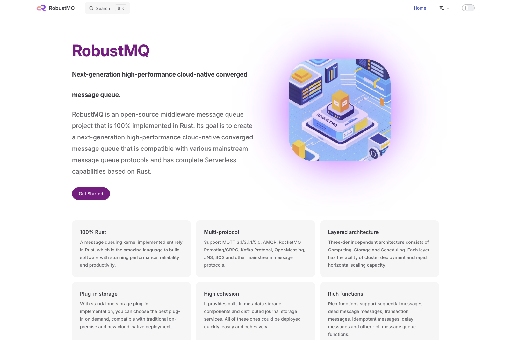

# How to Build the Documentation Environment

RobustMQ uses [VitePress](https://vitepress.dev/) to build its documentation system. If you need to modify the configuration, you can refer to the [VitePress documentation](https://vitepress.dev/guide/getting-started) to help improve the documentation build for RobustMQ.

## Mac
### Prerequisites

Install `node` using the following command:
```shell
brew install node
```

### Steps

1. Install the packages required by `VitePress` using the following command:
```shell
npm install
```

2. Start local development with the following command:
```shell
npm run docs:dev
```

3. Open the local link, and the final result should look like this:


