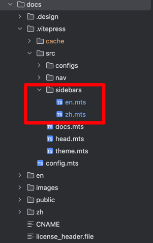
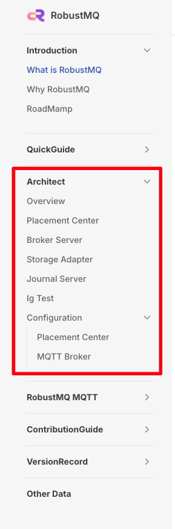
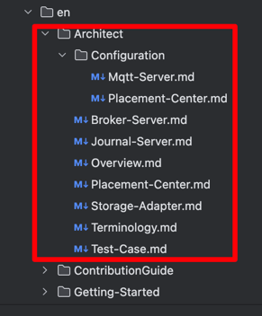

# Documentation Contribution Guide

## Overview
The directories `zh` and `en` represent Chinese and English documentation, respectively. The `images` directory contains the corresponding image content.

## Markdown Function Support Guide

For the content supported by Markdown, you can refer to the [VitePress Writing Guide](https://vitepress.dev/guide/markdown) for information on Markdown functionality and writing guidelines.

## Notes
1. When you write documentation in the `zh` directory, you need to copy it to the corresponding `en` directory. If you have time, you can use a large language model to translate it into the corresponding language. The same applies when writing `en` documentation.
2. Store the corresponding document images in the `images` directory. The naming format should be `document-name-number`.
3. If you need to reference other documents, you can refer to the [VitePress Writing Guide](https://vitepress.dev/guide/markdown). Many writing-related extension features can be found there to answer your questions.
4. After completing the writing task, you need to add it to the corresponding directory. For specific steps, please refer to the content below.

## How to Add Documents to the Directory
1. Open the `doc/.vitepress/src/sidebars` directory, as shown in the following figure:
   

   Here, `en` represents the English directory, and `zh` represents the Chinese directory. We will use the `en` directory as an example:
   ```ts
   export const sidebar = [
       {
           text: "Architect",
           collapsed: true,
           items: [
               {text: "Overview", link: "/en/Architect/Overview"},
               {text: "Meta Service", link: "/en/Architect/Meta-Service"},
               {text: "Broker Server", link: "/en/Architect/Broker-Server"},
               {text: "Storage Adapter", link: "/en/Architect/Storage-Adapter"},
               {text: "Journal Server", link: "/en/Architect/Journal-Server"},
               {text: "Ig Test", link: "/en/Architect/Test-Case"},
               {
                   text: "Configuration",
                   collapsed: true,
                   items: [
                       {text: "Meta Service", link: "/en/Configuration/META"},
                       {text: "MQTT Broker", link: "/en/Configuration/MQTT"},
                   ],
               },
           ],
       },
   ]
   ```

   The corresponding directory structure displayed is shown in the following figure:
   

   The structure in the `en` directory is shown in the following figure:
   

   Therefore, if you want to add a `Test.md` document to the corresponding directory, you just need to add the following content to the `en.mts` and `zh.mts` in `doc/.vitepress/src/sidebars` to add the content to the directory:

   ```ts
   export const sidebar = [
       {
           text: "Architect",
           collapsed: true,
           items: [
               {text: "Overview", link: "/en/Architect/Overview"},
               {text: "Meta Service", link: "/en/Architect/Meta-Service"},
               {text: "Broker Server", link: "/en/Architect/Broker-Server"},
               {text: "Storage Adapter", link: "/en/Architect/Storage-Adapter"},
               {text: "Journal Server", link: "/en/Architect/Journal-Server"},
               {text: "Ig Test", link: "/en/Architect/Test-Case"},
               {text: "Test", link: "/en/Architect/Test"}, // [!code highlight]
               {
                   text: "Configuration",
                   collapsed: true,
                   items: [
                       {text: "Meta Service", link: "/en/Configuration/META"},
                       {text: "MQTT Broker", link: "/en/Configuration/MQTT"},
                   ],
               },
           ],
       },
   ]
   ```

   ::: tip
   If you want to learn more about how to use it, you can refer to the [VitePress Sidebar Documentation](https://vitepress.dev/zh/reference/default-theme-sidebar).
   :::
