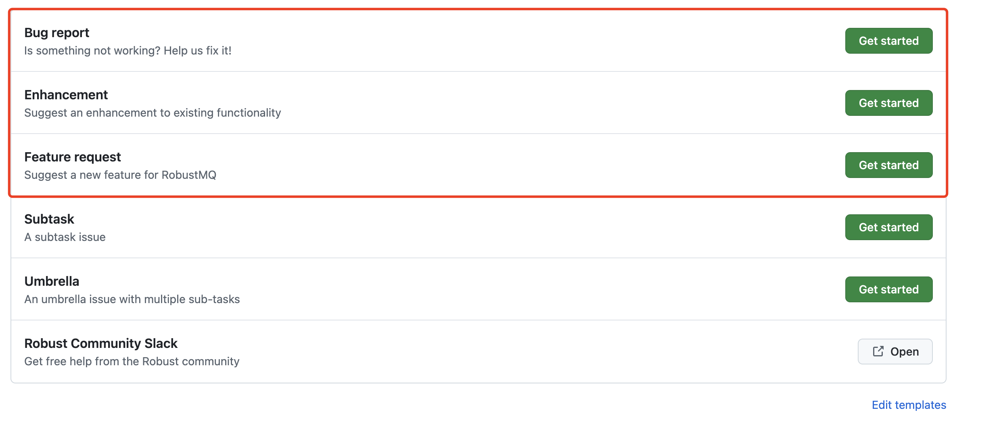
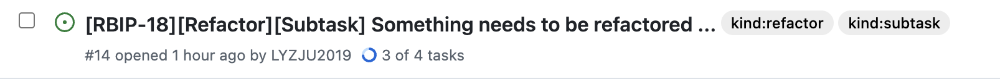

# GitHub Contribution Guide

## 1. Creating an ISSUE

The main types of ISSUES include: feat, bug, test, refactor, chore, style, docs, perf, build, ci. The corresponding explanations are as follows:
- feat: New feature
- bug: Bug issue
- test: Additional test cases
- refactor: Code refactoring that is neither a new feature nor a bug fix
- docs: Changes and additions to documentation, including code comments
- perf: Code involving performance optimization, which requires proof of optimization
- build: Changes to the build system or external dependencies
- ci: Changes to continuous integration configuration, including modifications to configuration files and scripts
- style: Code style changes, used for submission formatting, punctuation, etc., that do not affect the code
- chore: Mixed types of work, possibly involving multiple other types of changes

### Users and Contributors Creating ISSUES

For users and contributors, if there are new feature requirements or bug fixes, they can submit an Issue by selecting `BugReport`, `Enhancement` or `FeatureRequest`.



### Committer Creating ISSUES

If it is a small development task, then the process of creating an issue will be similar to users and contributors. You can  use `BugReport`, `Enhancement`, or `FeatureRequest` to associate your issue with pull requests.

If it is a relatively large planned task that needs to be broken down, use `Umbrella` to associate with the corresponding issues and plan subtasks inside `Umbrella`. The specifics are as follows:


For each subtask, create the corresponding subtask using `Subtask` and describe the specific content that needs to be completed for that subtask.

For `Umbrella`, it is temporarily divided into two categories, RBIP-* and MINOR.

RBIP-*: Indicates the addition of features and characteristics, such as RBIP-09, RBIP-10, with the sequence number increasing.


MINOR: Indicates fixing or adding small features. It can start with MINOR, followed by the title.


For `Subtask`, use the following format:
`[RBIP-*/MINOR][Style/Refactor/Performance/Docs/Test/Build/CI/Chore][Subtask] xxx`, for example,



## 2. Creating a Pull Request

If the PR is associated with an ISSUE, it must include the following in the PR content:

```
close #issue_number
```

`close` is a fixed prefix, `#` is also a fixed prefix, and `issue_number` represents the ISSUE number associated with the PR. For example:


#297, #292 are the corresponding ISSUE numbers.

For example, if you need to submit a PR to resolve ISSUE #297, the PR content should include:

```
close #297
```

When this PR is MERGED, the ISSUE will be automatically closed. After the PR is merged, the PR and ISSUE will look like this:

PR:


ISSUE:


For more details, you can refer to the [PR submission example](./Pull-Request-Example.md).

## 3. Sign off

A signature is a simple line of text at the end of the code description that proves that you wrote the code or that you have the rights to release it as open source.

You just add one line to each git commit message:

```text
Signed-off-by: your_name <your_email>
```

You can add a signature when you create a git commit with `git commit -s`.

If you want to do this automatically, you can set up some aliases:

```bash
# will automatically add the signature when committing using the alias
git config --add alias.c "commit -s"
```

Example commit message:

```text
feat: a good start!

Signed-off-by: robustmq <robustmq@outlook.com>
```

## 4. Reasons for PR Submission Failure

#### License Error

License checker / license-header-check (pull_request) failed. Some files are missing a License, which needs to be added. It is best to run the check command before each submission.

```
cargo install hawkeye

# Execute in the current project to check which files are missing a License
hawkeye check

# Automatically add a License to each code file
hawkeye format
```

#### Title Format Error

PR Title Checker / check (pull_request_target) failed due to incorrect PR title format.

```
Prefix: Title
Prefix options include: feat|fix|test|refactor|chore|style|docs|perf|build|ci|revert

feat: New feature
For example: feat: Compatible with Rocksdb

fix: Bug fix
docs: Documentation change
style: Code style change (does not affect code logic), used for submissions that only involve formatting, punctuation, whitespace, etc., that do not affect code execution.
refactor: Code refactoring (code changes that are neither new features nor bug fixes)
perf: Performance optimization
test: Adding or modifying tests
chore: Miscellaneous (changes to the build process or auxiliary tools)
build: Changes to the build system or external dependencies
ci: Changes to continuous integration configuration, including modifications to configuration files and scripts.
revert: Revert
```

### Fix DCO check failure error

If your PR fails the DCO check, you need to fix the entire commit history in the PR.

We recommend that you compress the commits in the PR into a single one, attach a signature according to the signing process, and then force a commit.

For example, there are 3 commits in your PR:

```bash
git rebase -i HEAD^3
(interactive squash + sign off append)
git push origin -f
```

Note that this approach will cause multiple commit records to be compressed into one, which makes review difficult and is only used to fix DCO checks.

Best practice is to include a signature in every commit.