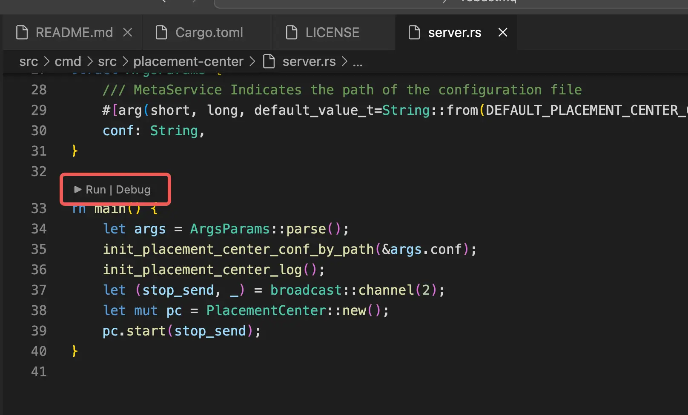

# VS Code Running
## Overview
Download the project code.
Initialize the environment.
Enter the `src/cmd/src` directory, and you can see:
```
.
├── journal-server
│   └── server.rs
├── mqtt-server
│   └── server.rs
└── placement-center
    └── server.rs
```

Enter the directory of the corresponding component, open `server.rs`, and you will see the `main` function. As shown in the figure below, you can start the service:


