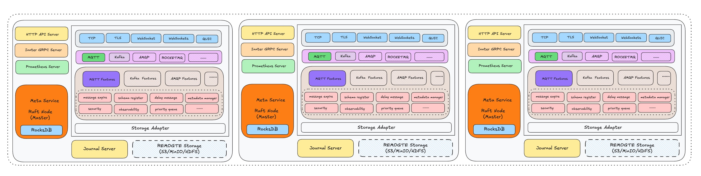

<div align="center">
  
</div>

## What is RobustMQ

RobustMQ is a next-generation unified communication platform built with Rust, purpose-designed for AI, IoT, and big data scenarios.

**Vision: The next-generation unified communication infrastructure for AI, IoT, and big data.**

Through dual MQTT and Kafka protocols, million-scale Topics, object storage (S3/MinIO, etc.) data sources, multi-mode storage engines (memory/hybrid/persistent/tiered), and intelligent data caching, RobustMQ provides high-performance, low-cost, and stable communication infrastructure for AI training, Agent communication, IoT devices (edge/cloud), and big data processing.

---

## Why RobustMQ

Existing communication middleware is designed for single-purpose scenarios:

- **Kafka** was designed for big data log streaming. Topic counts are limited by the file system (tens of thousands at most), making it unable to support million-scale Agent communication and AI training data caching needs.
- **MQTT Brokers** are designed for IoT device connectivity and lack the high-throughput data stream processing capabilities.
- **Neither considered** the new demands of the AI era: Agent communication isolation, GPU training data acceleration, and unified edge-to-cloud data pipelines.

RobustMQ was designed for these scenarios from the ground up, rather than retrofitting existing systems.

---

## Architecture



RobustMQ consists of three components with a fixed, clear architecture:

### Meta Service
Responsible for cluster metadata management and coordination. All node states, Topic configurations, and client session information are stored in Meta Service, with consistency and high availability guaranteed by a self-developed **Multi Raft** mechanism. Multiple independent Raft Groups handle different types of metadata, avoiding the performance bottleneck of a single Raft group.

### Broker
Responsible for protocol processing and request routing. The Broker is **stateless**, handling only client connections, protocol parsing, and message routing without holding any persistent data. This compute-storage separation design allows Brokers to scale horizontally at any time without data migration.

### Storage Engine
Responsible for data persistence. Supports three storage engines, configurable independently per Topic:

| Engine | Latency | Use Case |
|--------|---------|---------|
| Memory | Microseconds | Gradient sync, real-time metrics, ephemeral notifications |
| RocksDB | Milliseconds | Million-scale Topics, IoT device messages, offline storage |
| File Segment | Milliseconds | High-throughput log streaming, Kafka workloads |

The storage engine uses a pluggable interface and can be extended with additional backends (HDFS, object storage, etc.) in the future.

---

## Core Features

### 🦀 High-Performance Rust Core
Zero-cost abstractions, memory safety, and no GC pauses. Built on the Tokio async runtime, delivering stable latency with no GC-induced jitter.

### 🔌 Multi-Protocol Support
- **MQTT 3.x / 5.0**: Full protocol support for IoT devices and edge computing
- **Kafka Protocol** (in development): Existing Kafka clients and toolchains connect with zero code changes

The same data can be written via MQTT and consumed via Kafka. Both protocols share the same storage layer with zero-copy protocol conversion.

RobustMQ's architecture is designed to support additional protocols over time. **AMQP, RocketMQ, and other protocols** are part of the long-term roadmap — the architecture already accommodates them. However, the short-term focus is on building MQTT and Kafka support to a solid, production-ready standard first.

### 🤖 Million-Scale Lightweight Topics
Unified KV storage based on RocksDB. All Topics share the same storage instance, distinguished by key prefixes. Creating a Topic is simply adding a metadata record — no physical files are created, supporting millions of Topics. Each AI Agent can have its own isolated communication channel.

### 🔄 Shared Subscription
Borrowed from MQTT's shared subscription mechanism, breaking Kafka's limitation of "concurrency equals number of Partitions." Multiple consumers can concurrently consume from the same Partition, completely decoupling consumer concurrency from storage sharding — enabling elastic scaling for AI training clusters.

### 🧠 Object Storage Data Source & Intelligent Cache (In Development)
Topics can directly point to file paths in S3/MinIO. RobustMQ acts as an intelligent cache layer with three-tier caching (memory/SSD/object storage) and predictive preloading, reducing training data access latency from 200ms to under 2ms and significantly improving GPU utilization.

---

## Use Cases

| Scenario | Description |
|----------|-------------|
| **IoT Device Connectivity** | MQTT protocol, millions of concurrent device connections, QoS 0/1/2, offline messages, will messages |
| **AI Agent Communication** | Million-scale Topics, independent channel per Agent, precise monitoring and permission isolation |
| **AI Training Data Acceleration** | Direct object storage integration, intelligent cache layer reduces GPU wait time |
| **Edge-to-Cloud Data Pipeline** | MQTT edge collection, Kafka cloud consumption, unified dual-protocol storage, no bridge layer needed |
| **Big Data Stream Processing** | Kafka protocol compatible, zero-change integration with Flink/Spark/Kafka Connect |

---

## Current Status

| Feature | Status |
|---------|--------|
| MQTT 3.x / 5.0 Core Protocol | ✅ Available |
| Session Persistence & Recovery | ✅ Available |
| Shared Subscription | ✅ Available |
| Authentication & ACL | ✅ Available |
| Rule Engine | ✅ Basic Available |
| Grafana + Prometheus Monitoring | ✅ Available |
| Web Management Console | ✅ Available |
| Kafka Protocol | 🚧 In Development |
| AI Training Data Cache | 🚧 In Development |

> **Note**: The current version (0.3.0) is still in early stages and not recommended for production use. Version 0.4.0 is expected to reach production-ready status around May 2025.

---

## Quick Start

```bash
# Install and start
curl -fsSL https://raw.githubusercontent.com/robustmq/robustmq/main/scripts/install.sh | bash
broker-server start

# Verify MQTT connection
mqttx pub -h localhost -p 1883 -t "test/topic" -m "Hello RobustMQ!"
mqttx sub -h localhost -p 1883 -t "test/topic"
```

Access `http://localhost:8080` to open the Web management console.

Full documentation: [Quick Start Guide](../QuickGuide/Quick-Install.md)

---

## Project Philosophy

RobustMQ is a **non-commercial open source project** with no corporate backing, no paid version, and all core features fully open source.

This is a project driven by technical conviction — believing that redesigning communication infrastructure with Rust is the right direction, that the AI era needs a messaging system truly designed for new scenarios, and that excellent infrastructure software should belong to the entire community.

The long-term goal is to become an **Apache Top-Level Project**, building a global developer community for sustainable growth.

---

## Project Info

- **Language**: Rust
- **License**: Apache 2.0 (fully open source, no commercial version)
- **GitHub**: https://github.com/robustmq/robustmq
- **Website**: https://robustmq.com
