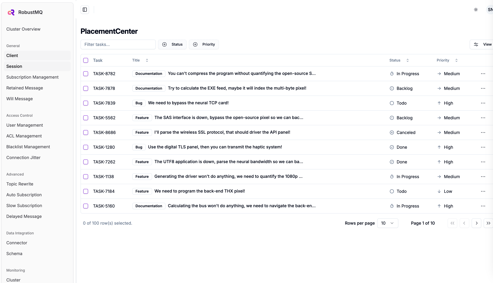
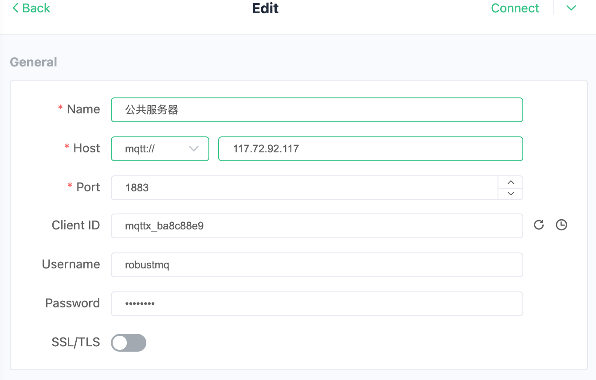
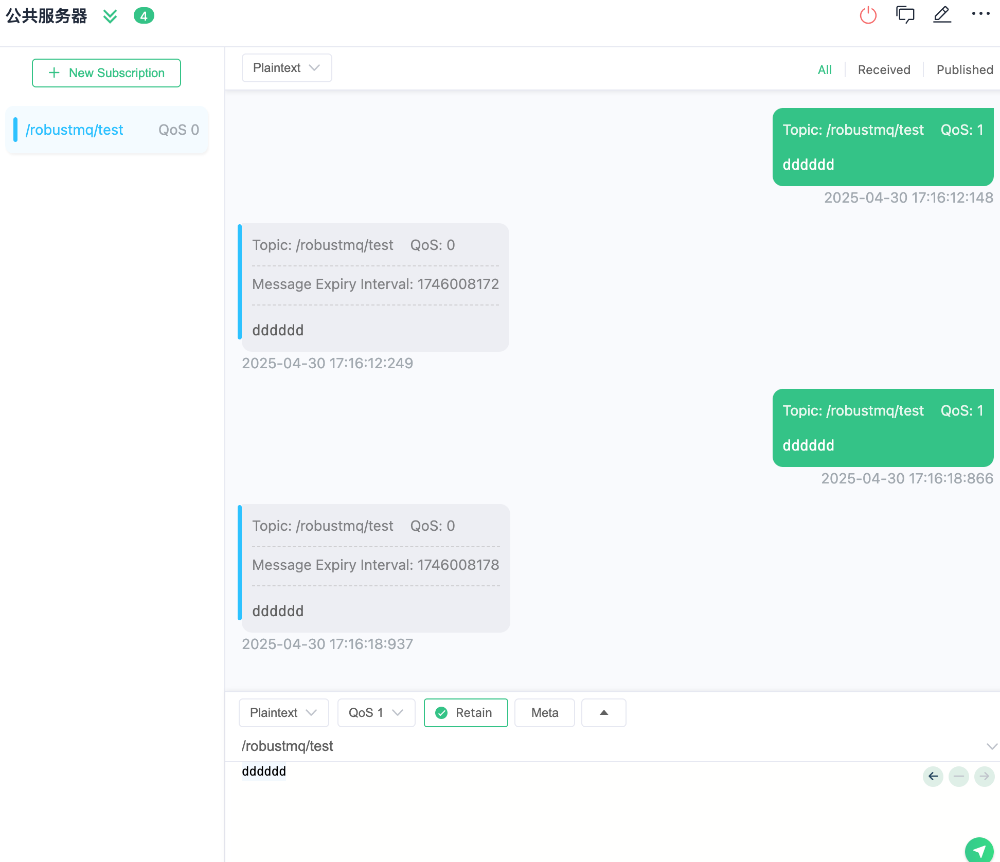

# RobustMQ Public MQTT Server

This guide introduces how to use the public MQTT server provided by RobustMQ for testing and development.

## Server Information

### Endpoints

| Protocol | Address | Port | Description |
|----------|---------|------|-------------|
| MQTT TCP | 117.72.92.117 | 1883 | Standard MQTT connection |
| MQTT SSL/TLS | 117.72.92.117 | 1884 | Encrypted MQTT connection |
| MQTT WebSocket | 117.72.92.117 | 8083 | WebSocket connection |
| MQTT WebSocket SSL | 117.72.92.117 | 8084 | Encrypted WebSocket connection |
| MQTT QUIC | 117.72.92.117 | 9083 | QUIC protocol connection |

### Authentication

- **Username**: `admin`
- **Password**: `robustmq`

### Management Interface

- **Dashboard**: <http://117.72.92.117:8080/>



## Quick Experience

> **📦 MQTTX Installation**: If you haven't installed MQTTX CLI yet, please refer to our [MQTTX Installation Guide](../RobustMQ-MQTT/MQTTX-Guide.md#installing-mqttx-cli) for detailed installation instructions on different platforms.

> Web UI ：https://mqttx.app/web-client#/recent_connections

### Using MQTTX Command Line Tool

#### 1. Send Messages

```bash
# Send simple message
mqttx pub -h 117.72.92.117 -p 1883 -u admin -P robustmq -t "test/topic" -m "Hello RobustMQ!"

# Send QoS 1 message
mqttx pub -h 117.72.92.117 -p 1883 -u admin -P robustmq -t "test/qos1" -m "QoS 1 message" -q 1

# Send retained message
mqttx pub -h 117.72.92.117 -p 1883 -u admin -P robustmq -t "test/retained" -m "Retained message" -r

# Send JSON format message
mqttx pub -h 117.72.92.117 -p 1883 -u admin -P robustmq -t "sensors/temperature" -m '{"value": 25.5, "unit": "celsius"}'
```

#### 2. Subscribe to Messages

```bash
# Subscribe to single topic
mqttx sub -h 117.72.92.117 -p 1883 -u admin -P robustmq -t "test/topic"

# Subscribe to wildcard topics
mqttx sub -h 117.72.92.117 -p 1883 -u admin -P robustmq -t "test/+"  # Single-level wildcard
mqttx sub -h 117.72.92.117 -p 1883 -u admin -P robustmq -t "test/#"  # Multi-level wildcard

# Subscribe and display detailed information
mqttx sub -h 117.72.92.117 -p 1883 -u admin -P robustmq -t "test/topic" --verbose
```

#### 3. Performance Testing

```bash
# Publish performance test
mqttx bench pub -h 117.72.92.117 -p 1883 -u admin -P robustmq -t "test/bench" -c 10 -C 100

# Subscribe performance test
mqttx bench sub -h 117.72.92.117 -p 1883 -u admin -P robustmq -t "test/bench" -c 50
```

### Using MQTTX GUI Client

#### 1. Connection Configuration

- **Host**: 117.72.92.117
- **Port**: 1883
- **Username**: admin
- **Password**: robustmq
- **Client ID**: Custom



#### 2. Publish and Subscribe

After connecting successfully, you can:

- Create subscriptions to receive messages
- Publish messages to specified topics
- View real-time message flow



## Complete Example

### Step 1: Subscribe to Messages

```bash
# Terminal 1: Subscribe to temperature sensor data
mqttx sub -h 117.72.92.117 -p 1883 -u admin -P robustmq -t "sensors/temperature" --verbose
```

### Step 2: Send Messages

```bash
# Terminal 2: Send temperature data
mqttx pub -h 117.72.92.117 -p 1883 -u admin -P robustmq -t "sensors/temperature" -m '{"sensor": "temp-001", "value": 23.5, "unit": "celsius", "timestamp": "2024-01-01T12:00:00Z"}'
```

### Step 3: View Dashboard

Visit <http://117.72.92.117:3000/> to view real-time connections and message statistics.

## Important Notes

1. **Public Server Limitations**: This is a public server for testing purposes, do not use in production environments
2. **Message Retention**: Messages are not permanently retained, please process them promptly
3. **Connection Limits**: Please use reasonably to avoid excessive resource consumption
4. **Security Reminder**: Do not transmit sensitive information in messages

## Supported Protocol Features

- ✅ MQTT 3.1.1
- ✅ MQTT 5.0
- ✅ QoS 0, 1, 2
- ✅ Retained Messages
- ✅ Will Messages
- ✅ Topic Wildcards
- ✅ SSL/TLS Encryption
- ✅ WebSocket Support
- ✅ QUIC Protocol Support
