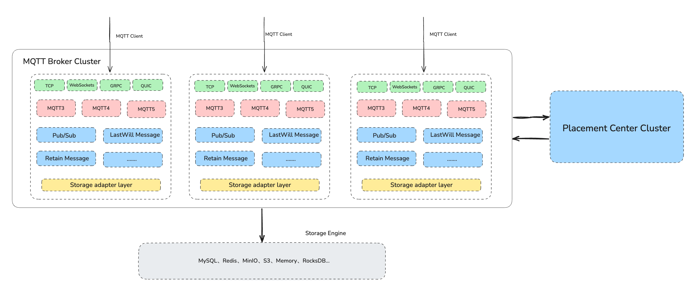

# Overview
RobustMQ MQTT is the Converged Message Queue RobustMQ's complete implementation of the MQTT protocol, which fully supports all the features and functionality of MQTT 3.1/3.1.1/5.0. It supports cluster mode deployment, and a single cluster can host tens of billions of connections, and support TCP, SSL, WebSocket, WebSockets, QUIC and other access methods.

RobustMQ MQTT goal is to build a high-performance, highly available, and scalable Broker Server in Rust that supports the standard MQTT protocol.

## Feature
| Feature | description |
| --- | --- |
| Cluster deployment | Broker node stateless deployment, a single cluster supports up to hundreds of Broker nodes |
| Maximum connections in a single machine | A single machine can carry millions of connections. |
| Cluster Max connection | The cluster can support 10 billion levels of connections. |
| MQTT protocol | Full support for all features of MQTT 3.1/3.1.1/5.0 |
| Network protocol | Supports TCP, SSL, WebSocket, WebSockets protocol access |
| Keep message | support |
| Testamentary message | Support |
| Shared subscriptions | Support |
| System topic | support |
| Exclusive subscription | Support |
| Delayed release | Support |
| Auto-subscribe | Support |
| Topic rewriting | Support |
| Wildcard subscription | Support |
| Session | Supports sessions, as well as Session persistence and expiration. |
| Authentication | Supports password authentication for built-in databases, MySQL, Redis |
| Authorization | Supports authentication implementations for built-in databases, MySQL, Redis |
| blacklist | supported |
| Connection jitter | Support |
| Message store | Messages are automatically dropped when the Topic is not subscribed |
| Offline messages | Support for storing offline messages based on Memory, RocksDB, MySQL, Journal Engine, S3, Minio, and other storage engines |
| Data integration | Bridge connector with File/Kafka support |
| Metrics | Supports metrics along the cluster /Topic dimension |
| Prometheus | Supported |
| Trace | supported |
| System topic | support |
| Slow subscribe statistics | Support |
| QUIC protocol | supported |

## MQTT 5 features
| Feature | description |
| --- | --- |
| MQTT publish/subscribe | Support |
| Subscription QOS 0,1,2 | Support |
| Publish QOS 0,1,2 | Support |
| Subscribe to wildcards | Support |
| Session | Yes, supports Session persistence and expiration. |
| Keep message | support |
| Testamentary message | Support |
| Request/Response | Supported |
| User Properties | supported |
| Topic Alias | supported |
| Payload Format Indicator & Content Type | supported |
| Shared Subscriptions | supported |
| Subscription Options | supported |
| Subscription identifiers | supported |
| Keep Alive | Supported |
| Message Expiry Interval | Supported |
| Maximum Packet Size | Support |
 
## 架构概述

As shown in the figure above: RobustMQ MQTT consists of three parts: MQTT Broker, Placement Center, and Storage Engine.

The Placement Center is the metadata management center for the RobustMQ MQTT cluster and is responsible for metadata management of the MQTT cluster, node management of the cluster, failure recovery of the cluster, and more.

MQTT brokers are completely stateless nodes, and MQTT clients randomly access the Pub/Sub where a Broker completes the message data. MQTT Broker completes node discovery and node exploration based on Placement Center, thus completing cluster construction.

The MQTT cluster persistently stores message data to the Storage Engine through the Storage Adapter layer.

The metadata of the MQTT Cluster is stored in the Placement Center Cluster. MQTT Broker supports the parsing of MQTT 3/4/5 protocol based on TCP and the internal control and scheduling of the cluster based on GRPC protocol.

The Placement Center will run the controller thread corresponding to the MQTT Broker cluster. Responsible for scheduling MQTT clusters, such as the Leader of the shared cluster.

## Dashboard
RobustMQ MQTT Dashboard is under intensive development.

## Command-line tools
RobustMQ MQTT supports the robust-ctl mqtt tool. For more information, please refer to: [robustmq-ctl mqtt](../RobustMQ-Command/Mqtt-Broker.md)