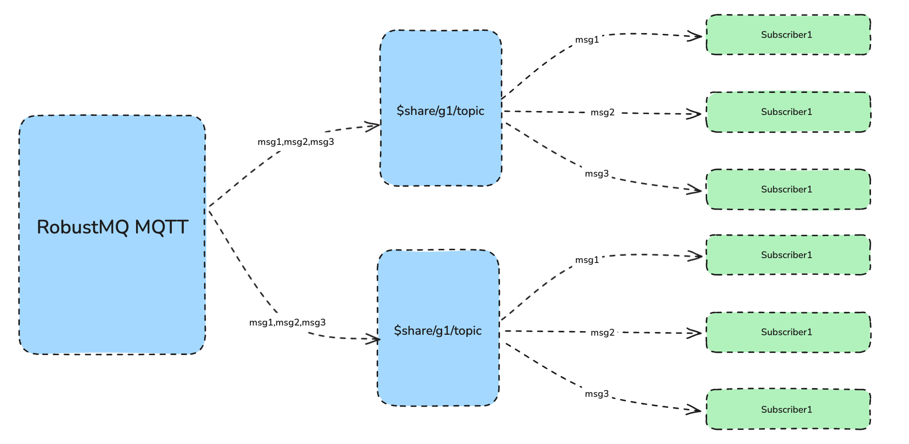
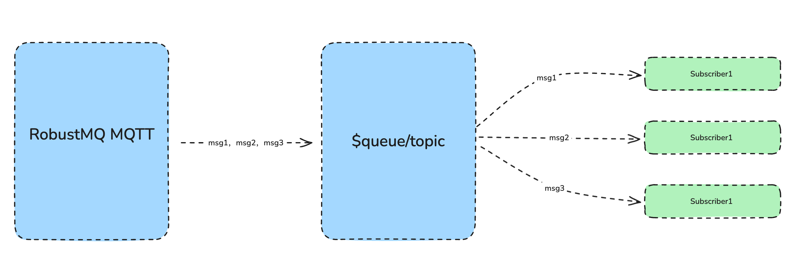

## Overview
RobustMQ MQTT implements the shared subscription functionality. A shared subscription is a subscription pattern used to achieve load balancing among multiple subscribers. Clients can be divided into multiple subscription groups, and messages will still be forwarded to all subscription groups, but only one client will receive the message within each subscription group. You can prefix the original topic for a group of subscribers to enable a shared subscription.

RobustMQ MQTT supports two formats of shared subscription prefixes, one for shared subscriptions with groups (prefixes $share/&lt; group-name&gt; /) and shared subscriptions without groups (prefixed with $queue/). Examples of two shared subscription formats are as follows:
- with group format, $share/abc/t/1, $share/abc/, t/1
- without group format , $queue/t/1, $queue/, t/1

## Shared subscriptions with groups
You can do this by prefacing the original theme with $share/&lt; group-name&gt;  Subscribers prefixed with a group enable shared subscriptions. The group name can be any string. The RobustMQ MQTT Broker forwards messages to different groups simultaneously, and subscribers belonging to the same group can receive messages using load balancing.

For example, if subscribers s1, s2 and s3 are members of group g1, subscribers s4 and s5 are members of group g2, and all subscribers subscribe to the original topic t1. The topics of the shared subscription must be $share/g1/t1 and $share/g2/t1. When the RobustMQ MQTT Broker publishes message msg1 to the original topic t1:

RobustMQ MQTT Broker sends msg1 to both groups g1 and g2.
One subscriber in s1, s2, s3 will receive msg1.
One subscriber in s4 and s5 will receive msg1.

## Shared subscriptions without groups
A shared subscription prefixed with $queue/ is a shared subscription without a group. It's a special case of the $share subscription. You can think of this as all subscribers are in one subscription group, like $share/$queue.

## Share subscriptions and sessions
When a client has a persistent session and subscripts to a shared subscription, the session will continue to receive messages published to the shared subscription topic when the client disconnects. If the client is disconnected for a long time and the message publishing rate is high, the internal message queue in the session state may overflow. To avoid this problem, it is recommended to use clean_session=true sessions for shared subscriptions. That is: the session expires immediately after the client disconnects.

When the client uses MQTT v5, it is recommended to set a short session expiration time (if not 0). This allows the client to temporarily disconnect and reconnect to receive messages published during the disconnection. When a session expires, QoS1 and QoS2 messages in the send queue, or QoS1 messages in the flight window are redistributed to other sessions in the same group. When the last session expires, all pending messages are discarded.
