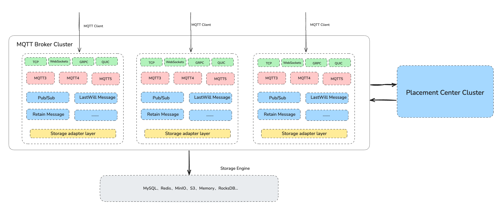

## System Architecture

As shown in the figure above: RobustMQ MQTT is composed of three parts: MQTT Broker, Placement Center, and Storage Engine.

The MQTT Broker is a completely stateless node. It uses the Placement Center to perform node discovery and health checks, thereby completing the cluster construction. MQTT clients randomly access a Broker to complete the Pub/Sub of message data. The MQTT Broker supports the parsing of MQTT 3/4/5 protocols based on TCP, and the internal control and scheduling of the cluster based on the GRPC protocol.

The metadata of the MQTT cluster is stored in the Placement Center Cluster. The Placement Center is the metadata management center of the RobustMQ MQTT cluster, responsible for the management of cluster metadata, node management, fault recovery, etc. The Placement Center runs the controller threads corresponding to the MQTT Broker cluster, which are responsible for the scheduling of the MQTT cluster, such as the Leader of the shared cluster.

The MQTT cluster persists message data to the Storage Engine through the Storage Adapter layer.
