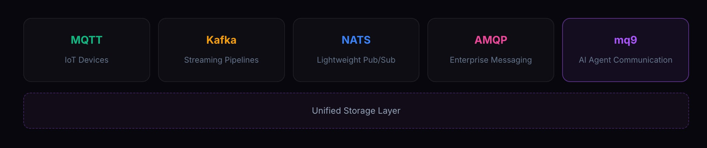

# mq9 Overview

## What is mq9

mq9 is RobustMQ's protocol layer designed specifically for AI Agent communication. It sits alongside MQTT, Kafka, NATS, and AMQP, built natively on top of RobustMQ's unified storage architecture.

### What problem it solves

In multi-Agent systems, Agents are not servers — they are task-driven, they start, execute, and die, coming online and offline at any time. When Agent A sends a message to Agent B and B is offline, the message is gone. Every team building multi-Agent systems works around this with their own temporary solution:

- **Redis pub/sub**: No persistence — messages are lost if the recipient is offline
- **Kafka**: Topics require advance creation and maintenance; not designed for throwaway Agents
- **Homegrown queues**: Every team rebuilds the same thing; Agent implementations are incompatible across teams

These approaches work, but they're all workarounds — **offline delivery is treated as a boundary condition handled manually, not a guarantee provided by the infrastructure.**

mq9 solves it directly: **send a message, the recipient gets it when they come online.** Just like email — you send it, the recipient reads it whenever they're available, and the message doesn't disappear.

A system today might have dozens of Agents; tomorrow it might have millions. mq9 is designed for that scale from the start: mailboxes created on demand, TTL auto-destruction, horizontally scalable Broker. From the first Agent to millions — the same API, the same operational model.

### Current capabilities

Already available: mailbox lifecycle (TTL auto-destruction), three-tier priority messages (critical / urgent / normal), store-first delivery, competing consumers, public mailbox discovery, Python SDK, LangChain/LangGraph toolkit, and MCP Server.

### Future direction

The mailbox solves "messages get delivered." But as Agent networks mature, more is needed: semantic discovery (Agents describe needs rather than specifying addresses), intent routing (messages automatically find the best recipient), policy interception (the transport layer understands semantics and enforces access control), and context awareness (conversation history travels with messages, reducing repeated token transmission).

These four directions are mq9's evolution roadmap — see [Roadmap](./Roadmap.md). The thinking behind them: [What should a messaging system look like in the AI era](../Blogs/82.md).

---

## Positioning

mq9 is not a general-purpose message queue. It does not compete with or replace MQTT or Kafka. It is designed specifically for **AI Agent async communication**. HTTP and A2A protocols solve synchronous calls — the caller waits, the recipient must be online. mq9 solves async communication — send it, the recipient handles it whenever they're online. The two don't overlap and don't compete.

### Position within RobustMQ

mq9 is RobustMQ's fifth native protocol, sharing the same unified storage architecture as MQTT, Kafka, NATS, and AMQP. Deploy one RobustMQ instance — all capabilities are ready. IoT devices send data over MQTT, analytics systems consume over Kafka, Agents collaborate over mq9 — one broker, one storage layer, no bridging, no data copying.

### Position within the NATS ecosystem

mq9 is built on top of the NATS protocol, but NATS is only the transport layer — the communication protocol between client and Broker, just like HTTP is the transport protocol for the Web. mq9's Broker is implemented by RobustMQ entirely in Rust; storage, priority scheduling, TTL management, and store-first delivery semantics are all RobustMQ's own capabilities, with no relation to NATS Server.

The choice of NATS is pragmatic: NATS has official and community clients covering 40+ languages; Python, Go, JavaScript, and Rust — the most common languages in AI — all have mature implementations. mq9 is ready out of the box for developers in all these languages from day one, with no need to wait for SDK coverage. NATS pub/sub and request/reply primitives also happen to cover all the communication patterns mq9 needs.

In semantic terms, mq9 sits between NATS Core and JetStream. Core NATS is too lightweight — no persistence, messages lost offline. JetStream is too heavy — streams, consumers, offsets, ACK — unnecessary machinery just to send a message between Agents. mq9 adds persistence, priority, and TTL auto-management on top of pub/sub, without introducing streams, consumer groups, or offsets.

---

## Core Concept: Mailbox

mq9 has a single core abstraction: **Mailbox (MAILBOX)**.

Why a mailbox? Because mq9 treats Agents like people. The most natural async communication between people is email — you write it, send it, the recipient reads it whenever they're available; you don't have to wait, and the message doesn't disappear. Agent communication is fundamentally the same scenario: send it, the recipient gets it when they come online. Mailbox is the most intuitive mapping.

Following that analogy:

- **Address**: Every mailbox has a `mail_address` — its communication address. Private mailbox addresses are system-generated and unguessable, like a personal inbox only you know; public mailbox addresses are user-defined (e.g. `task.queue`), like a public department inbox that anyone can find and deliver to.

- **Letters**: Every message sent to a mailbox has a priority — normal (default), urgent, or critical. Priority is encoded in the delivery address, not the message content. Messages are delivered in priority order: critical first, then urgent, then normal; FIFO within the same priority.

- **Offline delivery**: When you're not around, letters still arrive and wait for you. mq9's store-first semantics work exactly this way — messages are written to storage first; when a subscriber comes online, all non-expired messages are pushed in full, in order by priority; nothing is lost due to being offline.

- **Mailbox lifetime**: Mailboxes declare a TTL at creation; they auto-destroy on expiry, taking all pending messages with them. No manual cleanup needed — forget about it when the task ends, the system handles it.

- **Security boundary**: An unguessable `mail_address` is the security boundary. Knowing the address lets you send and receive; without it, there's no way to interact. No token, no ACL — the address itself is the credential.

**Two kinds of mailboxes:**

| | Private mailbox | Public mailbox |
|---|---|---|
| `mail_address` | System-generated, unguessable | User-defined, meaningful name |
| Discoverability | Private — only Agents who know the `mail_address` can find it | Auto-registered to `PUBLIC.LIST`, discoverable by anyone |
| Use cases | Point-to-point messaging, task result delivery | Task queues, public channels, capability announcements |

---

## Operations at a Glance

| Operation | Subject | Description |
|-----------|---------|-------------|
| Create mailbox | `$mq9.AI.MAILBOX.CREATE` | Create a private or public mailbox; idempotent |
| Send (normal) | `$mq9.AI.MAILBOX.MSG.{mail_address}` | Default priority, no suffix |
| Send (urgent) | `$mq9.AI.MAILBOX.MSG.{mail_address}.urgent` | Urgent priority |
| Send (critical) | `$mq9.AI.MAILBOX.MSG.{mail_address}.critical` | Highest priority |
| Subscribe | `$mq9.AI.MAILBOX.MSG.{mail_address}.*` | Subscribe to all priorities |
| List messages | `$mq9.AI.MAILBOX.LIST.{mail_address}` | Return message metadata (non-consuming) |
| Delete message | `$mq9.AI.MAILBOX.DELETE.{mail_address}.{msg_id}` | Delete a specific message |
| Discover public mailboxes | `$mq9.AI.PUBLIC.LIST` | System-managed; subscribing triggers a full push |

**Three priority levels:**

| Level | Typical use |
|-------|-------------|
| `critical` (highest) | Abort signals, emergency commands, security events |
| `urgent` | Task interrupts, time-sensitive instructions |
| `normal` (default, no suffix) | Task dispatch, result delivery, routine communication |

---

## Design Principles

**Store first, then push**: Messages are written to the storage layer on arrival. Online subscribers take the real-time path; offline subscribers wait, and receive all non-expired messages in full on the next subscription. Agents that reconnect never miss messages.

**mail_address is not tied to Agent identity**: mq9 recognizes `mail_address`, not `agent_id`. One Agent can create different mailboxes for different tasks, leave them alone when done, and TTL handles cleanup automatically. Channel-level design, not identity-level.

**No new concepts invented**: Subscriptions reuse NATS native sub semantics. Competing consumers reuse NATS native queue groups. Reply-to reuses NATS native mechanisms.

**Broker is fully self-developed**: NATS is only the transport protocol. Storage, priority scheduling, TTL management, and store-first delivery semantics are all implemented by RobustMQ in Rust, running on RobustMQ's unified storage layer.

**Single node is enough, scale when needed**: A single instance covers most workloads, started with one command. When high availability is needed, switch to cluster mode — the API is unchanged, Agents notice nothing.
