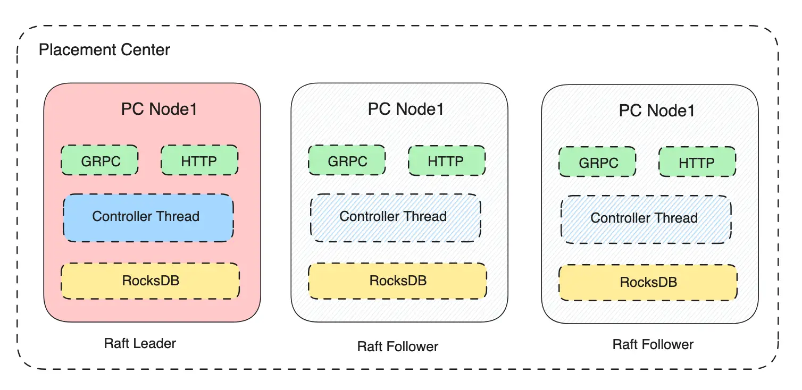

Placement Center（后面简称PC）是基于 Raft 和 RocksDB 实现一个元数据存储组件。从存储的角度看，它是一个高性能的分布式KV存储服务。从定义上看，它是 Robust Broker 和 Robust Journal 集群的元数据存储、控制和调度中心。架构如下：

- PC 是一个通过 Raft 协议组成的集群，根据 Raft 协议的定义完成Leader选举，切换、数据一致性等等。
- Placement Center Node (后面简称PCN) 是 PC 集群的运行节点，启动时会根据Raft协议选举出Leader和Follower，当Node 异常后，会自动进行Leader切换。
- PCN 单机的存储层是基于RocksDB来实现的。结合Raft协议实现数据的分布式可靠存储。
- PC 数据写入都是在Leader完成的，读取可以在 Leader 和 Follower 完成。
- 数据写入到Leader节点后，会先写入到本地的RocksDB进行持久存储，然后根据Raft协议分发到多个Follower。
- 数据读取可以从Leader或Follower节点读取，会直接从本地缓存和RocksDB读取相关数据。
- Placement Center（PC）支持GRPC和HTTP两种协议，GRPC是默认的数据流协议，负责数据的写入和读取。HTTP协议主要用来完成集群管控、集群状态、监控信息的操作和获取等等。
- Leader 节点会运行控制和调度相关的Controller Thread，用来监控Robust Broker和Robust Journal 集群，并执行必要的调度动作。
- Placement Center（PC）支持单节点运行和集群运行两种模式。集群模式建议最少3节点，并且节点数是奇数。
