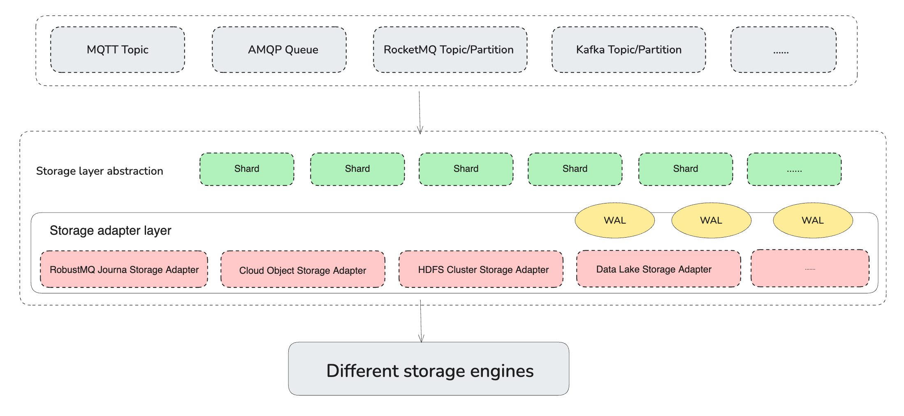

# Storage Adapter
## 背景
在传统的消息队列中，往往都只支持某一种单一存储，比如 Kafka/RocketMQ/RabbitMQ 的本地存储，Pulsar 的 Bookeeper 等。从而导致了这些消息队列无法完美满足在不同场景下的，比如选型、成本、性能、稳定性方面的灵活诉求。

比如云原生场景下，我们希望使用云原生的存储系统，比如 Object Storage(S3)，来存储消息数据。在自建场景下，我们希望使用自研的存储系统，比如 HDFS，来存储消息数据。此时，我们就需要一个统一的存储语意，来屏蔽不同存储系统的差异。

因此为了解决该问题，RobustMQ 在架构的角度通过 Storage Adapter 提供了一个统一的存储语意，并在底层对接各种不同的存储，从而屏蔽不同存储系统的差异。从而可以满足不同场景选型、成本、性能、稳定性方面的灵活诉求。

## 设计


Storage Adapter 是一个 lib，不是一个 Service。它通过 trait StorageAdapter 定义了以下语意：
- create_shard： 创建 Shard
- list_shard： 列举 Shard
- delete_shard： 删除 Shard
- write： 写入单条数据
- batch_write：写入多条数据
- read_by_offset ： 按 Offset 读取数据
- read_by_tag： 按 Tag 读取数据
- read_by_key： 按 Key 读取数据
- get_offset_by_timestamp： 按 Timestamp 获取 Offset
- get_offset_by_group： 按 Group 获取 Offset
- commit_offset： 提交 Offset
- close： 关闭 Storage Adapter

> StorageAdapter 文件路径：src/storage-adapter/src/storage.rs

如果需要适配任何一种存储系统（比如 HDFS、Ceph、S3 等），只需要实现 StorageAdapter trait 即可。具体实现可以参考 StorageAdapter 不同插件的实现。

当前已经适配的存储系统有：
- Journal Engine
- Memory
- Minio
- Mysql
- RocksDB
- S3

## RobustMQ MQTT的存储

比如 RobustMQ MQTT 可以通过配置文件来选择不同的存储系统：
```
[storage]
storage_type = "memory"
```

Storage 配置文件路径：conf/storage.toml
```
pub struct Storage {
    pub storage_type: String,
    #[serde(default)]
    pub journal_addr: String,
    #[serde(default)]
    pub mysql_addr: String,
    #[serde(default)]
    pub rocksdb_data_path: String,
    pub rocksdb_max_open_files: Option<i32>,
}
```