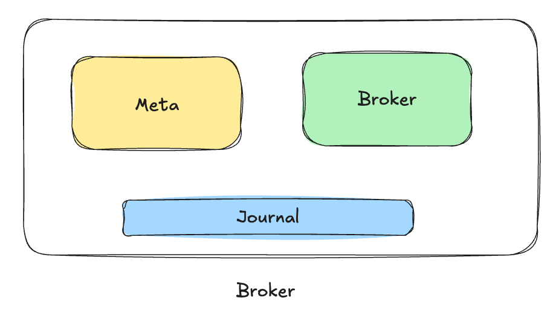
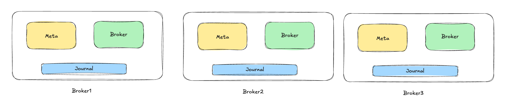

# 介绍 RobustMQ 的 Roles

> RobustMQ 是基于 Rust 构建的新一代高性能多协议消息队列。愿景是成为新一代云原生与 AI 原生消息基础设施。它不是简单的"又一个消息队列"，而是面向AI时代和云原生需求，对消息队列进行的一次重新思考和设计。

本文主要介绍部署RobustMQ 的关键概念 Roles。

### 一个二进制
RobustMQ 的安装包是由 Rust 代码打包而成的二进制文件，没有任何外部依赖。只需要一个二进制就可以拉起集群，可以通过下载二进制安装包执行文件，拉起集群。

```
$ wget https://github.com/robustmq/robustmq/releases/download/v0.1.33/robustmq-v0.1.33-linux-amd64.tar.gz
$ tar -xzvf robustmq-v0.1.33-linux-amd64.tar.gz
$ cd robustmq-v0.1.33-linux-amd64
$ tree
.
├── bin
│   ├── robust-bench
│   ├── robust-ctl
│   └── robust-server
├── config
│   ├── certs
│   │   ├── ca.pem
│   │   ├── cert.pem
│   │   └── key.pem
│   ├── logger.toml
│   ├── server.toml
│   ├── server.toml.template
│   ├── version.ini
│   └── version.txt
├── docs
├── libs
│   ├── broker-server
│   ├── cli-bench
│   └── cli-command
└── package-info.txt

```
### 启动 RobustMQ 

- 【单机版】启动1节点的 RobustMQ
```
./bin/robust-server start
```
- 【集群版】启动3节点的 RobustMQ

将config/server.toml 复制修改为 node1.toml、node2.toml、node3.toml三个文件。配置文件说明请参考[《RobustMQ 配置文件说明》](../Configuration/BROKER.md)

```
./bin/robust-server start config/node1.toml
./bin/robust-server start config/node2.toml
./bin/robust-server start config/node3.toml
```

### 关于 Roles
在RobustMQ 配置文件中，有一个关键的配置是roles，它的意思是，当前这台节点可以作为什么角色运行。 roles有三个选项: 
- meta：元数据节点
- broker：计算节点
- journal： 存储节点

也就是说，可以通过 roles 这个配置指定当前节点是什么角色。下面我们配置不同的roles，来启动不同的Node。

#### 内存存储的单节点
先来启动一个依赖内存存储的单节点RobustMQ，roles 配置如下：
```
roles = ["meta", "broker"]
```
架构图如下：


也就说，这个节点依赖meta service、broker server， 内存存储启动。因为集群中必须有元数据节点和Broker节点，因此一定需要有meta和broker，可以没有journal。

#### 本地存储的单节点

如下所示：

roles 配置如下：
```
roles = ["meta", "broker","journal"]
```

#### 混合部署三个节点的集群
如果是集群化部署，那么一定要有一个 meta 节点和一个broker节点。其他节点可以根据需要配置成meta或者broker节点。假设我们有三个节点，我们可以让这三个节点都是meta和broker，那么我们就有三个meta节点组成的集群。如下所示：

三个节点的roles 配置都是如下：
```
roles = ["meta", "broker","journal"]
```

### 关于集群中不同role的节点数量
1. meta 底层是基于 raft 构建的，所以它的节点数量可以是1，最好是奇数且最小节点数最好大于3，才有更好的容灾能力。
2. broker 的数量不限制，只要能够满足业务需求即可。最小一个
3. journal 不是强制部署，只有存储类型是本地持久化存储才需要部署journal。数量最好大于2，因为数据存储最小双副本。以保证数据的可靠性。

### 总结
也就是说，我们在生产环境部署时，可以根据业务需求，数据量大小调整每个节点的角色及其数量。可以单独扩容每个角色的节点数量，互不干扰。