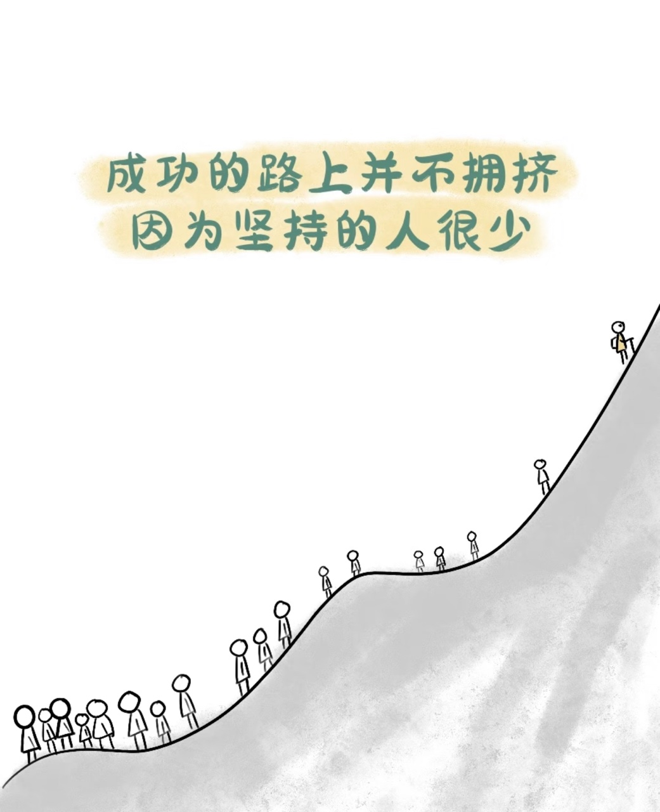

# RobustMQ 的自我审视：我们真的能成为下一代消息基础设施吗？

> 作为 RobustMQ 的开发者，今天我想和大家聊一个可能有些"不合时宜"的话题——对我们自己的技术路线进行一次彻底的、毫不留情的审视。

---

从项目立项的那一天起，我们就给 RobustMQ 定下了一个野心勃勃的目标：**成为新一代云原生与 AI 原生消息基础设施**。这个定位听起来很美好，但最近我一直在思考一个问题：**我们的技术路线真的能支撑这个定位吗？** 如果不能，是哪里出了问题？如果能，我们还需要做什么？

于是，我决定做一件可能有些"自虐"的事情——把 RobustMQ 和业界主流的消息队列（Kafka、Pulsar、NATS、Redpanda、Iggy）放在一起，客观地分析我们的优势和不足，看看这条路到底走得对不对。这篇文章不是营销软文，也不是技术吹嘘，而是一次真诚的自我审视。希望能给关注 RobustMQ 的朋友们一些参考，也给我们自己一些警醒。经过深入分析，我得出了一个既让人欣慰又让人焦虑的结论：

> **我们的技术路线方向是正确的，也具有前瞻性，但当前的支撑能力并不均衡，面临着显著的执行挑战。** 具体来说：

- **云原生定位**：**可以支撑（70%）** —— 架构设计合理，但需要 2-3 年时间打磨生态
- **AI 原生定位**：**比较薄弱（30%）** —— 说实话，这部分定义还比较模糊，需要重新审视
- **多协议统一**：**取决于执行（50-80%）** —— 成败的关键在于 Kafka 协议实现的质量
- **高性能表现**：**理论上可行（60%）** —— 但需要更多实际场景的性能验证

**成功的关键路径**：完成 Kafka 协议的高质量实现 → 建立 1-2 个标杆案例 → 持续 3-5 年的生态建设 → 聚焦差异化场景（IoT + 大数据融合、边缘到云）

---

## 一、为什么说"下一代"？我们看到了什么趋势

在开始剖析 RobustMQ 之前，我想先聊聊：为什么我们会提出"下一代消息基础设施"这个概念？这不是空穴来风，而是基于对行业趋势的观察。

### 云原生已成必然趋势

传统的 Kafka 采用计算存储耦合的架构，无法独立扩展，还依赖 ZooKeeper。Pulsar 虽然实现了计算存储分离，但架构复杂（Broker/BookKeeper/ZooKeeper 三件套），资源消耗很高。

在云环境下，计算和存储的定价模型、扩展特性都不一样，解耦后可以分别优化资源效率。这就是为什么我们坚信**计算存储分离**会成为标准模式。

### 企业真的需要多协议统一吗？

这是我们经常被问到的问题。答案是：**是的，而且需求很迫切。**

现在的企业场景极度碎片化：IoT 设备用 MQTT，大数据平台用 Kafka，微服务用 AMQP。维护多套系统的成本高得惊人，数据孤岛问题也很严重。

但问题在于，主流的消息队列都是单协议的。Pulsar 虽然有插件方案（KoP/MoP/AoP），但仍然需要额外维护。多协议统一的技术挑战确实很大（协议语义差异、性能开销），但市场价值是明确的。

### 为什么选择 Rust？

这个问题更直接一些。我们对比了几种主流语言：

- **Java/JVM**（Kafka/Pulsar）：GC 停顿会导致延迟毛刺
- **C++**（Redpanda）：极致性能，但内存安全完全依赖开发者的自觉
- **Go**（NATS）：低延迟 GC，轻量级，但仍有 GC
- **Rust**（RobustMQ/Iggy）：编译期内存安全 + C 级性能，但生态和人才确实是短板

我们最终选择了 Rust，不是因为它完美，而是因为它在安全性和性能之间找到了最好的平衡点。当然，这个选择也意味着我们要承担生态不成熟、招聘困难的代价。

### "AI 原生"是不是伪命题？

坦白说，这是我目前最困惑的部分。

AI 场景对消息队列的需求很明确：高吞吐、低延迟、灵活存储、丰富的连接器。但"AI 原生"的技术实现路径是什么？消息队列在 AI 场景中应该扮演什么角色？是纯粹的数据管道，还是要深度集成流处理、特征工程、模型推理？

业界目前没有成功先例可供参考。Kafka 通过外围组件（Streams/Connect）支持 AI 数据管道，这条路已经被验证了。

---

## 二、对 RobustMQ 技术架构的冷静审视

说完行业趋势，现在让我们回到 RobustMQ 本身。我想从优势和不足两个方面，诚实地分析我们的技术架构。

### 我们做对了什么

#### 1. 技术选型：Rust + 计算存储分离

**Rust 语言**给了我们零 GC、内存安全、现代语言特性这些优势。但代价是生态不成熟、招聘困难、社区相对较小。

**计算存储分离架构**：我们设计了 Broker（协议路由）+ Journal Server（持久化）+ Meta Service（元数据）三层架构。相比 Pulsar，我们用 Raft 替代了 ZooKeeper，简化了依赖。但资源效率、运维复杂度还需要更多生产环境的验证。

**插件化存储**：我们支持内存、SSD、S3、HDFS 等多种存储后端。这个设计看似简单，实则充满挑战。首先是性能开销问题，统一的存储抽象层必然带来额外的性能损耗；其次是一致性保证，不同存储后端的特性差异很大（比如 S3 的最终一致性 vs 本地磁盘的强一致性），如何在抽象层保证语义一致是个难题；第三是故障处理，不同存储的故障模式完全不同，需要针对性的容错策略；最后是运维复杂度，支持多种存储意味着测试矩阵和问题排查的复杂度成倍增加。灵活性是有了，但代价也是实实在在的。

#### 2. 部署模式：单一二进制的优势

我们采用单一二进制部署，简单、快捷，无论是开发测试、边缘场景还是大规模生产环境，都能保持一致的部署体验和极低的运维成本。

### 我们面临的挑战

#### 1. 多协议统一的技术难点

**协议语义映射**是最大的挑战：MQTT 的 QoS、Kafka 的分区、AMQP 的路由，这些概念如何统一？性能开销如何控制？如何在灵活性和高性能之间取得平衡？

**当前进展**：MQTT 已完成 / Kafka 正在开发 / AMQP 计划中 / RocketMQ 计划中

**关键门槛**：Kafka 协议的复杂度远超想象（Consumer Group、Rebalance、事务、幂等性）。这个协议能不能完整实现，直接决定了多协议统一的可行性。

#### 2. 生态差距：这是最残酷的现实

对比一下就知道差距有多大：
- **Kafka**：300+ 连接器、Streams API、丰富的工具生态
- **RobustMQ**：8+ 连接器、没有流处理、工具链刚起步

Pulsar 用了 6-7 年才建立起自己的生态。我们预计需要 **3-5 年**。这期间的关键挑战是：如何保持项目活力？如何吸引贡献者？如何获得早期采用者？

---

## 三、我们的定位真的站得住脚吗？

现在到了最关键的部分：我们给自己定的"云原生 + AI 原生"这个目标，技术路线真的能支撑吗？

### 云原生：70% 的支撑度

**好消息**：架构设计是契合的（计算存储分离、K8s Operator）。单一二进制在 Serverless 场景的冷启动也有优势。

**坏消息**：生态集成还不够深（Service Mesh、Observability、GitOps）。Kafka 和 Pulsar 在这方面已经有了深度集成。我们的实际能力还需要在生产环境中验证。

**我的看法**：云原生这条路是走对了，但需要 2-3 年时间才能达到 Kafka/Pulsar 的成熟度。

### AI 原生：30% 的支撑度（这是最薄弱的环节）

说实话，这是我目前最不确定的部分。

我们现有的能力主要是数据连接器（MySQL、MongoDB 等），这和"AI 原生"的定义还有很大距离。这些连接器本质上是通用的数据集成能力，并不是针对 AI 场景的专门优化。

更关键的是，"AI 原生"的技术实现路径到底是什么？消息队列在 AI 场景中应该扮演什么角色？业界目前没有成功先例。

**我的反思**：我们可能需要重新定义"AI 原生"的含义。与其试图在消息队列层面集成完整的 AI 能力，不如明确定位为"为 AI 场景优化的高性能消息队列"（低延迟、高吞吐、灵活存储、丰富连接器）。

### 多协议统一：50-80% 的支撑度（关键在执行）

这是我们的核心差异化特性，成败直接决定项目的竞争力。

**好消息**：架构设计支持多协议，MQTT 协议的成功实现证明了方案的可行性。

**坏消息**：Kafka 协议的复杂度远超 MQTT。如果不能高质量实现，多协议统一的价值就无法验证。

**关键里程碑**：如果我们能在 2026 年完成高质量的 Kafka 协议支持，支撑度可以达到 80%；如果只能实现部分功能或性能有妥协，支撑度会降到 50% 以下。

### 性能表现：60% 的支撑度（需要数据说话）

Rust 的零 GC 特性理论上可以提供可预测的低延迟，这是真实的技术优势。但消息队列的性能受多方面因素影响：网络 I/O、磁盘访问、并发模型、序列化开销。

**我们缺少什么**：
- 详细的性能基准测试报告（与 Kafka/Pulsar 在相同硬件和场景下的对比）
- 长期生产环境的性能稳定性验证（P99、P999 延迟表现）

性能优势需要用数据证明，而不是只停留在语言特性层面。

---

## 四、接下来要爬的几座大山

如果说前面是诊断，那么这部分就是开药方。要实现我们的目标，还有几座大山要爬。

### 第一座山：协议完整性

Kafka 协议的复杂度超乎想象：Consumer Group、Rebalance、事务、幂等性……子集实现满足不了重度用户，完整兼容成本又很高。AMQP 的路由模型映射、多语言 SDK 的兼容性测试，每一项都是硬骨头。

**我们的策略**：
- 采用迭代策略，优先实现核心特性
- 建立自动化测试体系
- 投入充足的研发资源

### 第二座山：生态建设

这需要持续的投入：连接器开发、监控集成（Prometheus/Grafana/Jaeger）、管理工具（Dashboard/CLI）。

Kafka 有 Confluent 的支持，Pulsar 有 Apache 基金会。Apache 孵化能提供品牌，但最终还是要靠项目自身的吸引力。

**我们的计划**：
- 核心功能先行，逐步扩展
- 建立社区激励机制
- 持续投入生态建设

### 第三座山：生产案例

这是最现实的问题：没有案例，企业就不会采用；企业不采用，就没有案例。这是一个鸡生蛋、蛋生鸡的问题。

**我们的破局之道**：
- 推出早期采用者计划（针对创业公司、非核心业务、学术机构）
- 提供全方位的技术支持
- 快速迭代，响应用户需求
- 积极宣传成功案例

我们的目标是先攻克 1-2 个标杆场景（比如 IoT 平台、实时数据管道），建立用户社区，形成口碑传播。

### 第四座山：竞争压力

消息队列市场已经很成熟了，Kafka 占据主导地位。Redpanda 凭借性能优势和简化部署也在快速崛起，Iggy 作为另一个 Rust 项目也在持续发展。

**我们的竞争策略**：
- 避免与 Kafka 正面竞争
- 聚焦差异化优势（多协议、IoT、边缘计算）

很遗憾，我们正在爬第一座山。很开心，我们正在爬第一座山。

---

## 五、成功的关键是什么？

经过这番审视，我梳理出了几个关键成功要素：

### 技术执行力（重要性：极高 / 难度：高）

**核心任务**：完成 Kafka 协议的高质量实现、性能优化、稳定性提升

**当前状态**：MQTT 已完成，Kafka 正在开发中

这是一切的基础。如果这个做不好，后面都是空谈。

### 市场定位（重要性：高 / 难度：中）

**核心任务**：聚焦 IoT + 大数据融合、边缘到云场景

**当前状态**：定位明确，但还没有充分验证

我们需要找到自己的"根据地"，而不是试图在所有场景都和 Kafka 竞争。

### 生态建设（重要性：高 / 难度：高）

**核心任务**：连接器扩展（目标 50+）、监控工具、管理控制台

**当前状态**：8+ 连接器，工具链处于早期阶段

这是一场持久战，需要至少 3-5 年的持续投入。

### 生产案例（重要性：极高 / 难度：中）

**核心任务**：建立 1-2 个标杆案例，覆盖核心应用场景

**当前状态**：项目处于早期阶段，案例还很缺乏

这是打破信任僵局的关键。有了案例，企业的顾虑会少很多。

---

## 六、我们的时间表

基于以上分析，我给 RobustMQ 制定了一个**乐观但现实**的时间表：

### 2025 年：夯实基础（0→1）

- MQTT 协议生产可用
- 完成 Kafka 协议核心功能
- 建立性能基准测试体系
- 扩展连接器到 20+
- 获得首批早期采用者

### 2026 年：验证价值（1→10）

- Kafka 协议完整支持
- 申请 Apache 孵化
- 启动 AMQP 协议开发
- 建立 1-2 个标杆案例
- 持续生态建设

### 2027+ 年：建立生态（10→100）

- 完善多协议生态
- 扩大市场份额
- 成为行业标准之一

这个时间表对标 Pulsar 的发展历程，我们预计需要 **4-5 年**时间。

### 主要风险

当然，这条路上充满了风险：
- Kafka 协议实现的技术难度
- 市场对多协议统一的接受度
- 竞争对手的快速演进
- 资源投入的持续性

---

## 写在最后

写完这篇自我审视，我的心情是复杂的。

**欣慰的是**：我们的技术方向是正确的，架构设计也是合理的。Rust 的选型、计算存储分离、插件化存储、多协议统一，这些都代表了行业的演进方向。在现有的消息队列生态中，RobustMQ 是唯一同时具备"多协议统一"、"计算存储分离"、"Rust 实现"、"单一二进制部署"、"插件化存储引擎"这五个特征的开源项目，具有清晰的差异化竞争优势。

**焦虑的是**：执行挑战太大了。MQTT 的成功只是 0→1，接下来的 1→10 需要协议完整性、性能验证、标杆案例三者兼备；10→100 更需要生态和品牌的持续建设。这需要至少 3-5 年的持续投入，而且还有很多不确定性。

**"AI 原生"这个定位需要重新审视。** 我们需要更务实一点，明确定位为"为 AI 场景优化的高性能消息队列"，而不是试图在消息队列层面集成完整的 AI 能力。

**对于想要尝试 RobustMQ 的朋友**，我的建议是：
- **2025 年**：可以在非关键业务试用，特别是 MQTT 场景
- **2026 年**：如果 Kafka 协议实现质量达标，可以在中小规模生产环境采用
- **2027+ 年**：再考虑大规模替换现有系统

这不是谦虚，而是实事求是。技术创新需要时间积累，生态建设更是如此。

路漫漫其修远兮，吾将上下而求索。从技术路线到架构设计，从云原生到多协议统一，我们选择了一条充满挑战但方向正确的道路。这条路不会一帆风顺，需要时间的积累、技术的打磨、生态的建设，更需要社区的理解和支持。

我们深知，开源项目的成功不是一蹴而就的。Kafka 用了十年成为行业标准，Pulsar 用了七年建立起自己的生态。RobustMQ 才刚刚起步，前方还有无数未知的挑战等待着我们。但正是这些挑战，让这个项目变得更有意义。

每一行代码的编写，每一个协议的实现，每一次架构的优化，都是在为下一代消息基础设施铺路。这个过程可能漫长，可能艰辛，但我们相信，只要方向正确、执行到位、社区支持，终将到达我们想要到达的地方。

感谢每一位关注 RobustMQ 的朋友，感谢每一位贡献者，感谢每一位提出建议的用户。让我们一起，把这条路走下去。

---

**关于作者**

RobustMQ 开发团队，致力于打造新一代云原生与 AI 原生消息基础设施。

**项目地址**

GitHub: https://github.com/robustmq/robustmq  
官网: https://www.robustmq.com

**如果这篇文章对你有帮助，欢迎给我们一个 Star！**

---

**发布时间**：2025-01-29  
**声明**：本文为作者真实思考，观点仅代表个人立场
