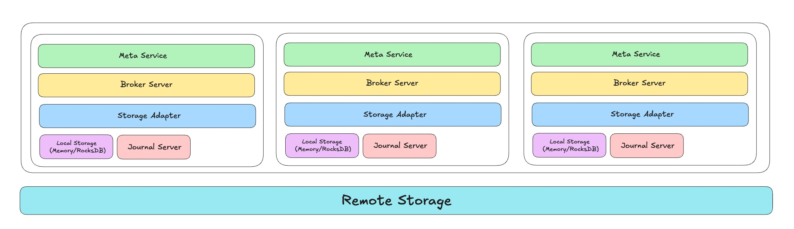
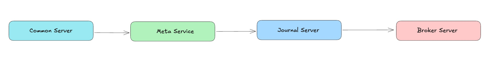

# 06: RobustMQ 整体架构概述

> RobustMQ 是基于 Rust 构建的新一代高性能多协议消息队列。愿景是成为新一代云原生与 AI 原生消息基础设施。它不是简单的"又一个消息队列"，而是面向AI时代和云原生需求，对消息队列进行的一次重新思考和设计。

在[《RobustMQ: 技术设计理念综述》](02.md)中讲述了RobustMQ 的核心技术思想。它有六个特点：高性能、Serverless、插件式存储、极简高内聚架构、 计算/存储/调度分离、多协议。本文我们将会详细讲解 RobustMQ 整体架构的设计实现。

在[《介绍 RobustMQ 的 Roles》](./03.md) 中我们知道了节点Role的概念。接下来我们将会详细介绍一下RobustMQ的整体架构。

### 架构概述
来看下图：

如上图所示，RobustMQ 整体由 Meta Service、Broker Server、Storage Adapter、Journal Server、数据存储层五部分组成。
  1. Meta Service：元数据和调度层，负责集群的元数据存储和调度。主要完成:
     - Broker 和 Journal 集群相关的元数据(Topic、Group、Queue、Partition 等)存储、分发。
     - Broker 和 Journal 集群的控制、调度，比如集群节点的上下线、配置存储/分发等。
  2. Broker Server：消息队列逻辑处理层，负责不同消息队列协议的解析和逻辑处理。主要完成：
     - 解析MQTT、Kafka、AMQP、RocketMQ 等协议的解析
     - 整合、抽象不同协议通用的逻辑, 处理不同协议的不同消息队列逻辑。以兼容适配不同的消息队列。
  3. Storage Adapter：存储适配层，存储适配层会将多种 MQ 协议中的 Topic/Queue/Partition 统一抽象为 Shard。同时适配不同的底层存储引擎（比如本地文件存储：Journal Server、远程的HDFS、对象存储、自研的存储组件等等），从而实现存储适配层的插件化、可插拔。也就是说，Storage Adapter会根据配置，将数据存储到不同的存储引擎。
  4. Journal Server：是 RobustMQ 自带的持久化存储引擎。它是一个类似Apache Bookeeper 的本地多副本、分段式、持久化存储服务。它目标是构建一个高性能、高吞吐、高可靠的持久化存储引擎。从Storage Adapter的视角看，Journal Server 只是它对接的存储引擎之一。你可以理解它是为了解决RobustMQM 高内聚 、无外部依赖的特性而特意实现的。
  5. 数据存储层（本地 Or 远程存储）： 指数据的存储层。数据的存储层可以是（本机的内存），也可以是远程存储服务（比如HDFS、 MinIO、Aws S3等）。它由 Storage Adapter负责对接。

### 详细架构
先来看下图：

如上图所示，这是一个由三个RobustMQ Node组成的集群，如果选择自带的持久化存储引擎Journal Server，不选择使用外部的存储引擎，则不需要依赖任何外部组件。也就是说，可以通过./bin/robust-server start 一键启动节点。

从单节点来看，它主要由通用Server、Meta Service Message Broker、存储层四大部分组成：
- 通用Server： 是指由Inner GRPC Server、Admin HTTP Server、Prometheus Server组成的通用Server 。Inner GRPC 用于多个RobustMQ Node 之间通信，Admin HTTP Server提供了统一的对外的HTTP 协议的运营接口，Prometheus Server 指节点对外暴露的提供指标采集的接口。通用Server 部分是Meta Service、Message Broker、Journal Server 共用的。
- Meta Service：是指节点内Meta Service部分代码，当Inner Grpc Server启动成功后。Meta Service 会读取配置中的 meta_addrs，知道所有的Meta Server Node。然后通过GRPC 协议和所有节点进行通信，然后给予Raft 协议选举出Meta Master 节点。当选举Ready 后，Meta Service 即可正常对外提供服务。
- Message Broker：是指节点中完成消息逻辑处理的核心代码，它用来适配多种不同的消息协议，并完成不同协议的逻辑处理。它由四层组成：
  1. 网络层：网络层会支持TCP、TLS、WebSocket、WebSockets、QUIC 五种协议的解析。
  2. 协议层：在网络层之上，当节点收到不同协议的请求包后，会解析包的内容。长期来看，会支持MQTT、Kafka、AMQP、RocketMQ等等协议的解析。当前已支持MQTT、Kafka 协议的解析。
  3. 协议逻辑层：因为不同的协议会有不同的处理逻辑，所以这部分每个协议的代码都是独立的，比如mqtt-broker、kafka-broker、amqp-broker等等。不同的协议 broker 会处理协议本身的特性逻辑。
  4. 消息通用逻辑层：但是消息队列本身是一个很垂直的领域，核心是pub/sub模型。也就是说，不同协议的逻辑有很大一部分是通用的。比如消息的收发、消息过期、延时消息、监控、日志、安全、Schema等等都是通用的。因此这部分代码逻辑在开发阶段会被抽离出来，独立成通用的部分，给各个协议用。也就是说，长期来看，RobustMQ的核心基础设施开发好后，适配新的协议是一件工作量没那么大的事情。
  5. 存储适配层：存储适配层会去适配不同的存储引擎。它主要做两个事情：1. 将MQTT Topic、AMQP Queue、Kafka Partition等概念独立抽象成 Shard 的概念。2. 对接不同的存储引擎，存储数据。
- 存储层： 是指消息的存储层。它由两部分组成：一个是内置的分段式分布式存储引擎Journal Server，一个是第三方分布式存储引擎。存储层会根据

### 单机启动流程

如果是单机模式，节点启动后的启动组件的顺序是：先启动通用Server、再启动 Meta Service、再启动 Journal Server、最后启动 Message Broker。也就是说：
1. 首先要启动Server 层，让多个节点间可以进行通信
2. 其次启动元数据协调服务。如果是三节点集群，则多个 Node 之间首先会进行选举，选举出Meta Service Master，一旦选举完成，则集群元数据层则Ready 提供服务。
3. 然后启动内置存储层Journal Server，Journal Server 是一个集群架构，它依赖Meta Service 来完成选举、集群构建、元数据存储。所以，必须等待Meta Service Ready。
4. 最后启动Message Broker，Message Broker 也需要依托Meta Service 来完成集群构建、选举、协调等等工作。如果配置了内置存储，则也需要依赖Journal Server来完成数据的持久化存储。所以它必须一个启动。

### 混合存储架构
在我们的设想中，我们希望RobustMQ 支持混合存储架构。也就是说存储引擎的选择是 Topic 维度的，不是集群维度的。也就是说，在集群启动时或者运行中，可以配置集群默认的存储引擎，也支持配置多种存储引擎。此时：
1. 如果Topic 是数据量小、对耗时敏感、不允许丢数据，那么可以选择本地持久化存储引擎。
2. 如果 Topic 数据量大、对耗时敏感、极端情况下允许丢少量数据，那么可以选择内存存储引擎。
3. 如果 Topic 数据量大，对耗时不敏感、不允许丢数据，对成本敏感、那么可以选择远程存储引擎。
4. 如果 Topic 数据量大，对耗时敏感、不允许丢数据，对成本不敏感、那么可以选择内置的Journal Server。

据我们观察，从业务的角度，很少业务会有混合场景，即使有，业务在开发部署时，也会分开部署。因此，在实际部署的过程中，一般只需要一个存储引擎就可以了。