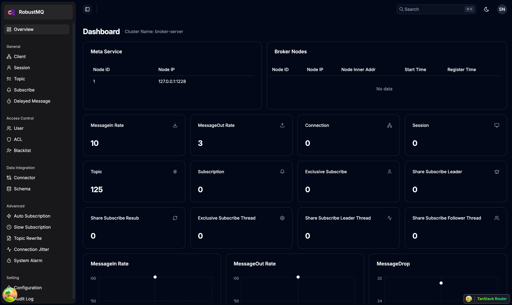
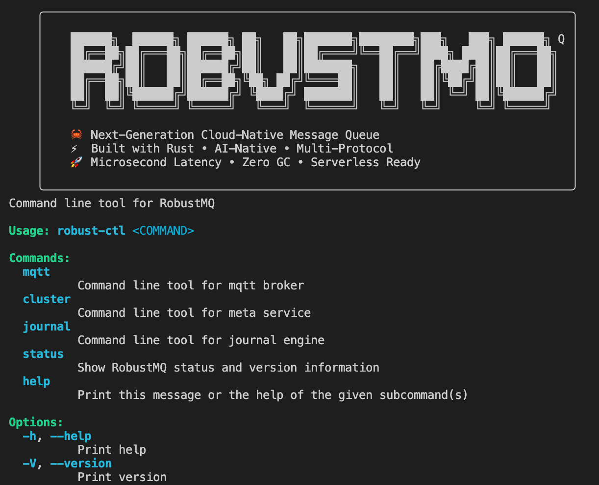
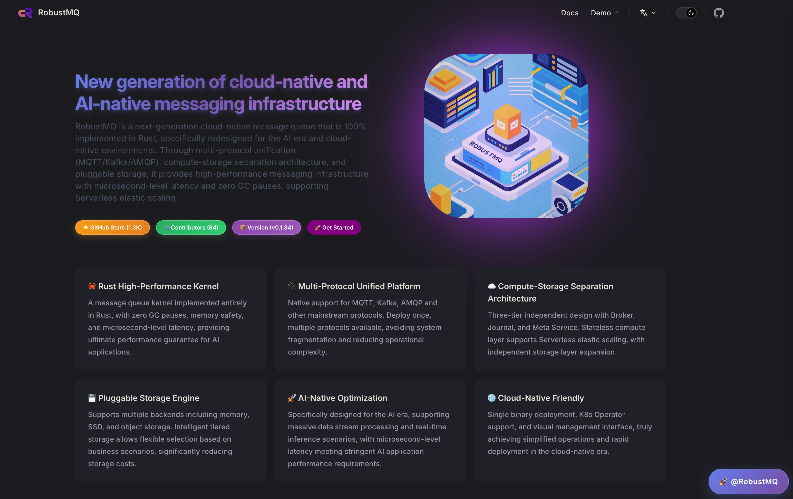

# 08: 🎉 RobustMQ 0.2.0 RELEASE 正式发布

> RobustMQ 是基于 Rust 构建的新一代高性能多协议消息队列。愿景是成为新一代云原生与 AI 原生消息基础设施。它不是简单的"又一个消息队列"，而是面向AI时代和云原生需求，对消息队列进行的一次重新思考和设计。

### 🎆 首个正式版本发布

在上一篇文章《很高兴有机会让你看到不一样的作品》中，我们预计在10月份发布0.2.0版本。在这个首个 RELEASE 版本中，我们主要完成了三大核心模块的工作：

- **整体架构**：确定了系统和代码架构，完成了网络模块、插件化存储、可观测体系、安全体系等基础组件的开发
- **MQTT 协议**：完整支持 MQTT 3.1/3.1.1/5.0 协议及各种高级特性
- **生态工具**：提供Web管理界面、命令行工具、HTTP Restful API 接口、技术文档、官网等等完整工具链

这个版本基本完成了《技术设计理念综述》中提到的技术设想的第一阶段开发工作。

### 🏢 架构设计全面稳定

可以说过去两年的最大成果是整体架构设计的全面稳定。在这期间我们的架构设计和代码经过了很多轮的重构。目前的架构和代码实现是我们比较满意的。只需要一个命令就可以启动服务，拉起集群，无任何外部依赖。同时在这个架构下也很好的支持了多协议解析，插件化存储、Serverless三个最大的特点。

整体架构图如下：


可以说，在这个架构下，长期来看 RobustMQ 支持多协议的速度会越来越快。因为消息队列的特性是有很多共性的，比如网络层、可观测体系，甚至特性中的延时能力、消息过期等都是可复用的。也就说，在我们支持完一个完整的协议的基础上，支持其他协议将会是很多复用的代码逻辑。

在《技术设计理念综述》中提到的六个核心特点：**高性能、Serverless、插件式存储、极简高内聚架构、计算/存储/调度分离、多协议**，在 0.2.0 版本中，这些设计理念都得到了很好的体现，并完成了第一阶段的开发工作：

#### 🚀 高性能架构
- **基于 Rust 的零拷贝设计**：消息处理全程无内存拷贝，性能提升显著
- **异步 I/O 模型**：基于 Tokio 的高并发处理，单机可支持百万级连接
- **集群化部署**：支持多节点集群部署，水平扩展能力强

#### ☁️ 云原生架构
- **存算分离设计**：计算节点无状态，可以快速弹性扩缩容
- **插件化存储**：支持内存、本地存储、对象存储等多种存储引擎
- **多协议支持**：统一内核支持多种消息协议，降低运维复杂度
- **容器友好**：完美适配 Kubernetes，支持 Docker、Operator 部署

#### 🔧 极简架构
- **单二进制部署**：一个文件就能启动完整集群，无外部依赖
- **内置元数据管理**：基于 Raft 的分布式一致性，不依赖 ZooKeeper
- **自动故障恢复**：节点故障自动检测和恢复，运维成本低

### 📡 MQTT 3/4/5 协议完整支持

本版本完整实现了 **MQTT 3.1、3.1.1、5.0** 三个版本的协议支持。这不仅仅是简单的协议解析，而是包含了完整的功能实现：

- **完整的 MQTT 协议栈**：从连接建立、订阅发布到会话管理，每个细节都严格按照协议标准实现
- **集群化部署**：支持无状态的水平扩缩容，完美适配 Docker、Kubernetes 部署
- **灵活的 QoS 支持**：QoS 0、1、2 全面支持，保证消息的可靠传输
- **MQTT5 的所有高级特性**：遗嘱消息、保留消息、共享订阅、自动订阅、延迟发布、排它订阅、Session 持久化、离线消息等完整特性
- **数据桥接**：支持数据导入到下游的 Kafka、Pulsar 等消息引擎

### 🛠️ 完整的生态工具

在这个版本中，我们希望我们是一个完整的开源组件，而不只是一个单独的Server。所以我们花了很大精力在Web管理工具、监控界面、命令行工具、API、官网文档等等。因此在这个版本中，我们

#### 🎛️ Dashboard 管理界面
提供了RobustMQ MQTT Web 管理界面，支持，比如：
- 实时监控集群状态和性能指标
- 管理 Topic、订阅、客户端连接
- 查看消息流量和系统资源使用情况
- 配置集群参数和存储引擎

界面效果如下：



#### 🔧 Command 命令行工具
提供功能完整的 CLI 工具，比如：
```bash
# 查看集群配置
robust-ctl cluster config get

# 查看 Topic 列表
robust-ctl mqtt topic list

# 查看客户端连接
robust-ctl mqtt client list

# 发送测试消息
robust-ctl mqtt publish --topic test --payload "Hello RobustMQ!"
```

命令行效果示意图：



#### 🌐 HTTP API 接口

提供完整的 RESTful API，方便集成到现有的运维系统，比如：
```bash
# 获取集群配置
POST /api/cluster/config/get

# 查看 Topic 列表
POST /api/mqtt/topic/list

# 查看 MQTT 概览信息
GET /api/mqtt/overview
```

#### 🌐 官网和文档
同时我们还提供了官网主页和完善的技术文档。



### ❓ 生产环境使用说明

目前 0.2.0-RELEASE 为首个可试用版本，尚不支持生产环境部署。我们预计在今年年底推出生产可用版本。欢迎试用并提供反馈建议。

### 🗺️ 关于未来的计划

0.2.0 作为首个 RELEASE 版本，仅仅是一个起点。我们制定了详细的发展计划：

#### 📋 短期计划（今年内）
- **基础模块完善**：继续完善网络模块、存储引擎、监控体系等基础组件
- **MQTT 稳定性优化**：提升 MQTT 协议的稳定性和可靠性
- **性能提升**：进一步优化消息吞吐量，降低延迟、连接数支持
- **功能丰富**：增加更多 MQTT 高级特性和企业级功能
- **文档完善**：提供更详细的使用指南和最佳实践文档

#### 🎯 中期计划（明年）
- **AMQP 协议支持**：兼容 RabbitMQ 生态，让用户可以无缝迁移 AMQP 协议生态
- **多租户架构**：企业级权限管理和资源隔离能力
- **高可用增强**：跨地域部署和灾备恢复能力
- **运维工具完善**：更强大的监控、告警和运维管理工具

#### 🌟 长期愿景
- **Kafka 协议支持**：兼容 Kafka 生态，实现真正的多协议统一
- **AI 原生能力**：为 AI 应用场景优化的消息处理和智能路由
- **边缘计算支持**：轻量级边缘节点部署，支持物联网和边缘场景
- **生态建设**：丰富的客户端 SDK、集成工具和社区生态

更长期来看，会支持更多协议，同时精简、优化、提升内核能力。

### 🚀 快速体验与反馈

欢迎体验 RobustMQ 0.2.0 并提供宝贵的反馈意见。

#### 🚀 快速开始
```bash
# 下载二进制包
wget https://github.com/robustmq/robustmq/releases/download/v0.2.0/robustmq-0.2.0-linux-amd64.tar.gz

# 解压运行
tar -xzf robustmq-0.2.0-linux-amd64.tar.gz
cd robustmq-0.2.0-linux-amd64
./bin/robust-server start
```

#### 🔗 相关链接
- **GitHub**: https://github.com/robustmq/robustmq
- **官网**: https://robustmq.com
- **文档**: https://robustmq.com/docs
- **Dashboard**: `http://localhost:8080` (启动后访问)
- **在线 Demo**: http://117.72.92.117:8080/

#### 📱 加入我们
- **微信群**: 扫描官网二维码加入技术讨论群
- **GitHub Discussions**: 参与项目讨论和规划
- **贡献代码**: 欢迎任何形式的贡献。

---

**RobustMQ 团队**  
2025年9月29日
