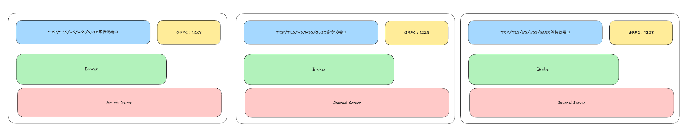

# RobustMQ：单二进制架构设计

初次接触 RobustMQ 架构时，从架构图中可以看到系统采用了存算分离、计算/存储/调度三层分离的设计理念，并由 Meta Service、Broker Server、Storage Adapter、插件化存储等多个组件构成。这可能会给人留下系统部署复杂的印象。


然而，在设计之初，RobustMQ 的核心设计目标之一就是简化使用和运维，实现一键部署。

因此，RobustMQ 采用单二进制设计，不依赖任何外部组件。仅需下载二进制安装包，即可启动集群。只需执行一条命令，即可启动服务，如下所示：

```bash
$ wget https://github.com/robustmq/robustmq/releases/download/v0.2.4/robustmq-v0.2.4-linux-amd64.tar.gz
$ tar -xzf robustmq-v0.2.4-linux-amd64.tar.gz
$ cd robustmq-v0.1.35-linux-amd64
$ ./bin/robust-server start
```

更值得关注的是，安装包大小仅为 20 余 MB。经过进一步优化后，可压缩至 10MB 以内，使其能够部署在任何场景，包括边缘计算场景。

那么，为何功能如此丰富、架构看似复杂的系统，却无需外部依赖，仅需一条命令即可启动呢？

## robust-server start 原理

下图展示了启动过程的技术架构：



如上图所示，每个 Broker 支持两类通信端口：gRPC 和其他协议（TCP/TLS/WS/WSS/QUIC 等）。其中 gRPC 协议作为集群内部通信协议，用于 Broker 之间的通信。

当执行 `robust-server start` 命令时，系统按照以下流程启动：

1. 首先启动 gRPC 协议监听，以支持节点间相互发现并组成集群。关于 Roles 配置的详细说明，请参考[《RobustMQ Roles》](../Blogs/03.md)。
2. 启动 Raft 状态机，状态机通过 gRPC 协议发现其他节点，触发选举流程，选举出 Meta Service 的 Leader。此时，Meta Service 启动完成。
3. 如果配置的存储引擎为内存模式，则直接进入 Broker 启动流程。
4. 如果配置的存储引擎为 Journal Engine，则触发 Journal Engine 的启动流程。
5. Journal Engine Node 向 Meta Service 注册节点信息，依托 Meta Service 组成集群。当 Journal Engine Node 注册成功后，存储层启动完成。
6. 启动 Broker，Broker 向 Meta Service 注册节点信息，同样依托 Meta Service 组成集群。
7. Broker 启动后，内核会运行控制器、心跳上报等异步线程。当这些线程启动完成后，Broker 启动流程结束。

可以看出，虽然 RobustMQ 的架构设计较为复杂，但这些复杂度已被封装在代码层面，对用户而言使用非常简单。

## 总结

RobustMQ 的使用极为简单，无需复杂的配置和安装流程，仅需下载安装包即可实现一键启动。
