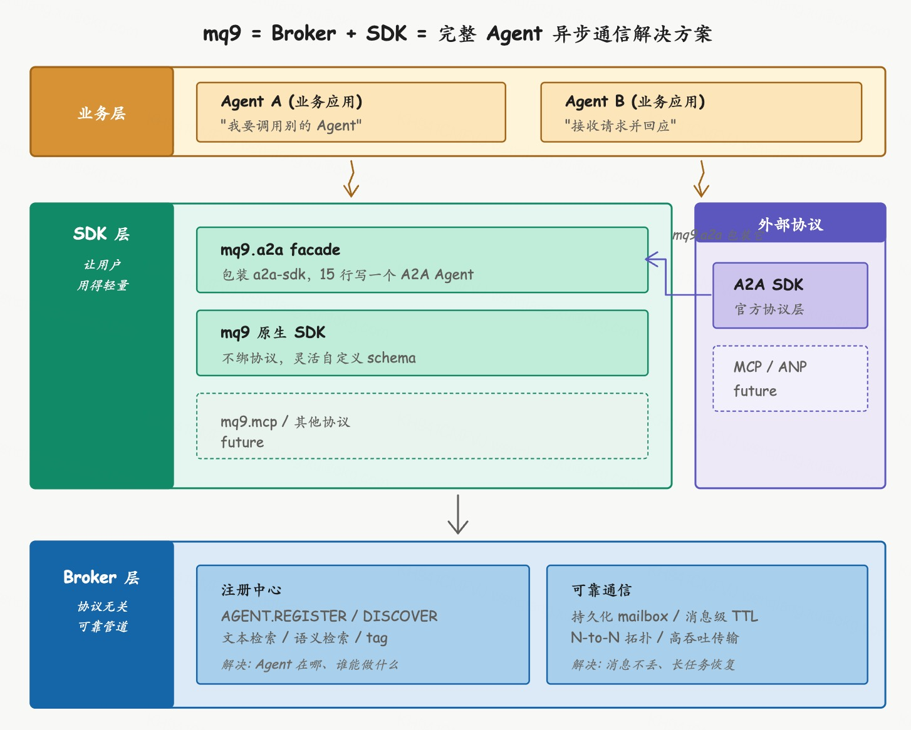

# Broker + SDK：完整 Agent 异步通信解决方案

mq9 这段时间一直在思考一件事：怎么和 A2A 协议更好地结合，让 Agent 之间的异步通信变得更可靠、更简单。

思考做下来发现一件事：SDK 这一环加上之后，mq9 已经不只是消息队列或传输管道，而是 Agent 异步通信的完整方案。

这篇文章把这个判断背后的逻辑讲一遍。

## mq9 之前在做什么

mq9 是为 Agent 通信场景设计的消息基础组件，定位本身不绑定任何特定协议。

Agent 通信有它特有的需求：长任务异步、双方可能不在线、N-to-N 协作、按地址语义路由。这些传统消息队列（Kafka、RabbitMQ）不直接覆盖，HTTP 作为通信通道也不匹配。mq9 broker 在做的，就是把这套能力做出来：持久化 mailbox、注册中心、N-to-N 拓扑、消息级 TTL、按 key 压缩。

定位的独立性意味着 mq9 服务的是 Agent 通信这个场景本身，不依附于任何上层协议。A2A 在用 mq9 就服务 A2A，MCP 扩展到 Agent-Agent 时服务 MCP，自定义协议也能服务。底层做扎实，上层用什么协议是另一回事。

## A2A 协议和生态留好了位置

把 A2A 协议本身和生态格局一起看，会发现 mq9 这种东西不是无的放矢。

**A2A 协议本身设计很克制**。它只定义 Message、Task、AgentCard 这些数据结构和 RPC 方法语义，协议层之外的事几乎都不管：发现机制明确写"outside the scope"、可靠传输只给 HTTP/SSE/webhook、长任务恢复要 server 自己重放、N-to-N 没有协议层支持。这种克制是有意识的设计，A2A 工作组只做协议，传输和基础设施留给生态。1.0 版本还专门为多 transport 留了扩展点（ClientFactory.register、AgentCard.supportedInterfaces 等）。

**生态本身也意识到这些空白**。awesome-a2a 仓库扫一遍，格局清晰：SDK、框架集成、平台 Runtime 都极度拥挤，但 Agent 注册中心、可靠异步传输、Monitoring/Tracing 适配、协议无关通信管道这几块全是真空。awesome-a2a 的 README 明确写着 "Community contributions welcome"，主动招募几个方向。

A2A 协议留给生态的位置、生态自己承认的空白，恰好都是 mq9 在做的事。mq9 和 A2A 不是依赖也不是替代关系，**mq9 填的是 A2A 协议工作组有意识留给生态的位置**。

## 但单有 broker 还不够

broker 的工程深度有了之后还有个问题：用户够不到。

业务方面对的不是"我要个 broker"，是"我要让我的 Agent 之间通信"。从"有 broker"到"能让 Agent 通信"中间隔着一大段距离：要连 broker、要定义 mailbox、要发消息、要集成 A2A 协议、要处理 Task 状态、要和 a2a-sdk 互通。这些事让业务方自己做，相当于让他们自己写一遍中间件。

broker 的工程深度是真实的，但工程深度本身不会自己变成产品。需要 SDK 把 broker 的能力封装成业务方能直接用的形态。

## SDK 加上之后形成完整方案

mq9 由 broker 和 SDK 两部分组成，相辅相成。

| 维度 | broker | SDK |
|------|--------|-----|
| 解决的问题 | Agent 之间怎么可靠通信 | 用户怎么用得更好 |
| 角色 | 通信能力的来源 | 通信能力的释放 |
| 单独存在的局限 | 用户够不到 | 没有 broker 只是又一个 wrapper |
| 组合后的效果 | 业务方 15 行代码完成可靠 Agent 通信 |

broker 把 Agent 通信做扎实，SDK 把 broker 的能力用最少代码暴露给用户。SDK 包装 a2a-sdk 提供轻量 facade，业务方 15 行代码就能写一个 A2A Agent 跑在 mq9 上。

合在一起，**mq9 同时解决了 Agent 通信的两个核心痛点**：

**Agent 注册和发现**：我的 Agent 在哪、对方 Agent 在哪、谁有能力做我需要的事。mq9 broker 内置 AGENT.REGISTER 和 AGENT.DISCOVER，支持文本检索、语义检索、tag 过滤，开箱即用。

**Agent 之间的可靠通信**：消息怎么不丢、怎么按优先级处理、怎么 N-to-N 协作、长任务怎么恢复、双方不在线怎么办。mq9 mailbox 模型为这些场景设计，配合 SDK 让业务方 15 行代码就能用上。

这两个痛点不是 mq9 发明的，是 Agent 通信场景天然存在的。当前生态里没有任何一个项目同时把这两个痛点解决到"开箱即用"的程度。要么只做注册（AWS Registry），要么只做传输的小修小补（A2A 默认 HTTP），要么做全家桶（Bindu/Aira/Inai）把核心痛点淹没在十几个功能里。

mq9 把这两件事做扎实，让 Agent 的可靠通信变得非常简单。**这就是"Agent 异步通信完整方案"的具体含义**：业务方面对 mq9 看到的是"我的 Agent 怎么和别的 Agent 通信"这个完整问题的答案，不需要再去拼凑底层组件。

## 和传统消息队列的对比

完整方案不只是"消息队列做得好"，是产品定位的根本不同。

| 维度 | 传统消息队列（Kafka/RabbitMQ） | mq9 |
|------|------------------------------|-----|
| 抽象单元 | topic / queue | mailbox（Agent 地址语义）|
| 服务对象 | 通用消息流 | 专为 Agent 通信场景设计 |
| 发现能力 | 无 | 内置注册中心 + 语义检索 |
| 协议无关性 | 通用字节流 | 通用字节流 + 主流 Agent 协议封装 |
| 接入复杂度 | 业务方写胶水代码 | 业务方 15 行代码 |
| 长期方向 | 通用 throughput 和 retention | Agent 场景的安全、审计、可观测 |

Kafka 永远不会内置 "agent.translator.inbox" 这种 Agent 地址语义，因为它的定位是通用消息基础设施。mq9 的定位是 Agent 通信场景，所有设计都围绕这个场景展开。两者是不同场景的专门工具，不是替代关系。一个公司在数据团队用 Kafka、在 Agent 平台用 mq9，是合理的并存。

## 长期可能做的一些事情

往后看，mq9 可能会做一些事情，都是为 Agent 通信场景专门增强的能力，不是消息队列传统关心的方向。

**安全**：Agent 之间通信涉及业务系统、用户数据、决策权限。一个能调用核心交易系统的 Agent 和一个翻译 Agent 不能用同样的访问控制。mq9 可以做 Agent 级别的认证授权，不只是 topic ACL。

**审计**：Agent 做了什么决策、调用了什么 Agent、传递了什么消息，需要可审计、可追溯，特别是金融、医疗、法律等高风险场景。broker 的消息持久化天然适合做审计基础，加 SDK 层的轨迹采集就是完整审计能力。

**可观测**：Agent 协作经常涉及多个 Agent 串联，出问题时谁慢、谁失败、消息卡在哪。broker 上的消息天然可以承载 OpenTelemetry trace context。

**合规**：Agent 通信进入金融、医疗等强监管行业是大概率的事。消息保留期、数据脱敏、跨境传输管控这些都是合规要求。架构上提前想好比事后改容易。

这些事是为 Agent 通信场景专门做的增强。Kafka 把"通用消息可靠传输"做到极致是它的方向，mq9 把"Agent 通信场景的完整方案"做深是 mq9 的方向。聚焦一件事，做透。

## 总结

mq9 是 Agent 通信的基础组件，由两部分组成：broker 提供协议无关的可靠消息管道（持久化 mailbox、注册中心、N-to-N 拓扑），SDK 提供协议轻量级封装层（支持 A2A 等主流协议，也支持自定义协议）。broker 解决可靠通信，SDK 解决怎么用得更好，相辅相成。

合在一起，mq9 同时解决 Agent 通信的两个核心痛点：注册发现和可靠通信。这是 Agent 异步通信的完整方案，不是单一的消息队列或传输管道。和传统消息队列是不同场景的专门工具，不是替代关系。

往后看，mq9 可能会把 Agent 场景特有的能力做深：安全、审计、可观测、合规。这是消息队列从未关心、但 Agent 场景必然需要的方向。