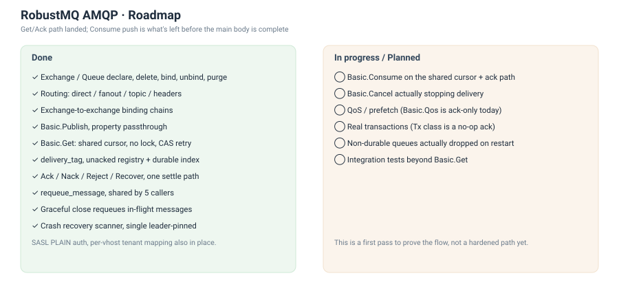

# AMQP 协议进展：主体功能基本走完，就差 Consume

AMQP 是继 Kafka 之后验证"一份数据、多协议"这套内核架构的第三个协议。它的消费模型跟 Kafka、MQTT 都不一样：没有位点提交这一步，`Get`/`Consume` 取走一条消息就是一条，还要支持显式的 ack、nack、requeue。

现状：Exchange/Queue 管理、四种路由、`Basic.Get` 整条链路（游标、未确认状态、崩溃恢复）都已经跑通，主体只剩 `Basic.Consume` 没接进来。这是第一版实现，目标是把流程走通、验证这套架构能不能撑住 AMQP 的语义，还没到生产可用的程度。下面列具体缺口。

## 已经做完的部分

Exchange 和 Queue 的声明、删除、绑定、解绑、清空都能用了，四种路由类型（direct、fanout、topic、headers）也都实现了，包括 exchange 到 exchange 的链式绑定。`Basic.Publish` 能把消息属性完整地存下来、投递的时候原样带回去。

`Basic.Get` 这条链路是这一版做得最完整的部分：一个共享的投递游标（不挂在连接上，跨节点也不会重复投递），靠 meta-service 的条件写做并发控制，没有引入锁；`delivery_tag` 按 channel 递增；未确认的消息既有内存里的登记表，也有一份写进内部 topic 的持久化索引；`Ack`/`Nack`/`Reject`/`Recover` 统一走一条结算路径；requeue 是个共享函数，channel/connection 优雅关闭、还有崩溃恢复的兜底扫描,都调用它。这套东西前几篇已经拆开讲过，这里不重复。

没做完、或者只做了一半的：

1. `Basic.Consume` 还是最早那版实现：自己起一个循环，用自己的一份游标读数据，跟 `Get` 那套共享游标、未确认索引是两个独立体系。同一个 queue 上如果 `Get` 和 `Consume` 同时跑，两边不共享进度，是当前最大的缺口。
2. `Basic.Cancel`、`Basic.Qos` 现在只是协议层面的应答，没有真正停止推送，也没有 prefetch 限流。
3. `Tx` 类是空实现，`Select`/`Commit`/`Rollback` 都直接答 Ok，没有真正的事务缓冲。
4. 非 durable 的 queue，消息落盘方式跟 durable 的一样，重启不会丢。这跟协议里"非持久化队列应该丢"的语义不一致，是更早实现遗留的问题，这次没有顺手修。
5. 集成测试目前只覆盖 `Basic.Get` 这条链路，`Consume`、`Exchange`/`Queue` 的管理接口还没有对应用例。

## 接下来做什么

下一步是把 `Basic.Consume` 迁到跟 `Get` 一样的共享游标和未确认机制上，两者共用同一套投递记账，这样同一个 queue 上竞争消费才是真的竞争消费，而不是两条平行线。这块做完，AMQP 的主体就算是完整跑通了。

再往后是补测试和补细节：`Cancel` 真正停掉推送、`Qos` 真正做 prefetch、集成测试往 `Consume` 和管理接口上补。事务和非 durable 队列的那两个缺口留着，不是这一阶段要解决的。

## 小结

Kafka 那篇的结论是"一份数据、多协议"对 Kafka 也成立，不只是对 MQTT。AMQP 走到这一步，可以加一句更具体的：投递游标这类"谁来读下一条"的并发问题，用 meta-service 现成的条件写就能解决，不需要为每个新协议单独发明一套锁或协调机制。这才是这条架构路径的复用价值：不止三份协议代码共享一份存储，连"怎么保证并发安全"这类细节问题，也复用同一套解法。

等验证完AMQP后，接下来就要回归MQTT和Kafka的主线了。走到这一步代码和架构验证这条路算是真正走完了。接下来的目标是真正打造一个生产可用的MQTT Broker。打通边缘物联网、大数据、AI 这条链路了。
