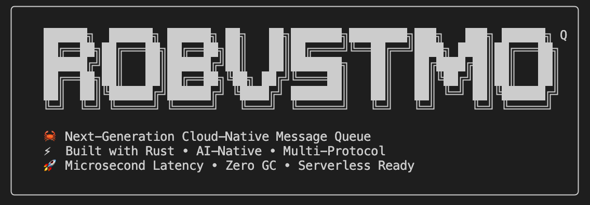

# RobustMQ 0.3.0 RELEASE 版本正式发布

RobustMQ 0.3.0 今天正式发布。这是一个重要的里程碑版本——不只是功能迭代，而是对 RobustMQ 整体定位和架构的一次重新梳理。

> **注意**：0.3.0 仍处于早期阶段，暂不建议在生产环境使用。我们计划在 0.4.0 版本达到生产可用标准，预计 5 月份左右发布。欢迎提前试用并反馈问题，帮助我们加速迭代。

## 重新定义 RobustMQ
从 0.3.0 开始，RobustMQ 的定位变得更加清晰：**下一代 AI、IoT、大数据统一的通信基础设施**。

具体来说：RobustMQ 是用 Rust 构建的、专门为 AI、IoT、大数据场景设计的下一代统一通信平台。通过 MQTT 和 Kafka 双协议、百万级 Topic、对象存储（S3/MinIO 等）数据源、多模式存储引擎（内存/混合/持久/分层）、智能数据缓存，为 AI 训练、Agent 通信、IoT 设备（边缘/云端）、大数据处理提供高性能、低成本、稳定的通信基础设施。

为什么是这个定位？过去一年多开发下来，我越来越清楚地看到：现有的通信中间件都是为单一场景设计的。Kafka 为大数据日志流设计，无法支撑百万级 Topic 和 AI 训练的数据缓存需求；EMQ 为 IoT 设备连接设计，不具备大吞吐的数据流处理能力；两者都没有考虑 AI 时代 Agent 通信、GPU 训练数据加速这些新场景。

RobustMQ 的机会在于：从一开始就为这些场景设计，而不是后期打补丁。0.3.0 是朝这个方向迈出的第一步。

## 极简架构，三个组件

0.3.0 对架构做了重新设计。整个系统由三个组件构成：

**Meta Service** 负责集群元数据管理和协调。所有节点的状态、Topic 配置、客户端会话信息都存储在 Meta Service 中，通过自研的 Multi Raft 机制保证一致性和高可用。

**Broker** 负责协议处理和请求路由。Broker 是无状态的，只处理客户端连接、协议解析、消息路由，不持有任何持久化数据。这种存算分离的设计让 Broker 可以随时水平扩展，加节点不需要数据迁移。

**Storage Engine** 负责数据持久化。支持三种存储引擎：Memory（纯内存，微秒级延迟）、RocksDB（统一 KV 存储，支持百万级 Topic）、File Segment（顺序写入，Kafka 场景高吞吐）。上层协议和存储引擎之间是插件化的接口，未来可以扩展更多存储后端。

这个架构最大的特点是**固定**。组件边界清晰，不会因为支持新协议或新存储而变形。加一个新协议，只需要在 Broker 层实现解析逻辑；加一个新存储，只需要实现 Storage Engine 的接口。核心架构不动。

**Multi Raft** 是 0.3.0 的重要基础设施投入。Meta Service 使用自研的 Multi Raft 实现，支持多个独立的 Raft Group，不同类型的元数据可以由不同的 Raft Group 管理，避免单一 Raft 的性能瓶颈。这是支撑后续大规模部署的基础。

## MQTT Broker 核心功能趋于完整

0.3.0 的 MQTT Broker 在功能完整性上达到了一个重要节点：核心功能覆盖了生产级 MQTT Broker 的主要场景。

具体包括：完整的 MQTT 3.x 和 5.0 协议支持（连接/断开/Keep-alive/遗嘱消息/保留消息/QoS 0/1/2）、Session 持久化与恢复、共享订阅、主题重写与过滤、认证与权限控制（用户名密码/ACL）、离线消息存储、延迟消息、规则引擎基础功能。

这意味着：常见的 IoT 场景，RobustMQ 的 MQTT Broker 已经可以承接。稳定性、运维工具、生态集成还需要继续完善，但核心协议功能已经就位。

## 代码质量：多轮重构和 Bug 修复

0.3.0 背后是大量不可见的工程投入。

过去几个月，代码经历了多轮重构：连接管理层从单一实现重构为可扩展的抽象层，存储引擎从耦合设计拆分为插件化接口，gRPC 客户端层加入了重试机制和超时控制，Handler 处理层加入了每个 Handler 线程的独立监控指标。

稳定性上：修复了多个在高并发场景下的 race condition、会话恢复逻辑的边界 bug、大量连接下的内存增长问题。性能上：优化了连接建立的关键路径，减少了不必要的 gRPC 调用，handler 处理超时机制避免了任务卡死导致的吞吐崩塌。

这些工作不产生新功能，但决定了系统能不能在生产环境真正跑起来。

## 生态工具完善

一个消息系统能否真正落地，不只取决于核心功能，配套工具同样关键。0.3.0 对五个方向的生态工具做了系统性完善。

**1. Grafana + Prometheus**：内置完整的监控指标体系，覆盖连接数、消息吞吐、Handler 处理延迟、gRPC 调用耗时、存储引擎读写、队列积压等核心维度。提供开箱即用的 Grafana Dashboard，部署后直接导入即可看到完整的运行状态，无需自己配置。
<div align="center">
  
  
</div>

**2. Command CLI**：完善了命令行管理工具，支持集群状态查询、Topic 管理、客户端会话查看、用户权限配置等日常运维操作，所有管理动作均可通过命令行完成。


**3. HTTP API**：提供完整的 REST API，覆盖集群管理、Topic 操作、用户管理、规则引擎配置等，方便与现有运维平台和自动化脚本集成。

**4. Bench CLI**：内置压测工具，支持 MQTT 连接、发布、订阅多种压测模式，可指定并发数、消息速率、Payload 大小、持续时长等参数，方便在部署后快速验证集群性能和稳定性。


**5. RobustMQ Dashboard**：提供 Web 管理控制台，集群概览、节点状态、Topic 列表、客户端连接、规则引擎配置均可在界面上直接操作，降低运维门槛。
<div align="center">
  
  
</div>

## 后续计划

0.3.0 是起点，不是终点。接下来的方向：

**持续优化性能和稳定性。** MQTT 连接建立路径还有明显的优化空间，Meta Service 的 Raft 写入吞吐是当前的瓶颈之一，存储引擎的读写性能还没有做深度调优。这些会持续推进。

**继续完善 MQTT 功能。** 规则引擎的完整实现、Webhook 集成、运维 API、监控大盘，这些是让 RobustMQ MQTT 真正可用于生产的必要条件。

**开发 AI MQ 相关功能。** Topic 直连对象存储（S3/MinIO 作为数据源）、三层智能缓存（内存/SSD/对象存储）、多 epoch 训练的预测式预加载。这是 RobustMQ 区别于所有现有消息队列的核心差异点。

**开发 Kafka 相关功能。** Kafka 协议的完整实现，让现有的 Kafka 客户端和工具链（Flink、Spark、Kafka Connect）零改动接入 RobustMQ。共享订阅打破 Partition 数量对并发度的限制。

---

## 如何使用

RobustMQ 的设计目标之一是极简部署，无任何外部依赖，三个命令拉起一个完整集群。

**一键安装启动**，执行安装脚本后直接运行，无需安装 JVM、ZooKeeper 或任何其他外部依赖：

```bash
curl -fsSL https://raw.githubusercontent.com/robustmq/robustmq/main/scripts/install.sh | bash
broker-server start
```

集群就绪后，用任意 MQTT 客户端连接验证：

```bash
mqttx pub -h localhost -p 1883 -t "test/topic" -m "Hello RobustMQ!"
mqttx sub -h localhost -p 1883 -t "test/topic"
```

也可以访问 `http://localhost:8080` 打开 Web 管理控制台，查看集群状态。

完整的快速上手文档：https://robustmq.com/QuickGuide/Overview.html

---

0.3.0 的发布，标志着 RobustMQ 从"摸索方向"进入"方向明确后稳步推进"的阶段。架构固定了，定位清晰了，接下来是把每个方向做深、做稳。

项目地址：https://github.com/robustmq/robustmq

欢迎试用和反馈。
