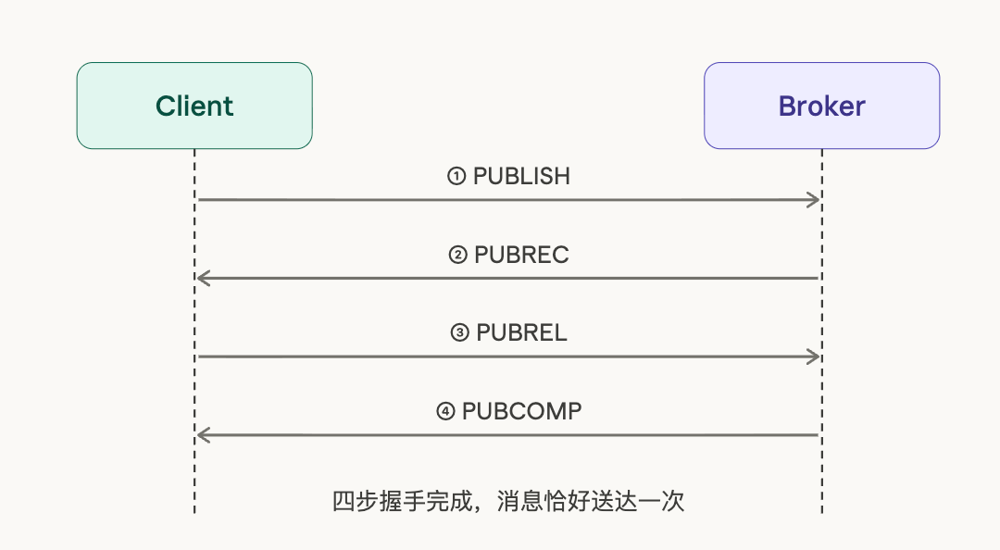
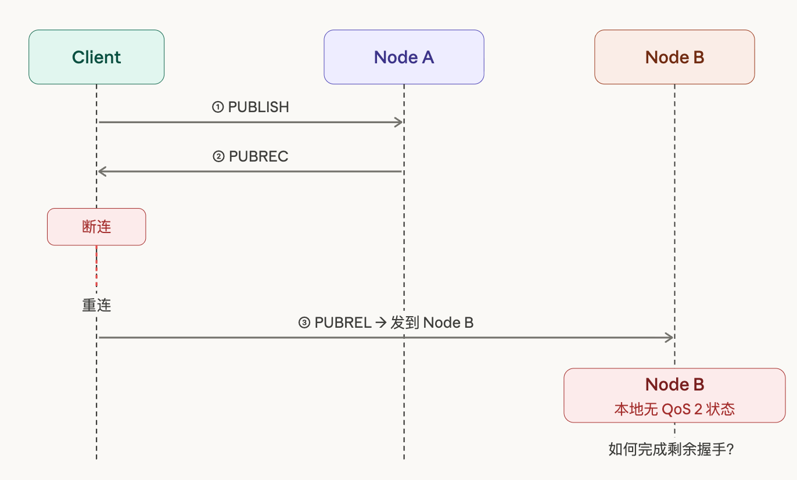
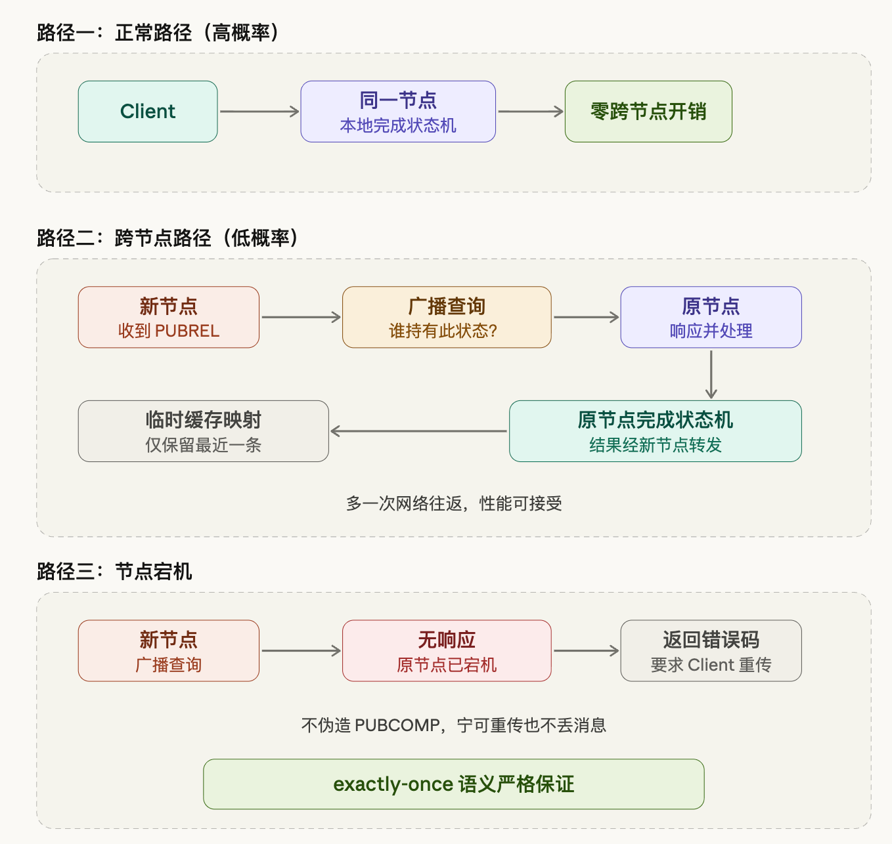

# 集群模式下 QoS 2 的一个边界问题

最近在设计 RobustMQ 集群模式下 QoS 2 的处理逻辑，遇到一个值得认真想的问题，顺便记录一下思考过程。

## 问题从哪里来

MQTT QoS 2 是一个四步握手协议，设计目标是保证消息恰好送达一次，不多不少。整个流程是这样的：Client 先向 Broker 发送 PUBLISH，Broker 收到后回一个 PUBREC 表示已收到；Client 收到 PUBREC 后，再发送 PUBREL 表示确认；Broker 最后回 PUBCOMP，整个握手完成，消息被认为已经精确送达。



在单节点场景下，这套流程没什么难度。Broker 本地维护一份会话状态，记录每个 Client 当前处于握手的哪个阶段，四步走完把状态清掉就行。逻辑简单，状态完整，没有歧义。

但集群模式下，一个很自然的边界情况出现了。Client 完成了前两步，收到了 PUBREC，然后因为某种原因断连了。当它重新连接时，负载均衡把它分配到了另一个节点。这时新节点收到了 Client 发来的 PUBREL，但本地完全没有这个 Client 的任何 QoS 2 状态记录——它不知道这条消息从哪来，也不知道该怎么处理。



这不是一个极端的假设，也不是需要刻意构造的测试场景。网络抖动、负载均衡切换、节点重启，任何一种情况都可能触发这个问题。在规模稍大的 IoT 部署里，这类事件每天都在发生。

## 已有方案为什么不够好

面对这个问题，行业里有两个比较成熟的做法，但都有各自的代价。

第一种是维护一张全局路由表，记录每个 ClientId 当前连接在哪个节点上。任何节点收到请求，先查这张表，找到持有会话的节点，把请求转发过去。这套逻辑清晰，正确性容易保证，在小集群下工作得很好。

但问题出在"全局"两个字上。这张路由表需要实时同步到集群中的所有节点——如果集群有 100 万个连接，就是 100 万条记录，每次有 Client 连接或断开，都要触发一次全集群广播，把变更同步给所有节点。集群节点数越多，同步的开销就越高，网络风暴的风险也越大。节点数的上限背后的约束之一，正是全局路由表的同步压力。

第二种思路更激进：直接把 QoS 2 的会话状态写入 Raft，所有节点都能查到，跨节点处理完全没有障碍，一致性由 Raft 保证，问题从根本上消失了。听起来很干净，但代价是每一步握手都要走一次 Raft 写入。QoS 2 本身就是四步，高并发场景下这个成本不可忽视，而且 Raft 写入的延迟会直接体现在消息吞吐上。

这两个方案本质上都在用一套全量的、持续运行的基础设施，去解决一个只在异常情况下才会出现的小概率问题。用来解决问题的机器比问题本身还重，这是一种不太划算的权衡。

## 先把问题的概率分布想清楚

任何方案设计之前，有一件事应该先做：想清楚这个问题实际发生的频率。

在正常运行的生产环境里，绝大多数 Client 的连接是稳定的。PUBLISH 发出去，四步握手在同一个节点完成，PUBCOMP 回去，这是高概率路径，也是系统 99% 的时间在走的路径。跨节点的情况只在网络抖动或节点切换时出现，是低概率路径，发生的前提本身就是一次异常事件。

如果为这个低概率路径设计一套全量同步的方案，相当于在每一次正常握手上都持续付出跨节点同步的代价，只是为了应对极少数情况。高概率路径的性能被低概率路径的设计拖累了，本末倒置。

更合理的思路应该是反过来：让高概率路径做到零开销，低概率路径按需处理，整体性能取决于实际的跨节点比例，而不是连接总数。这两者之间的差距，在大规模场景下可以差出一个数量级。

## 我们的方案：本地优先，按需广播

基于这个判断，RobustMQ 选择了本地优先加按需广播发现的策略。



在正常路径下，Client 全程在同一节点，QoS 2 状态在本地完成流转，没有任何跨节点交互。这也是绝大多数请求走的路径，在这条路上的开销和单节点没有任何区别。

跨节点的情况出现时，处理逻辑是这样的：新节点收到 PUBREL，本地查不到对应的状态记录，于是向集群广播一个查询：谁持有这个 Client 的 QoS 2 状态？持有状态的那个节点响应之后，新节点把这条映射关系临时缓存下来，然后把请求转给原节点，由原节点完成状态机的剩余流转，再把结果通过新节点转发给 Client。

临时缓存只保留最近一条。如果一个 Client 频繁断连重连，历史映射的命中价值其实很低——每次重连可能落到不同的节点，保留太多历史反而是浪费。最坏情况是每次都走一遍广播，多了一次网络往返，这个成本在可接受范围内，不会影响正确性。

节点宕机是需要单独处理的情况。广播发出去，但没有任何节点响应，说明持有状态的节点已经宕机了，那条 QoS 2 的中间状态随着节点一起消失了。这时候的处理是：返回错误码，要求 Client 重新发送 PUBLISH，从头走一遍握手流程。

这里有一个不能妥协的原则：不伪造 PUBCOMP。QoS 2 的语义承诺是 exactly-once，如果在状态丢失的情况下假装握手完成，消息就真的丢了，而 Client 完全不知道。宁可让 Client 多发一次，重传只是多了一次握手的成本，消息不会丢。协议语义的正确性，比减少一次重传更重要。

## 大规模断连重连时的压力处理

方案整体是清晰的，但还有一个边界情况需要认真对待：大量 Client 同时断连重连。

这在实际场景里并不罕见——比如一次网络分区恢复，或者一次计划内的节点滚动重启，都可能在短时间内产生数以万计的 Client 同时重连。这些 Client 的 PUBREL 全部落到新节点，新节点全部本地查不到状态，就会在极短的时间内产生大量广播请求，形成一次明显的流量峰值。

直接限流是一个思路，但有更优雅的处理方式：批量合并。在新节点侧设置一个 30 毫秒的聚合窗口，窗口内积累的所有跨节点 PUBREL 请求，不立即发出广播，而是等窗口结束后合并成一次 node call 批量发给目标节点，目标节点批量查询，批量返回：

```text
30ms 窗口内：
  ClientA / pkid=1
  ClientB / pkid=5
  ClientC / pkid=8
      ↓
合并为一次请求发给目标节点
目标节点批量查询，批量返回
```

这样 node call 的总次数由时间窗口大小决定，而不是跨节点请求的数量。即使 10 万个 Client 同时断连重连，在 30 毫秒的窗口里，产生的 node call 数量仍然是可控的，和集群节点数无关。批量窗口本身就是一种天然的削峰手段，不需要额外的限流逻辑。30 毫秒的延迟对 MQTT 的会话恢复来说完全可以接受，但换来了广播风暴的防护能力。

对于同一个 Client 频繁断连重连的情况，临时缓存只保留最近一条映射，降低堆积风险。最坏情况是频繁走广播，性能有损耗，但不影响正确性。

## 为什么是这个方案

这个方案背后有一个基本判断：不追求所有路径都最优，追求整体期望值最优。

把资源集中在高概率路径，做到极致轻量，这是系统大多数时间的状态，性能要好。低概率路径接受合理的性能降级，多一次广播、多一次网络往返，但不牺牲语义正确性，也不让低概率路径的处理代价渗透到正常路径上。节点宕机这种极端情况，有明确的处理策略，不留灰色地带，不做不诚实的兜底。

这不是一个复杂的方案，但前提是把问题本身想清楚了。很多设计上的"重"，来自于没有认真分析概率分布，把小概率问题当成了必须全量防御的常态。把问题的频率想清楚之后，合理的方案其实并不难找到。
